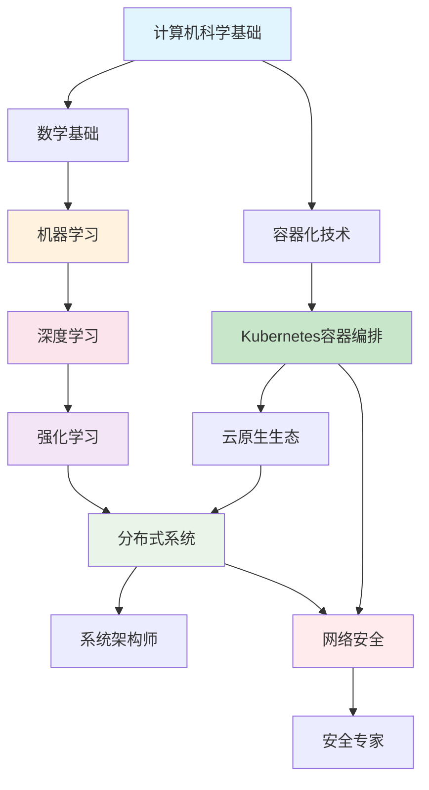

# SystemLearning 🚀

> 系统性学习计算机科学各个领域的完整知识体系项目

## 📚 项目简介

**SystemLearning** 是一个专为系统性学习计算机科学各个领域而设计的综合性学习项目。本项目采用渐进式学习路径，从基础概念到高级实践，涵盖云原生技术、机器学习、深度学习、强化学习等多个热门领域。

### 🎯 学习理念

- **系统性**: 每个领域都有完整的学习路径设计
- **实践性**: 理论学习与动手实践相结合
- **渐进性**: 从基础概念逐步深入到高级应用
- **现代性**: 关注最新技术趋势和最佳实践

## 🗂️ 学习领域

### 🔄 已完成领域

#### [Kubernetes - 云原生容器编排](./kubernetes/) ✅
完整的Kubernetes学习体系，从入门到生产环境最佳实践。

- **学习周期**: 10周（10个实验）
- **文档规模**: 9,487行，248KB
- **涵盖内容**: 基础概念、Pod管理、服务发现、应用部署、配置管理、存储、网络安全、监控日志、自动扩缩容、生产环境实践
- **适用认证**: CKA、CKAD、CKS

#### [Docker - 容器化技术](./docker/) ✅
Docker容器技术的系统性学习。

- **基础概念**: 容器化原理、镜像构建
- **实践应用**: 多容器应用、网络配置、数据管理
- **生产实践**: 安全加固、性能优化

#### [调试解决方案归档](./debugging-solutions/) ✅
系统性的错误调试与解决方案知识库。

- **问题分类**: CUDA错误、训练问题、模型问题、通用修复
- **归档体系**: 标准化模板、快速查找、详细分析
- **已解决问题**: 2个典型案例（CUDA断言失败、梯度爆炸）

### 🚧 进行中的领域

#### [Reinforcement Learning (RL) - 强化学习](./reinforcement-learning/) 🚧
从经典RLHF到高级动态攻防博弈的完整学习路径。

- **学习进度**: 3/11个实验已完成 (27%)
- **已完成**: lab01-RL基础与RLHF范式、lab02-实现PPO算法、lab03-优化PPO-实现GRPO
- **当前状态**: 数值稳定性问题已解决，GRPO算法成功实现
- **代码实现**: 5个Python文件，包含错误分析和稳定版本
- **下一步**: lab04-大规模训练的核心挑战

### 🚧 规划中的领域

#### 🤖 Machine Learning (ML) - 机器学习
系统性机器学习知识体系，从数学基础到实际应用。

```
规划内容：
📊 数学基础 (线性代数、概率论、统计学)
🔍 经典算法 (监督学习、无监督学习、集成学习)
🛠️ 工具框架 (Scikit-learn、Pandas、NumPy)
📈 特征工程与模型评估
🏭 MLOps (模型部署、监控、版本管理)
```

#### 🧠 Deep Learning (DL) - 深度学习
深度学习从原理到实践的完整学习路径。

```
规划内容：
🧮 神经网络基础 (感知机、反向传播、激活函数)
🏗️ 经典架构 (CNN、RNN、LSTM、Transformer)
🖼️ 计算机视觉 (图像分类、目标检测、图像生成)
📝 自然语言处理 (文本分类、机器翻译、大语言模型)
⚡ 深度学习框架 (PyTorch、TensorFlow、JAX)
```

#### 🌐 分布式系统
大规模分布式系统设计与实现。

```
规划内容：
🏗️ 系统架构 (微服务、服务网格、API网关)
💾 分布式存储 (分布式数据库、对象存储)
📨 消息队列 (Kafka、RabbitMQ、Pulsar)
🔄 一致性算法 (Raft、Paxos、PBFT)
📊 监控观测 (链路追踪、指标监控、日志分析)
```

#### 🔐 网络安全
信息安全与网络安全的系统性学习。

```
规划内容：
🛡️ 安全基础 (密码学、认证授权、漏洞分析)
🌐 网络安全 (防火墙、入侵检测、渗透测试)
📱 应用安全 (Web安全、移动安全、API安全)
☁️ 云安全 (容器安全、Kubernetes安全、DevSecOps)
🚨 安全运营 (SOC、SIEM、事件响应)
```

## 🏗️ 项目结构

```
SystemLearning/
├── README.md                          # 项目总览
├── debugging-solutions/               # 🛠️ 调试解决方案归档
│   ├── README.md                      # 问题索引和指南
│   ├── quick-reference.md             # 快速查找指南
│   ├── template.md                    # 问题记录模板
│   ├── cuda-errors/                   # CUDA相关错误
│   ├── training-issues/               # 训练过程问题
│   ├── model-issues/                  # 模型相关问题
│   └── general-fixes/                 # 通用修复方案
├── kubernetes/                        # ✅ Kubernetes学习体系
│   ├── README.md                      # 主文档
│   ├── lab01-k8s基础概念与环境搭建/    # 基础入门
│   ├── lab02-Pod的创建与管理/         # Pod管理
│   ├── lab03-Service服务发现与负载均衡/ # 服务发现
│   ├── lab04-Deployment应用部署与更新/ # 应用部署
│   ├── lab05-ConfigMap和Secret配置管理/ # 配置管理
│   ├── lab06-数据持久化与存储/        # 存储管理
│   ├── lab07-网络策略与安全/          # 网络安全
│   ├── lab08-监控与日志管理/          # 监控运维
│   ├── lab09-自动扩缩容HPA-VPA/       # 弹性伸缩
│   ├── lab10-生产环境最佳实践/        # 生产实践
│   └── 项目完成总结.md                # 学习总结
├── docker/                           # ✅ Docker容器技术
│   └── ...
├── reinforcement-learning/           # 🚧 强化学习 (进行中)
│   ├── lab01-RL基础与RLHF范式/        # ✅ 强化学习基础
│   ├── lab02-实现PPO算法/             # ✅ PPO算法实现
│   ├── lab03-优化PPO-实现GRPO/        # ✅ GRPO算法优化
│   └── ...                           # 更多实验进行中
├── machine-learning/                 # 🚧 机器学习 (规划中)
├── deep-learning/                    # 🚧 深度学习 (规划中)
├── distributed-systems/              # 🚧 分布式系统 (规划中)
└── cybersecurity/                    # 🚧 网络安全 (规划中)
```

## 🛠️ 调试解决方案归档

当你在学习过程中遇到问题时，可以查看我们的 **调试解决方案归档**：

📁 **[debugging-solutions/](./debugging-solutions/)** - 系统性的错误解决方案库

### 🔍 快速问题定位

| 问题类型 | 查看文档 | 典型症状 |
|----------|----------|----------|
| 🔥 **CUDA错误** | `cuda-errors/` | `RuntimeError: CUDA error: device-side assert` |
| 📈 **训练问题** | `training-issues/` | 梯度爆炸、参数NaN/inf、训练不稳定 |
| 🤖 **模型问题** | `model-issues/` | 模型加载失败、推理异常 |
| 🔧 **通用修复** | `general-fixes/` | 环境配置、依赖冲突 |

### ⚡ 快速查找指南
- 📖 **[快速查找指南](./debugging-solutions/quick-reference.md)** - 按症状快速定位解决方案
- 📝 **[问题模板](./debugging-solutions/template.md)** - 记录新问题的标准格式
- 📊 **[问题索引](./debugging-solutions/README.md)** - 所有已解决问题的完整列表

### 🏆 已解决的典型问题
- **CUDA-001**: `torch.multinomial` CUDA断言失败 → 数值稳定性修复
- **TRAIN-001**: GRPO训练梯度爆炸 → 多层梯度控制机制

---

## 🚀 如何使用

### 环境要求
- **操作系统**: Windows 10/11 或 macOS 14.6+ 或 Linux
- **硬件配置**: 16GB+ 内存，至少20GB可用存储，推荐NVIDIA GPU（用于深度学习）
- **开发工具**: Git、Docker、Python 3.8+、各领域特定工具

### 开始学习

1. **选择学习领域**
   ```bash
   cd SystemLearning
   ls -la  # 查看可用的学习模块
   ```

2. **按序学习**
   ```bash
   # 例如：开始Kubernetes学习
   cd kubernetes
   cat README.md  # 阅读学习指南
   cd lab01-k8s基础概念与环境搭建
   ```

3. **跟踪进度**
   - 每个领域都有完整的学习路径
   - 建议按照设计的顺序循序渐进
   - 完成每个实验后进行总结

## 📊 学习统计

### 当前进度
- ✅ **Kubernetes**: 100% 完成 (10个实验，9,487行文档)
- ✅ **Docker**: 基础完成 (10个实验)
- ✅ **调试解决方案归档**: 100% 完成 (系统化调试知识库)
- 🚧 **强化学习**: 27% 完成 (3/11个实验，5个Python文件)
- 🚧 **机器学习**: 规划中
- 🚧 **深度学习**: 规划中
- 🚧 **分布式系统**: 规划中
- 🚧 **网络安全**: 规划中

### 项目统计 📈
- **总文档数**: 30+ markdown文件
- **代码文件**: 5个Python实现
- **实验数量**: 31个规划实验（13个已完成）
- **知识领域**: 8个技术方向
- **调试案例**: 2个完整解决方案

### 目标里程碑
- **2024 Q4**: 完成强化学习核心内容 (lab01-06)
- **2025 Q1**: 完成强化学习高级对抗博弈 (lab07-11)
- **2025 Q2**: 启动机器学习基础模块
- **2025 Q3**: 完成深度学习核心内容

## 🎯 学习收益

完成本项目的学习后，你将获得：

### 🏆 技术能力
- **云原生技术栈**: Kubernetes、Docker、微服务架构
- **AI/ML技能**: 机器学习、深度学习、强化学习的理论和实践
- **系统设计**: 大规模分布式系统的设计和实现能力
- **安全意识**: 全面的网络安全和系统安全知识

### 📜 认证准备
- **云原生**: CKA、CKAD、CKS认证
- **机器学习**: TensorFlow、AWS ML、Google ML认证
- **安全**: CISSP、CEH、Security+认证

### 💼 职业发展
- **DevOps/SRE工程师**: 具备完整的云原生技术栈
- **机器学习工程师**: 从算法到部署的全栈能力
- **系统架构师**: 分布式系统设计和优化能力
- **安全工程师**: 全面的安全防护和响应能力

## 🤝 贡献指南

这是一个个人学习项目，但也欢迎：

- 🐛 **错误报告**: 发现内容错误或技术问题
- 💡 **改进建议**: 学习路径优化或内容补充
- 📚 **资源分享**: 优质的学习资源推荐
- 🔗 **经验交流**: 学习心得和实践经验

## 📖 参考资源

### 官方文档
- [Kubernetes官方文档](https://kubernetes.io/docs/)
- [Docker官方文档](https://docs.docker.com/)
- [Scikit-learn用户指南](https://scikit-learn.org/stable/user_guide.html)
- [PyTorch教程](https://pytorch.org/tutorials/)

### 经典书籍
- 《Kubernetes权威指南》
- 《机器学习》- 周志华
- 《深度学习》- Ian Goodfellow
- 《强化学习：原理与Python实现》

### 在线课程
- [Coursera机器学习课程](https://www.coursera.org/learn/machine-learning)
- [Deep Learning Specialization](https://www.coursera.org/specializations/deep-learning)
- [Kubernetes认证培训](https://training.linuxfoundation.org/certification/certified-kubernetes-administrator-cka/)

## 📞 联系方式

- **GitHub**: [jerry609](https://github.com/jerry609)
- **项目仓库**: [SystemLearning](https://github.com/jerry609/SystemLearning)

---

## 📈 学习路线图



**🎯 开始你的系统性学习之旅吧！每一步都是向专业技术人员迈进的重要里程碑。**

---

*最后更新时间: 2024年12月19日*