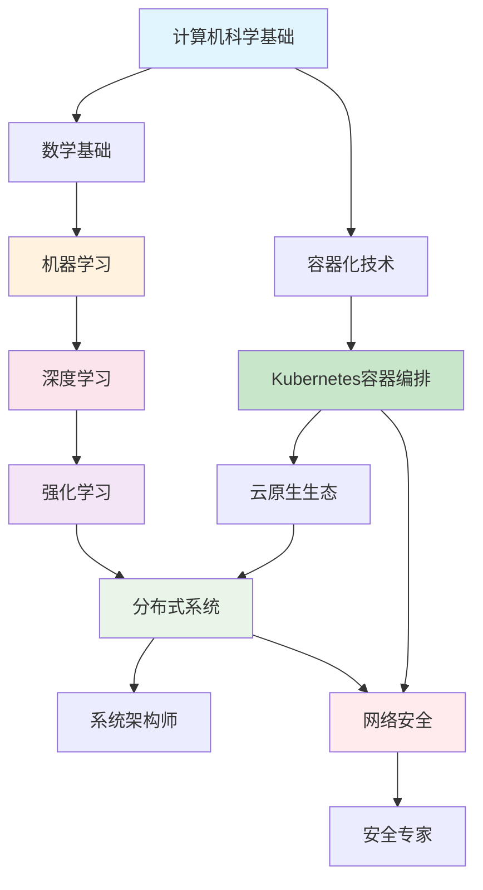

# SystemLearning 🚀

> 系统性学习计算机科学各个领域的完整知识体系项目

## 📚 项目简介

**SystemLearning** 是一个专为系统性学习计算机科学各个领域而设计的综合性学习项目。本项目采用渐进式学习路径，从基础概念到高级实践，涵盖云原生技术、机器学习、深度学习、强化学习等多个热门领域。

### 🎯 学习理念

- **系统性**: 每个领域都有完整的学习路径设计
- **实践性**: 理论学习与动手实践相结合
- **渐进性**: 从基础概念逐步深入到高级应用
- **现代性**: 关注最新技术趋势和最佳实践

## 🗂️ 学习领域

### 🔄 已完成领域

#### [Kubernetes - 云原生容器编排](./kubernetes/) ✅
完整的Kubernetes学习体系，从入门到生产环境最佳实践。

- **学习周期**: 10周（10个实验）
- **文档规模**: 9,487行，248KB
- **涵盖内容**: 基础概念、Pod管理、服务发现、应用部署、配置管理、存储、网络安全、监控日志、自动扩缩容、生产环境实践
- **适用认证**: CKA、CKAD、CKS

#### [Docker - 容器化技术](./docker/) ✅
Docker容器技术的系统性学习。

- **基础概念**: 容器化原理、镜像构建
- **实践应用**: 多容器应用、网络配置、数据管理
- **生产实践**: 安全加固、性能优化

### 🚧 规划中的领域

#### 🤖 Machine Learning (ML) - 机器学习
系统性机器学习知识体系，从数学基础到实际应用。

```
规划内容：
📊 数学基础 (线性代数、概率论、统计学)
🔍 经典算法 (监督学习、无监督学习、集成学习)
🛠️ 工具框架 (Scikit-learn、Pandas、NumPy)
📈 特征工程与模型评估
🏭 MLOps (模型部署、监控、版本管理)
```

#### 🧠 Deep Learning (DL) - 深度学习
深度学习从原理到实践的完整学习路径。

```
规划内容：
🧮 神经网络基础 (感知机、反向传播、激活函数)
🏗️ 经典架构 (CNN、RNN、LSTM、Transformer)
🖼️ 计算机视觉 (图像分类、目标检测、图像生成)
📝 自然语言处理 (文本分类、机器翻译、大语言模型)
⚡ 深度学习框架 (PyTorch、TensorFlow、JAX)
```

#### 🎮 Reinforcement Learning (RL) - 强化学习
强化学习算法与应用的系统性学习。

```
规划内容：
🎯 基础理论 (MDP、策略、价值函数)
🎲 经典算法 (Q-Learning、Policy Gradient、Actor-Critic)
🚀 深度强化学习 (DQN、PPO、SAC、A3C)
🎪 应用场景 (游戏AI、机器人控制、推荐系统)
🔧 实践框架 (OpenAI Gym、Stable Baselines3)
```

#### 🌐 分布式系统
大规模分布式系统设计与实现。

```
规划内容：
🏗️ 系统架构 (微服务、服务网格、API网关)
💾 分布式存储 (分布式数据库、对象存储)
📨 消息队列 (Kafka、RabbitMQ、Pulsar)
🔄 一致性算法 (Raft、Paxos、PBFT)
📊 监控观测 (链路追踪、指标监控、日志分析)
```

#### 🔐 网络安全
信息安全与网络安全的系统性学习。

```
规划内容：
🛡️ 安全基础 (密码学、认证授权、漏洞分析)
🌐 网络安全 (防火墙、入侵检测、渗透测试)
📱 应用安全 (Web安全、移动安全、API安全)
☁️ 云安全 (容器安全、Kubernetes安全、DevSecOps)
🚨 安全运营 (SOC、SIEM、事件响应)
```

## 🏗️ 项目结构

```
SystemLearning/
├── README.md                          # 项目总览
├── kubernetes/                        # ✅ Kubernetes学习体系
│   ├── README.md                      # 主文档
│   ├── lab01-k8s基础概念与环境搭建/    # 基础入门
│   ├── lab02-Pod的创建与管理/         # Pod管理
│   ├── lab03-Service服务发现与负载均衡/ # 服务发现
│   ├── lab04-Deployment应用部署与更新/ # 应用部署
│   ├── lab05-ConfigMap和Secret配置管理/ # 配置管理
│   ├── lab06-数据持久化与存储/        # 存储管理
│   ├── lab07-网络策略与安全/          # 网络安全
│   ├── lab08-监控与日志管理/          # 监控运维
│   ├── lab09-自动扩缩容HPA-VPA/       # 弹性伸缩
│   ├── lab10-生产环境最佳实践/        # 生产实践
│   └── 项目完成总结.md                # 学习总结
├── docker/                           # ✅ Docker容器技术
│   └── ...
├── machine-learning/                 # 🚧 机器学习 (规划中)
├── deep-learning/                    # 🚧 深度学习 (规划中)
├── reinforcement-learning/           # 🚧 强化学习 (规划中)
├── distributed-systems/              # 🚧 分布式系统 (规划中)
└── cybersecurity/                    # 🚧 网络安全 (规划中)
```

## 🚀 如何使用

### 环境要求
- **操作系统**: macOS 14.6+ (Intel/Apple Silicon)
- **硬件配置**: 16GB+ 内存，至少20GB可用存储
- **开发工具**: Git、Docker、各领域特定工具

### 开始学习

1. **选择学习领域**
   ```bash
   cd SystemLearning
   ls -la  # 查看可用的学习模块
   ```

2. **按序学习**
   ```bash
   # 例如：开始Kubernetes学习
   cd kubernetes
   cat README.md  # 阅读学习指南
   cd lab01-k8s基础概念与环境搭建
   ```

3. **跟踪进度**
   - 每个领域都有完整的学习路径
   - 建议按照设计的顺序循序渐进
   - 完成每个实验后进行总结

## 📊 学习统计

### 当前进度
- ✅ **Kubernetes**: 100% 完成 (10个实验，9,487行文档)
- ✅ **Docker**: 基础完成
- 🚧 **Machine Learning**: 规划中
- 🚧 **Deep Learning**: 规划中
- 🚧 **Reinforcement Learning**: 规划中

### 目标里程碑
- **2024 Q3**: 完成机器学习基础模块
- **2024 Q4**: 完成深度学习核心内容
- **2025 Q1**: 完成强化学习实践项目
- **2025 Q2**: 完成分布式系统设计

## 🎯 学习收益

完成本项目的学习后，你将获得：

### 🏆 技术能力
- **云原生技术栈**: Kubernetes、Docker、微服务架构
- **AI/ML技能**: 机器学习、深度学习、强化学习的理论和实践
- **系统设计**: 大规模分布式系统的设计和实现能力
- **安全意识**: 全面的网络安全和系统安全知识

### 📜 认证准备
- **云原生**: CKA、CKAD、CKS认证
- **机器学习**: TensorFlow、AWS ML、Google ML认证
- **安全**: CISSP、CEH、Security+认证

### 💼 职业发展
- **DevOps/SRE工程师**: 具备完整的云原生技术栈
- **机器学习工程师**: 从算法到部署的全栈能力
- **系统架构师**: 分布式系统设计和优化能力
- **安全工程师**: 全面的安全防护和响应能力

## 🤝 贡献指南

这是一个个人学习项目，但也欢迎：

- 🐛 **错误报告**: 发现内容错误或技术问题
- 💡 **改进建议**: 学习路径优化或内容补充
- 📚 **资源分享**: 优质的学习资源推荐
- 🔗 **经验交流**: 学习心得和实践经验

## 📖 参考资源

### 官方文档
- [Kubernetes官方文档](https://kubernetes.io/docs/)
- [Docker官方文档](https://docs.docker.com/)
- [Scikit-learn用户指南](https://scikit-learn.org/stable/user_guide.html)
- [PyTorch教程](https://pytorch.org/tutorials/)

### 经典书籍
- 《Kubernetes权威指南》
- 《机器学习》- 周志华
- 《深度学习》- Ian Goodfellow
- 《强化学习：原理与Python实现》

### 在线课程
- [Coursera机器学习课程](https://www.coursera.org/learn/machine-learning)
- [Deep Learning Specialization](https://www.coursera.org/specializations/deep-learning)
- [Kubernetes认证培训](https://training.linuxfoundation.org/certification/certified-kubernetes-administrator-cka/)

## 📞 联系方式

- **GitHub**: [jerry609](https://github.com/jerry609)
- **项目仓库**: [SystemLearning](https://github.com/jerry609/SystemLearning)

---

## 📈 学习路线图



**🎯 开始你的系统性学习之旅吧！每一步都是向专业技术人员迈进的重要里程碑。**

---

*最后更新时间: 2024年7月3日*