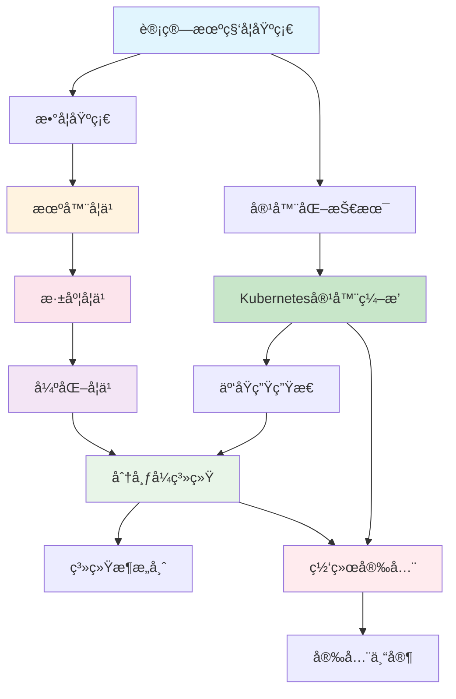

# SystemLearning 🚀

> 系统性学习计算机科学å„个领域的完整知识体系项目

## 📚 项目简介

**SystemLearning** 是一个专为系统性学习计算机科学å„个领域而设计的综åˆæ€§å­¦ä¹ é¡¹ç›®ã€‚本项目采用æ¸è¿›å¼å­¦ä¹ è·¯å¾„，ä»åŸºç¡€æ¦‚念到高级å®è·µï¼Œæ¶µç›–云åŸç”ŸæŠ€æœ¯ã€æœºå™¨å­¦ä¹ ã€æ·±åº¦å­¦ä¹ ã€å¼ºåŒ–学习等多个热门领域。

### 🯠学习ç†å¿µ

- **系统性**: æ¯ä¸ªé¢†åŸŸéƒ½æœ‰å®Œæ•´çš„学习路径设计
- **å®è·µæ€§**: ç†è®ºå­¦ä¹ ä¸åŠ¨æ‰‹å®è·µç›¸ç»“åˆ
- **æ¸è¿›æ€§**: ä»åŸºç¡€æ¦‚念é€æ­¥æ·±å…¥åˆ°é«˜çº§åº”用
- **ç°ä»£æ€§**: 关注最新技术趋势和最佳å®è·µ

## ğŸ—‚ï¸ å­¦ä¹ é¢†åŸŸ

### 🔄 已完æˆé¢†åŸŸ

#### [Kubernetes - 云åŸç”Ÿå®¹å™¨ç¼–æ’](./kubernetes/) ✅
完整的Kubernetes学习体系，ä»å…¥é—¨åˆ°ç”Ÿäº§ç¯å¢ƒæœ€ä½³å®è·µã€‚

- **学习周期**: 10周（10个å®éªŒï¼‰
- **文档规模**: 9,487行，248KB
- **涵盖内容**: 基础概念ã€Pod管ç†ã€æœåŠ¡å‘ç°ã€åº”用部署ã€é…置管ç†ã€å­˜å‚¨ã€ç½‘络安全ã€ç›‘æ§æ—¥å¿—ã€è‡ªåŠ¨æ‰©ç¼©å®¹ã€ç”Ÿäº§ç¯å¢ƒå®è·µ
- **适用认è¯**: CKAã€CKADã€CKS

#### [Docker - 容器化技术](./docker/) ✅
Docker容器技术的系统性学习。

- **基础概念**: 容器化åŸç†ã€é•œåƒæ„建
- **å®è·µåº”用**: 多容器应用ã€ç½‘络é…ç½®ã€æ•°æ®ç®¡ç†
- **生产å®è·µ**: 安全加固ã€æ€§èƒ½ä¼˜åŒ–

#### [调试解决方案归档](./debugging-solutions/) ✅
系统性的错误调试ä¸è§£å†³æ–¹æ¡ˆçŸ¥è¯†åº“。

- **问题分类**: CUDA错误ã€è®­ç»ƒé—®é¢˜ã€æ¨¡å‹é—®é¢˜ã€é€šç”¨ä¿®å¤
- **归档体系**: 标准化模æ¿ã€å¿«é€ŸæŸ¥æ‰¾ã€è¯¦ç»†åˆ†æ
- **已解决问题**: 2个典å‹æ¡ˆä¾‹ï¼ˆCUDA断言失败ã€æ¢¯åº¦çˆ†ç‚¸ï¼‰

#### [Kubernetes Operator - 云åŸç”Ÿæ‰©å±•å¼€å‘](./operator/) ✅
ä»é›¶å¼€å§‹æ„建 Kubernetes Operator 的完整学习路径。

- **学习周期**: 3个系列（13个练习）
- **文档规模**: 34个文档，18,000+行代ç å’Œæ–‡æ¡£
- **涵盖内容**:
    - **Ex1 - å¾®å‹æ¡†æ¶æ„建**: Stepæ¥å£ã€Pipelineã€é—­åŒ…ã€è£…饰器（5个练习）
    - **Ex2 - 真å®ä»£ç åº“ç†è§£**: 阅读PolarDBX/Crossplane代ç ï¼ˆ3个练习）
    - **Ex3 - 综åˆå®æˆ˜**: 完整Operatorå®ç°ï¼ˆ5个练习）
- **核心技能**:
    - 状æ€æœºä¸å调循ç¯
    - 资æºç”Ÿå‘½å‘¨æœŸç®¡ç†ï¼ˆåˆ›å»ºã€æ›´æ–°ã€åˆ é™¤ï¼‰
    - Finalizer 机制
    - 错误处ç†ä¸å¯è§‚测性
    - 生产级最佳å®è·µ
- **代ç å®ç°**: 6个完整å®ç°ï¼ˆframework + 5个solutions），所有测试通过

#### [Reinforcement Learning (RL) - 强化学习](./reinforcement-learning/) 🚀
ä»ç»å…¸RLHF到å‰æ²¿AIæ¶æ„的完整学习ä¸æ¢ç´¢è·¯å¾„。

- **学习周期**: 23周（23个å®éªŒï¼‰
- **文档规模**: 40+个文件，包å«æ ¸å¿ƒç®—法å®ç°ä¸å‰æ²¿ç ”究
- **涵盖内容**:
    - **核心算法**: PPOã€GRPOã€DAPOã€VeRLã€APO
    - **高级应用**: LLM集æˆã€çº¢é˜Ÿè¯„ä¼°ã€MLOps
    - **å‰æ²¿æ¶æ„**: MoEã€Mambaã€å¤šæ¨¡æ€LLaVA
    - **新兴范å¼**: æ€ç»´é“¾ (CoT)ã€è‡ªä¸»æ™ºèƒ½ä½“ (ReAct)
- **关键æˆå°±**: æ„建了ä»AI安全对é½åˆ°å‰æ²¿AIæ¶æ„æ¢ç´¢çš„完整知识体系
- **代ç å®ç°**: 15个Python文件（核心体系），12个å‰æ²¿æ–¹å‘æ¢ç´¢æ–‡æ¡£

### 🚧 规划中的领域

#### 🤖 Machine Learning (ML) - 机器学习
系统性机器学习知识体系，ä»æ•°å­¦åŸºç¡€åˆ°å®é™…应用。

```
规划内容：
📊 数学基础 (线性代数ã€æ¦‚ç‡è®ºã€ç»Ÿè®¡å­¦)
🔠ç»å…¸ç®—法 (监ç£å­¦ä¹ ã€æ— ç›‘ç£å­¦ä¹ ã€é›†æˆå­¦ä¹ )
ğŸ› ï¸ å·¥å…·æ¡†æ¶ (Scikit-learnã€Pandasã€NumPy)
📈 特å¾å·¥ç¨‹ä¸æ¨¡å‹è¯„ä¼°
🭠MLOps (模å‹éƒ¨ç½²ã€ç›‘æ§ã€ç‰ˆæœ¬ç®¡ç†)
```

#### 🧠 Deep Learning (DL) - 深度学习
深度学习ä»åŸç†åˆ°å®è·µçš„完整学习路径。

```
规划内容：
🧮 ç¥ç»ç½‘络基础 (感知机ã€åå‘ä¼ æ’­ã€æ¿€æ´»å‡½æ•°)
ğŸ—ï¸ ç»å…¸æ¶æ„ (CNNã€RNNã€LSTMã€Transformer)
ğŸ–¼ï¸ è®¡ç®—æœºè§†è§‰ (图åƒåˆ†ç±»ã€ç›®æ ‡æ£€æµ‹ã€å›¾åƒç”Ÿæˆ)
ğŸ“ è‡ªç„¶è¯­è¨€å¤„ç† (文本分类ã€æœºå™¨ç¿»è¯‘ã€å¤§è¯­è¨€æ¨¡å‹)
âš¡ æ·±åº¦å­¦ä¹ æ¡†æ¶ (PyTorchã€TensorFlowã€JAX)
```

#### 🌠分布å¼ç³»ç»Ÿ
大规模分布å¼ç³»ç»Ÿè®¾è®¡ä¸å®ç°ã€‚

```
规划内容：
ğŸ—ï¸ ç³»ç»Ÿæ¶æ„ (å¾®æœåŠ¡ã€æœåŠ¡ç½‘æ ¼ã€API网关)
💾 分布å¼å­˜å‚¨ (分布å¼æ•°æ®åº“ã€å¯¹è±¡å­˜å‚¨)
📨 消æ¯é˜Ÿåˆ— (Kafkaã€RabbitMQã€Pulsar)
🔄 一致性算法 (Raftã€Paxosã€PBFT)
📊 监æ§è§‚测 (链路追踪ã€æŒ‡æ ‡ç›‘æ§ã€æ—¥å¿—分æ)
```

#### 🔠网络安全
ä¿¡æ¯å®‰å…¨ä¸ç½‘络安全的系统性学习。

```
规划内容：
ğŸ›¡ï¸ å®‰å…¨åŸºç¡€ (密ç å­¦ã€è®¤è¯æˆæƒã€æ¼æ´åˆ†æ)
🌠网络安全 (防ç«å¢™ã€å…¥ä¾µæ£€æµ‹ã€æ¸—é€æµ‹è¯•)
📱 应用安全 (Web安全ã€ç§»åŠ¨å®‰å…¨ã€API安全)
â˜ï¸ 云安全 (容器安全ã€Kubernetes安全ã€DevSecOps)
🚨 安全è¿è¥ (SOCã€SIEMã€äº‹ä»¶å“应)
```

## ğŸ—ï¸ é¡¹ç›®ç»“æ„

```
SystemLearning/
├── README.md                          # 项目总览
├── debugging-solutions/               # ğŸ› ï¸ è°ƒè¯•è§£å†³æ–¹æ¡ˆå½’æ¡£
│   ├── README.md                      # 问题索引和指å—
│   ├── quick-reference.md             # 快速查找指å—
│   ├── template.md                    # 问题记录模æ¿
│   ├── cuda-errors/                   # CUDA相关错误
│   ├── training-issues/               # 训练过程问题
│   ├── model-issues/                  # 模å‹ç›¸å…³é—®é¢˜
│   └── general-fixes/                 # 通用修å¤æ–¹æ¡ˆ
├── kubernetes/                        # ✅ Kubernetes学习体系
│   ├── README.md                      # 主文档
│   ├── lab01-k8s基础概念ä¸ç¯å¢ƒæ­å»º/    # 基础入门
│   ├── lab02-Pod的创建ä¸ç®¡ç†/         # Pod管ç†
│   ├── lab03-ServiceæœåŠ¡å‘ç°ä¸è´Ÿè½½å‡è¡¡/ # æœåŠ¡å‘ç°
│   ├── lab04-Deployment应用部署ä¸æ›´æ–°/ # 应用部署
│   ├── lab05-ConfigMapå’ŒSecreté…置管ç†/ # é…置管ç†
│   ├── lab06-æ•°æ®æŒä¹…化ä¸å­˜å‚¨/        # 存储管ç†
│   ├── lab07-网络策略ä¸å®‰å…¨/          # 网络安全
│   ├── lab08-监æ§ä¸æ—¥å¿—管ç†/          # 监æ§è¿ç»´
│   ├── lab09-自动扩缩容HPA-VPA/       # 弹性伸缩
│   ├── lab10-生产ç¯å¢ƒæœ€ä½³å®è·µ/        # 生产å®è·µ
│   └── 项目完æˆæ€»ç»“.md                # 学习总结
├── docker/                           # ✅ Docker容器技术
│   └── ...
├── operator/                         # ✅ Kubernetes Operatorå¼€å‘
│   ├── ex1/                          # ✅ å¾®å‹æ¡†æ¶æ„建（5个练习）
│   │   ├── exercises/                # 练习说æ˜æ–‡æ¡£
│   │   ├── framework/                # 基础框æ¶ï¼ˆå­¦ç”Ÿå·¥ä½œåŒºï¼‰
│   │   └── solutions/                # å‚考答案
│   ├── ex2/                          # ✅ 真å®ä»£ç åº“ç†è§£ï¼ˆ3个练习）
│   │   ├── exercises/                # 练习说æ˜æ–‡æ¡£
│   │   ├── framework/                # 基础框æ¶
│   │   └── solutions/                # å‚考答案
│   └── ex3/                          # ✅ 综åˆå®æˆ˜ï¼ˆ5个练习）
│       ├── exercises/                # 练习说æ˜æ–‡æ¡£
│       ├── framework/                # 基础框æ¶
│       └── solutions/                # 完整å®ç°ï¼ˆex1-ex5）
├── reinforcement-learning/           # � 强化用学习 (扩展中)
│   ├── lab01-RL基础ä¸RLHF范å¼/        # ✅ Part1: 核心 - 强化学习基础
│   ├── lab02-å®ç°PPO算法/             # ✅ Part1: 核心 - PPO算法å®ç°
│   ├── lab03-优化PPO-å®ç°GRPO/        # ✅ Part1: 核心 - GRPO算法优化
│   ├── lab04-大规模训练的核心挑战/    # ✅ Part2: 对抗 - 训练挑战分æ
│   ├── lab05-å®ç°DAPO-解决训练ä¸ç¨³å®šæ€§/ # ✅ Part2: 对抗 - DAPO动æ€é‡‡æ ·
│   ├── lab06-å¯éªŒè¯å¼ºåŒ–学习VeRL/      # ✅ Part2: 对抗 - VeRL防Reward Hacking
│   ├── lab07-对抗性å好优化APO/       # ✅ Part3: åšå¼ˆ - APOåšå¼ˆæ¡†æ¶
│   ├── lab08-æ„建åˆæ­¥å¯¹æŠ—循ç¯/        # ✅ Part3: åšå¼ˆ - 对抗循ç¯å®ç°
│   ├── lab09-基äºVeRL的稳定对抗/      # ✅ Part3: åšå¼ˆ - VeRL稳定对抗
│   ├── lab10-æ„建完整的DAPO+APO+VeRL系统/ # ✅ Part3: åšå¼ˆ - 系统集æˆ
│   ├── lab11-攻防演化分æä¸è¯„ä¼°/      # ✅ Part3: åšå¼ˆ - 综åˆè¯„ä¼°
│   └── advanced_labs/                 # 🔬 Part4-6: å‰æ²¿æ¢ç´¢
│       ├── lab12-llm-integration/     # 🔬 应用: LLM集æˆä¸å¯¹é½
│       ├── lab13-red-teaming-evaluation/ # 🔬 应用: 红队攻防评估
│       ├── lab14-multi-agent-systems/ # 🔬 应用: 多智能体åšå¼ˆ
│       ├── lab15-mlops-deployment/    # 🔬 工程: MLOps部署
│       ├── lab16-moe-deep-dive/       # 🔬 æ¶æ„: MoE深入ç†è§£
│       ├── lab17-advanced-moe-variants/ # 🔬 æ¶æ„: 高级MoEå˜ä½“
│       ├── lab18-chain-of-thought/    # 🔬 范å¼: æ€ç»´é“¾(CoT)
│       ├── lab19-autonomous-agents-react/ # 🔬 范å¼: ReAct自主智能体
│       ├── lab20-mamba-architecture/  # 🔬 未æ¥: Mamba状æ€ç©ºé—´æ¨¡å‹
│       ├── lab21-multimodal-llava/    # 🔬 未æ¥: LLaVA多模æ€
│       ├── lab22-hierarchical-agents/ # 🔬 未æ¥: 分层智能体
│       └── lab23-model-as-a-service/  # 🔬 未æ¥: MaaS模å‹å³æœåŠ¡
├── machine-learning/                 # 🚧 机器学习 (规划中)
├── deep-learning/                    # 🚧 深度学习 (规划中)
├── distributed-systems/              # 🚧 分布å¼ç³»ç»Ÿ (规划中)
└── cybersecurity/                    # 🚧 网络安全 (规划中)
```

## ğŸ› ï¸ è°ƒè¯•è§£å†³æ–¹æ¡ˆå½’æ¡£

当你在学习过程中é‡åˆ°é—®é¢˜æ—¶ï¼Œå¯ä»¥æŸ¥çœ‹æˆ‘们的 **调试解决方案归档**：

📠**[debugging-solutions/](./debugging-solutions/)** - 系统性的错误解决方案库

### 🔠快速问题定ä½

| é—®é¢˜ç±»å‹ | 查看文档 | å…¸å‹ç—‡çŠ¶ |
|----------|----------|----------|
| 🔥 **CUDA错误** | `cuda-errors/` | `RuntimeError: CUDA error: device-side assert` |
| 📈 **训练问题** | `training-issues/` | 梯度爆炸ã€å‚æ•°NaN/infã€è®­ç»ƒä¸ç¨³å®š |
| 🤖 **模å‹é—®é¢˜** | `model-issues/` | 模å‹åŠ è½½å¤±è´¥ã€æ¨ç†å¼‚常 |
| 🔧 **通用修å¤** | `general-fixes/` | ç¯å¢ƒé…ç½®ã€ä¾èµ–å†²çª |

### âš¡ 快速查找指å—
- 📖 **[快速查找指å—](./debugging-solutions/quick-reference.md)** - 按症状快速定ä½è§£å†³æ–¹æ¡ˆ
- 📠**[问题模æ¿](./debugging-solutions/template.md)** - 记录新问题的标准格å¼
- 📊 **[问题索引](./debugging-solutions/README.md)** - 所有已解决问题的完整列表

### 🆠已解决的典å‹é—®é¢˜
- **CUDA-001**: `torch.multinomial` CUDA断言失败 → 数值稳定性修å¤
- **TRAIN-001**: GRPO训练梯度爆炸 → 多层梯度æ§åˆ¶æœºåˆ¶

---

## 🚀 如何使用

### ç¯å¢ƒè¦æ±‚
- **æ“作系统**: Windows 10/11 或 macOS 14.6+ 或 Linux
- **硬件é…ç½®**: 16GB+ 内存，至少20GBå¯ç”¨å­˜å‚¨ï¼Œæ¨èNVIDIA GPU（用äºæ·±åº¦å­¦ä¹ ï¼‰
- **å¼€å‘工具**: Gitã€Dockerã€Python 3.8+ã€å„领域特定工具

### 开始学习

1. **选择学习领域**
   ```bash
   cd SystemLearning
   ls -la  # 查看å¯ç”¨çš„学习模å—
   ```

2. **按åºå­¦ä¹ **
   ```bash
   # 例如：开始Kubernetes学习
   cd kubernetes
   cat README.md  # 阅读学习指å—
   cd lab01-k8s基础概念ä¸ç¯å¢ƒæ­å»º
   ```

3. **跟踪进度**
   - æ¯ä¸ªé¢†åŸŸéƒ½æœ‰å®Œæ•´çš„学习路径
   - 建议按照设计的顺åºå¾ªåºæ¸è¿›
   - 完æˆæ¯ä¸ªå®éªŒå进行总结

## 📊 学习统计

### 当å‰è¿›åº¦
- ✅ **Kubernetes**: 100% å®Œæˆ (10个å®éªŒï¼Œ9,487行文档)
- ✅ **Docker**: 100% å®Œæˆ (10个å®éªŒ)
- ✅ **Kubernetes Operator**: 100% å®Œæˆ (3个系列13个练习，34个文档，18,000+è¡Œ)
- ✅ **调试解决方案归档**: 100% å®Œæˆ (系统化调试知识库)
- ✅ **强化学习**: 核心体系100%å®Œæˆ (11个å®éªŒ), å‰æ²¿éƒ¨åˆ†æ‰©å±•ä¸­ (12个å®éªŒ)
- 🚧 **机器学习**: 规划中
- 🚧 **深度学习**: 规划中
- 🚧 **分布å¼ç³»ç»Ÿ**: 规划中
- 🚧 **网络安全**: 规划中

### 项目统计 📈
- **总文档数**: 94+ markdown文件
- **代ç æ–‡ä»¶**: 20个Pythonå®ç° + 81个Go文件
- **å®éªŒæ•°é‡**: 56个规划å®éªŒï¼ˆ44个已完æˆï¼‰
- **知识领域**: 9个技术方å‘（5个已完æˆï¼‰
- **调试案例**: 2个完整解决方案
- **算法å®ç°**: 5ç§æ ¸å¿ƒRL算法, 12个å‰æ²¿æ–¹å‘研究, 完整Operator框æ¶

### 目标里程碑
- ✅ **2024 Q4**: 完æˆå¼ºåŒ–学习核心体系 (lab01-11) - 已完æˆ
- 🯠**2025 Q1**: 完æˆå¼ºåŒ–学习å‰æ²¿æ‰©å±• (lab12-23)
- **2025 Q2**: å¯åŠ¨æœºå™¨å­¦ä¹ åŸºç¡€æ¨¡å—
- **2025 Q3**: 完æˆæ·±åº¦å­¦ä¹ æ ¸å¿ƒå†…容
- **2025 Q4**: å¯åŠ¨åˆ†å¸ƒå¼ç³»ç»Ÿå­¦ä¹ 

## 🯠学习收益

完æˆæœ¬é¡¹ç›®çš„学习å，你将è·å¾—：

### 🆠技术能力
- **云åŸç”ŸæŠ€æœ¯æ ˆ**: Kubernetesã€Dockerã€å¾®æœåŠ¡æ¶æ„
- **AI/ML技能**: 机器学习ã€æ·±åº¦å­¦ä¹ ã€å¼ºåŒ–学习的ç†è®ºå’Œå®è·µ
- **系统设计**: 大规模分布å¼ç³»ç»Ÿçš„设计和å®ç°èƒ½åŠ›
- **安全æ„识**: å…¨é¢çš„网络安全和系统安全知识

### 📜 认è¯å‡†å¤‡
- **云åŸç”Ÿ**: CKAã€CKADã€CKS认è¯
- **机器学习**: TensorFlowã€AWS MLã€Google ML认è¯
- **安全**: CISSPã€CEHã€Security+认è¯

### 💼 èŒä¸šå‘展
- **DevOps/SRE工程师**: 具备完整的云åŸç”ŸæŠ€æœ¯æ ˆ
- **机器学习工程师**: ä»ç®—法到部署的全栈能力
- **系统æ¶æ„师**: 分布å¼ç³»ç»Ÿè®¾è®¡å’Œä¼˜åŒ–能力
- **安全工程师**: å…¨é¢çš„安全防护和å“应能力

## 🤠贡献指å—

这是一个个人学习项目，但也欢è¿ï¼š

- 🛠**错误报告**: å‘ç°å†…容错误或技术问题
- 💡 **改进建议**: 学习路径优化或内容补充
- 📚 **资æºåˆ†äº«**: 优质的学习资æºæ¨è
- 🔗 **ç»éªŒäº¤æµ**: 学习心得和å®è·µç»éªŒ

## 📖 å‚考资æº

### 官方文档
- [Kubernetes官方文档](https://kubernetes.io/docs/)
- [Docker官方文档](https://docs.docker.com/)
- [Scikit-learn用户指å—](https://scikit-learn.org/stable/user_guide.html)
- [PyTorch教程](https://pytorch.org/tutorials/)

### ç»å…¸ä¹¦ç±
- 《Kubernetesæƒå¨æŒ‡å—》
- 《机器学习》- 周志å
- 《深度学习》- Ian Goodfellow
- 《强化学习：åŸç†ä¸Pythonå®ç°ã€‹

### 在线课程
- [Coursera机器学习课程](https://www.coursera.org/learn/machine-learning)
- [Deep Learning Specialization](https://www.coursera.org/specializations/deep-learning)
- [Kubernetes认è¯åŸ¹è®­](https://training.linuxfoundation.org/certification/certified-kubernetes-administrator-cka/)

## 📠è”系方å¼

- **GitHub**: [jerry609](https://github.com/jerry609)
- **项目仓库**: [SystemLearning](https://github.com/jerry609/SystemLearning)

---

## 📈 学习路线图


```mermaid
graph TD
    A[计算机科学基础] --> B[容器化技术]
    B --> C[Kubernetes容器编æ’]
    C --> D[云åŸç”Ÿç”Ÿæ€]
    
    A --> E[数学基础]
    E --> F[机器学习]
    F --> G[深度学习]
    G --> H[强化学习]
    
    D --> I[分布å¼ç³»ç»Ÿ]
    H --> I
    I --> J[系统æ¶æ„师]
    
    C --> K[网络安全]
    I --> K
    K --> L[安全专家]
    
    style A fill:#e1f5fe
    style C fill:#c8e6c9
    style F fill:#fff3e0
    style G fill:#fce4ec
    style H fill:#f3e5f5
    style I fill:#e8f5e8
    style K fill:#ffebee
```

**🯠开始你的系统性学习之旅å§ï¼æ¯ä¸€æ­¥éƒ½æ˜¯å‘专业技术人员迈进的é‡è¦é‡Œç¨‹ç¢‘。**

---

*最å更新时间: 2025å¹´1月15æ—¥ - æ–°å¢ Kubernetes Operator 完整学习系列*