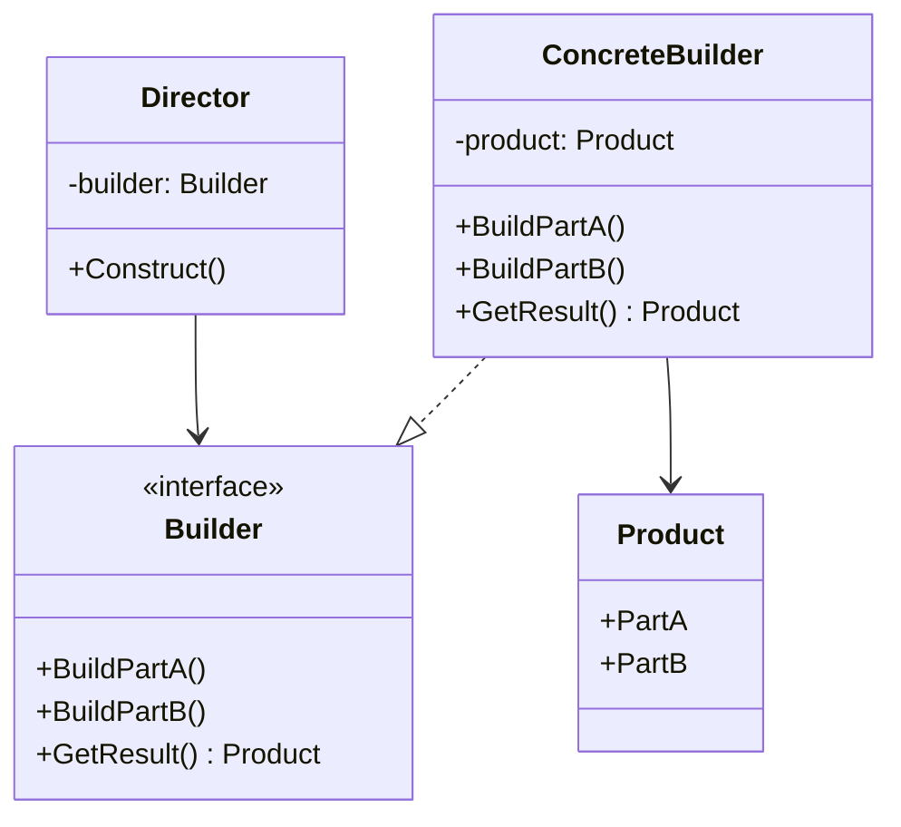
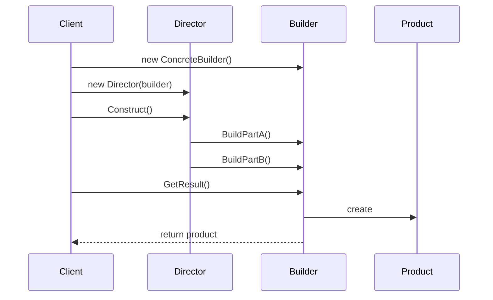

# 建造者模式 (Builder Pattern)

## 定义

建造者模式将复杂对象的构建与其表示分离，使得同样的构建过程可以创建不同的表示。

## 意图

- 分离对象的构建和表示
- 控制对象的构建过程
- 支持不同的对象表示
- 提供流畅的 API 接口

## 结构

### UML 类图



### UML 时序图



## 参与者

- **Builder（抽象建造者）**: 定义创建产品各个部分的接口
- **ConcreteBuilder（具体建造者）**: 实现 Builder 接口，构建产品的各个部分
- **Director（指挥者）**: 使用 Builder 接口构建对象
- **Product（产品）**: 被构建的复杂对象

## 协作

1. 客户端创建 Director 对象，并配置所需的 Builder 对象
2. Director 负责通知 Builder 何时构建产品的各个部分
3. Builder 处理 Director 的请求，并添加产品的各个部分
4. 客户端从 Builder 获取产品

## 适用场景

1. **构建复杂对象**
   - 对象有多个组成部分
   - 构建过程复杂且需要多个步骤

2. **对象有多个可选参数**
   - 避免构造函数参数过多
   - 提供更清晰的 API

3. **需要不同的对象表示**
   - 相同的构建过程，不同的表示
   - 如：HTML、XML、JSON 文档生成

4. **链式调用 API**
   - 提供流畅的接口
   - 提高代码可读性

5. **配置对象**
   - 服务器配置
   - HTTP 请求配置
   - 数据库连接配置

## 实现方式

### 1. 传统建造者模式

```go
// Product - 产品
type House struct {
    Foundation string
    Structure  string
    Roof       string
    Interior   string
}

// Builder - 抽象建造者
type HouseBuilder interface {
    BuildFoundation()
    BuildStructure()
    BuildRoof()
    BuildInterior()
    GetHouse() *House
}

// ConcreteBuilder - 具体建造者
type ConcreteHouseBuilder struct {
    house *House
}

func NewConcreteHouseBuilder() *ConcreteHouseBuilder {
    return &ConcreteHouseBuilder{house: &House{}}
}

func (b *ConcreteHouseBuilder) BuildFoundation() {
    b.house.Foundation = "Concrete Foundation"
}

func (b *ConcreteHouseBuilder) BuildStructure() {
    b.house.Structure = "Concrete Structure"
}

func (b *ConcreteHouseBuilder) BuildRoof() {
    b.house.Roof = "Concrete Roof"
}

func (b *ConcreteHouseBuilder) BuildInterior() {
    b.house.Interior = "Concrete Interior"
}

func (b *ConcreteHouseBuilder) GetHouse() *House {
    return b.house
}

// Director - 指挥者
type Director struct {
    builder HouseBuilder
}

func NewDirector(builder HouseBuilder) *Director {
    return &Director{builder: builder}
}

func (d *Director) Construct() {
    d.builder.BuildFoundation()
    d.builder.BuildStructure()
    d.builder.BuildRoof()
    d.builder.BuildInterior()
}

// 使用
func main() {
    builder := NewConcreteHouseBuilder()
    director := NewDirector(builder)
    director.Construct()
    house := builder.GetHouse()
}
```

### 2. 链式调用（Method Chaining）

```go
type HTTPRequest struct {
    Method  string
    URL     string
    Headers map[string]string
    Body    []byte
}

type HTTPRequestBuilder struct {
    request *HTTPRequest
}

func NewHTTPRequestBuilder() *HTTPRequestBuilder {
    return &HTTPRequestBuilder{
        request: &HTTPRequest{
            Headers: make(map[string]string),
        },
    }
}

func (b *HTTPRequestBuilder) Method(method string) *HTTPRequestBuilder {
    b.request.Method = method
    return b
}

func (b *HTTPRequestBuilder) URL(url string) *HTTPRequestBuilder {
    b.request.URL = url
    return b
}

func (b *HTTPRequestBuilder) Header(key, value string) *HTTPRequestBuilder {
    b.request.Headers[key] = value
    return b
}

func (b *HTTPRequestBuilder) Body(body []byte) *HTTPRequestBuilder {
    b.request.Body = body
    return b
}

func (b *HTTPRequestBuilder) Build() *HTTPRequest {
    return b.request
}

// 使用 - 链式调用
func main() {
    request := NewHTTPRequestBuilder().
        Method("POST").
        URL("https://api.example.com/users").
        Header("Content-Type", "application/json").
        Body([]byte(`{"name":"John"}`)).
        Build()
}
```

### 3. Functional Options 模式（Go 推荐）

```go
type Server struct {
    host    string
    port    int
    timeout time.Duration
    maxConn int
    tls     *tls.Config
}

// Option 是一个函数类型
type Option func(*Server)

// 提供各种选项函数
func WithHost(host string) Option {
    return func(s *Server) {
        s.host = host
    }
}

func WithPort(port int) Option {
    return func(s *Server) {
        s.port = port
    }
}

func WithTimeout(timeout time.Duration) Option {
    return func(s *Server) {
        s.timeout = timeout
    }
}

func WithMaxConn(maxConn int) Option {
    return func(s *Server) {
        s.maxConn = maxConn
    }
}

func WithTLS(config *tls.Config) Option {
    return func(s *Server) {
        s.tls = config
    }
}

// 构造函数接受可变数量的选项
func NewServer(opts ...Option) *Server {
    // 设置默认值
    s := &Server{
        host:    "localhost",
        port:    8080,
        timeout: 30 * time.Second,
        maxConn: 100,
    }
    
    // 应用所有选项
    for _, opt := range opts {
        opt(s)
    }
    
    return s
}

// 使用 - 灵活且优雅
func main() {
    // 使用默认值
    server1 := NewServer()
    
    // 自定义部分选项
    server2 := NewServer(
        WithHost("0.0.0.0"),
        WithPort(9090),
    )
    
    // 自定义所有选项
    server3 := NewServer(
        WithHost("192.168.1.100"),
        WithPort(443),
        WithTimeout(60 * time.Second),
        WithMaxConn(1000),
        WithTLS(tlsConfig),
    )
}
```

## 优缺点分析

### 优点

1. **分离构建和表示**
   - 构建逻辑独立
   - 易于维护和扩展

2. **更好的控制构建过程**
   - 可以精确控制构建步骤
   - 支持延迟构建

3. **代码可读性高**
   - 链式调用优雅
   - 参数含义清晰

4. **易于扩展**
   - 添加新的构建步骤简单
   - 不影响现有代码

5. **避免构造函数参数过多**
   - 解决"伸缩构造函数"问题
   - 提供默认值

### 缺点

1. **增加代码复杂度**
   - 需要额外的 Builder 类
   - 代码量增加

2. **可能过度设计**
   - 简单对象不需要建造者
   - 增加学习成本

## Go 语言实现要点

### 1. Functional Options 模式优势

```go
// ✅ 优点：
// - 向后兼容：添加新选项不影响现有代码
// - 默认值：可以提供合理的默认值
// - 可选参数：调用者只需指定需要的选项
// - 类型安全：编译时检查
// - 自文档化：选项名称清晰表达意图

type Config struct {
    timeout time.Duration
    retries int
    debug   bool
}

type ConfigOption func(*Config)

func WithTimeout(d time.Duration) ConfigOption {
    return func(c *Config) {
        c.timeout = d
    }
}

func WithRetries(n int) ConfigOption {
    return func(c *Config) {
        c.retries = n
    }
}

func WithDebug(debug bool) ConfigOption {
    return func(c *Config) {
        c.debug = debug
    }
}

func NewConfig(opts ...ConfigOption) *Config {
    c := &Config{
        timeout: 30 * time.Second,
        retries: 3,
        debug:   false,
    }
    for _, opt := range opts {
        opt(c)
    }
    return c
}
```

### 2. 验证和错误处理

```go
type Server struct {
    host string
    port int
}

type Option func(*Server) error

func WithHost(host string) Option {
    return func(s *Server) error {
        if host == "" {
            return errors.New("host cannot be empty")
        }
        s.host = host
        return nil
    }
}

func WithPort(port int) Option {
    return func(s *Server) error {
        if port < 1 || port > 65535 {
            return errors.New("invalid port number")
        }
        s.port = port
        return nil
    }
}

func NewServer(opts ...Option) (*Server, error) {
    s := &Server{
        host: "localhost",
        port: 8080,
    }
    
    for _, opt := range opts {
        if err := opt(s); err != nil {
            return nil, err
        }
    }
    
    return s, nil
}
```

### 3. 必需参数和可选参数

```go
// 必需参数作为普通参数，可选参数使用 Options
func NewDatabase(dsn string, opts ...Option) (*Database, error) {
    if dsn == "" {
        return nil, errors.New("dsn is required")
    }
    
    db := &Database{
        dsn:     dsn,
        maxConn: 10,
        timeout: 30 * time.Second,
    }
    
    for _, opt := range opts {
        opt(db)
    }
    
    return db, nil
}
```

## 实际应用

### 1. HTTP 客户端构建器

```go
type HTTPClient struct {
    baseURL    string
    timeout    time.Duration
    headers    map[string]string
    retries    int
    transport  *http.Transport
}

type ClientOption func(*HTTPClient)

func WithBaseURL(url string) ClientOption {
    return func(c *HTTPClient) {
        c.baseURL = url
    }
}

func WithTimeout(timeout time.Duration) ClientOption {
    return func(c *HTTPClient) {
        c.timeout = timeout
    }
}

func WithHeader(key, value string) ClientOption {
    return func(c *HTTPClient) {
        if c.headers == nil {
            c.headers = make(map[string]string)
        }
        c.headers[key] = value
    }
}

func WithRetries(retries int) ClientOption {
    return func(c *HTTPClient) {
        c.retries = retries
    }
}

func NewHTTPClient(opts ...ClientOption) *HTTPClient {
    client := &HTTPClient{
        timeout: 30 * time.Second,
        headers: make(map[string]string),
        retries: 3,
    }
    
    for _, opt := range opts {
        opt(client)
    }
    
    return client
}
```

### 2. SQL 查询构建器

```go
type Query struct {
    table   string
    columns []string
    where   []string
    orderBy string
    limit   int
}

type QueryBuilder struct {
    query *Query
}

func NewQueryBuilder(table string) *QueryBuilder {
    return &QueryBuilder{
        query: &Query{
            table:   table,
            columns: []string{"*"},
        },
    }
}

func (b *QueryBuilder) Select(columns ...string) *QueryBuilder {
    b.query.columns = columns
    return b
}

func (b *QueryBuilder) Where(condition string) *QueryBuilder {
    b.query.where = append(b.query.where, condition)
    return b
}

func (b *QueryBuilder) OrderBy(column string) *QueryBuilder {
    b.query.orderBy = column
    return b
}

func (b *QueryBuilder) Limit(limit int) *QueryBuilder {
    b.query.limit = limit
    return b
}

func (b *QueryBuilder) Build() string {
    sql := fmt.Sprintf("SELECT %s FROM %s",
        strings.Join(b.query.columns, ", "),
        b.query.table)
    
    if len(b.query.where) > 0 {
        sql += " WHERE " + strings.Join(b.query.where, " AND ")
    }
    
    if b.query.orderBy != "" {
        sql += " ORDER BY " + b.query.orderBy
    }
    
    if b.query.limit > 0 {
        sql += fmt.Sprintf(" LIMIT %d", b.query.limit)
    }
    
    return sql
}

// 使用
func main() {
    sql := NewQueryBuilder("users").
        Select("id", "name", "email").
        Where("age > 18").
        Where("status = 'active'").
        OrderBy("created_at DESC").
        Limit(10).
        Build()
    
    fmt.Println(sql)
    // SELECT id, name, email FROM users WHERE age > 18 AND status = 'active' ORDER BY created_at DESC LIMIT 10
}
```

### 3. 配置构建器

```go
type AppConfig struct {
    name        string
    version     string
    environment string
    database    DatabaseConfig
    server      ServerConfig
    logging     LoggingConfig
}

type DatabaseConfig struct {
    host     string
    port     int
    username string
    password string
}

type ServerConfig struct {
    host string
    port int
}

type LoggingConfig struct {
    level  string
    output string
}

type ConfigOption func(*AppConfig)

func WithName(name string) ConfigOption {
    return func(c *AppConfig) {
        c.name = name
    }
}

func WithDatabase(host string, port int, user, pass string) ConfigOption {
    return func(c *AppConfig) {
        c.database = DatabaseConfig{
            host:     host,
            port:     port,
            username: user,
            password: pass,
        }
    }
}

func WithServer(host string, port int) ConfigOption {
    return func(c *AppConfig) {
        c.server = ServerConfig{
            host: host,
            port: port,
        }
    }
}

func WithLogging(level, output string) ConfigOption {
    return func(c *AppConfig) {
        c.logging = LoggingConfig{
            level:  level,
            output: output,
        }
    }
}

func NewAppConfig(opts ...ConfigOption) *AppConfig {
    config := &AppConfig{
        name:        "MyApp",
        version:     "1.0.0",
        environment: "development",
    }
    
    for _, opt := range opts {
        opt(config)
    }
    
    return config
}
```

## 使用建议

### 何时使用

✅ **应该使用**:
- 对象有多个可选参数（>3 个）
- 构建过程复杂
- 需要不同的对象表示
- 需要链式调用 API

❌ **不应该使用**:
- 对象简单，参数少
- 构建过程简单
- 不需要灵活性

### 最佳实践

1. **在 Go 中优先使用 Functional Options**
   ```go
   // ✅ 推荐
   func NewServer(opts ...Option) *Server
   
   // ❌ 不推荐
   func NewServer(host string, port int, timeout time.Duration, ...)
   ```

2. **提供合理的默认值**
   ```go
   func NewConfig(opts ...Option) *Config {
       c := &Config{
           timeout: 30 * time.Second,  // 默认值
           retries: 3,                  // 默认值
       }
       // ...
   }
   ```

3. **选项函数命名清晰**
   ```go
   // ✅ 清晰
   WithTimeout(30 * time.Second)
   WithMaxConnections(100)
   
   // ❌ 不清晰
   Timeout(30)
   MaxConn(100)
   ```

4. **支持验证**
   ```go
   func WithPort(port int) Option {
       return func(s *Server) error {
           if port < 1 || port > 65535 {
               return errors.New("invalid port")
           }
           s.port = port
           return nil
       }
   }
   ```

## 常见问题

### Q1: 建造者模式和工厂模式有什么区别？

- **工厂模式**: 关注创建什么对象（对象类型）
- **建造者模式**: 关注如何创建对象（构建过程）

### Q2: 什么时候使用 Functional Options？

当对象有多个可选参数时。它比传统建造者模式更简洁，更符合 Go 的风格。

### Q3: Functional Options 的性能如何？

性能开销很小，主要是函数调用。对于大多数应用来说，可读性和灵活性的收益远大于性能开销。

### Q4: 如何处理必需参数？

将必需参数作为构造函数的普通参数，可选参数使用 Options：
```go
func NewDatabase(dsn string, opts ...Option) *Database
```

## 总结

建造者模式是一个强大的创建型模式，特别适合构建复杂对象。在 Go 语言中，Functional Options 模式是最推荐的实现方式，它提供了灵活性、可读性和向后兼容性。

**记住**:
- ✅ 在 Go 中使用 Functional Options
- ✅ 提供合理的默认值
- ✅ 选项函数命名清晰
- ✅ 支持验证和错误处理
- ❌ 不要过度设计简单对象
