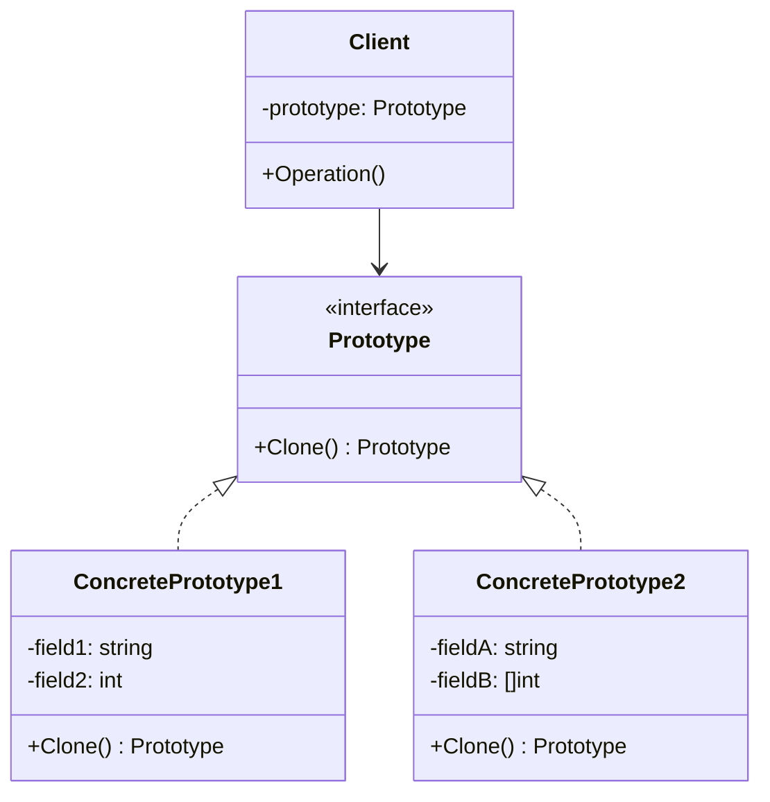
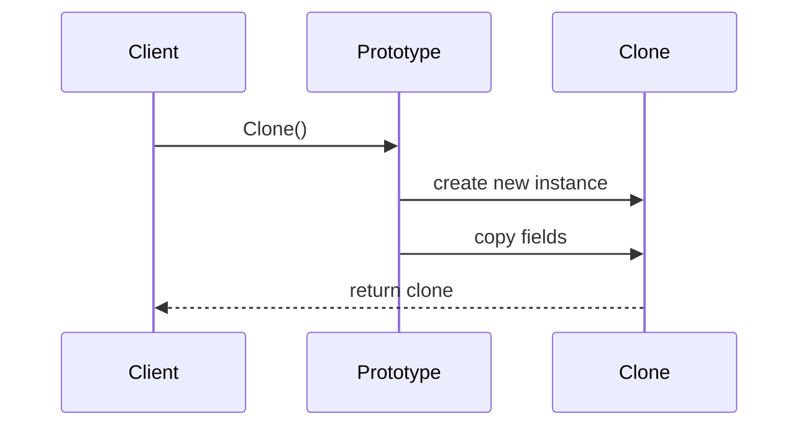

# 原型模式 (Prototype Pattern)

## 定义

原型模式通过复制现有对象来创建新对象，而不是通过实例化类。

## 意图

- 通过克隆创建对象
- 避免复杂的初始化过程
- 减少对象创建的开销
- 保存对象状态快照

## 结构

### UML 类图



### UML 时序图



## 参与者

- **Prototype（原型接口）**: 声明克隆方法
- **ConcretePrototype（具体原型）**: 实现克隆方法
- **Client（客户端）**: 通过调用原型的克隆方法创建新对象

## 协作

1. 客户端请求原型克隆自己
2. 原型创建一个新对象并复制自己的状态
3. 返回克隆的对象给客户端

## 适用场景

1. **对象创建成本高**
   - 初始化需要大量计算
   - 需要访问数据库或网络
   - 需要复杂的配置

2. **需要大量相似对象**
   - 游戏中的敌人、道具
   - 文档模板
   - 配置对象

3. **避免复杂的初始化**
   - 对象有复杂的依赖关系
   - 初始化过程繁琐

4. **保存对象状态**
   - 实现撤销/重做功能
   - 保存检查点
   - 历史记录

5. **运行时确定对象类型**
   - 动态加载类
   - 插件系统

## 深拷贝 vs 浅拷贝

### 浅拷贝 (Shallow Copy)

**定义**: 只复制对象的值类型字段和引用，不复制引用指向的对象。

```go
type Address struct {
    City    string
    Country string
}

type Person struct {
    Name    string
    Age     int
    Address *Address  // 引用类型
}

// 浅拷贝
func (p *Person) ShallowCopy() *Person {
    return &Person{
        Name:    p.Name,
        Age:     p.Age,
        Address: p.Address,  // 只复制指针，不复制对象
    }
}

// 使用
func main() {
    original := &Person{
        Name: "Alice",
        Age:  30,
        Address: &Address{
            City:    "Beijing",
            Country: "China",
        },
    }
    
    clone := original.ShallowCopy()
    
    // 修改克隆对象的地址
    clone.Address.City = "Shanghai"
    
    // 原始对象也被修改了！
    fmt.Println(original.Address.City)  // 输出: Shanghai
}
```

**特点**:
- ✅ 速度快
- ✅ 内存占用少
- ❌ 共享引用类型数据
- ❌ 修改克隆对象会影响原对象

### 深拷贝 (Deep Copy)

**定义**: 递归复制对象的所有字段，包括引用类型指向的对象。

```go
// 深拷贝
func (p *Person) DeepCopy() *Person {
    return &Person{
        Name: p.Name,
        Age:  p.Age,
        Address: &Address{  // 创建新的 Address 对象
            City:    p.Address.City,
            Country: p.Address.Country,
        },
    }
}

// 使用
func main() {
    original := &Person{
        Name: "Alice",
        Age:  30,
        Address: &Address{
            City:    "Beijing",
            Country: "China",
        },
    }
    
    clone := original.DeepCopy()
    
    // 修改克隆对象的地址
    clone.Address.City = "Shanghai"
    
    // 原始对象不受影响
    fmt.Println(original.Address.City)  // 输出: Beijing
    fmt.Println(clone.Address.City)     // 输出: Shanghai
}
```

**特点**:
- ✅ 完全独立的副本
- ✅ 修改克隆对象不影响原对象
- ❌ 速度较慢
- ❌ 内存占用多

### 对比表

| 特性 | 浅拷贝 | 深拷贝 |
|------|--------|--------|
| 复制内容 | 值类型 + 引用 | 递归复制所有内容 |
| 性能 | 快 | 慢 |
| 内存 | 少 | 多 |
| 独立性 | 共享引用数据 | 完全独立 |
| 实现难度 | 简单 | 复杂 |
| 适用场景 | 不可变对象 | 需要完全独立的副本 |

## Go 语言实现方式

### 1. 手动实现 Clone 方法

```go
type Document struct {
    Title   string
    Content string
    Tags    []string
    Meta    map[string]string
}

// 深拷贝
func (d *Document) Clone() *Document {
    // 复制切片
    tags := make([]string, len(d.Tags))
    copy(tags, d.Tags)
    
    // 复制 map
    meta := make(map[string]string)
    for k, v := range d.Meta {
        meta[k] = v
    }
    
    return &Document{
        Title:   d.Title,
        Content: d.Content,
        Tags:    tags,
        Meta:    meta,
    }
}
```

### 2. 使用 encoding/gob

```go
import (
    "bytes"
    "encoding/gob"
)

// 通用深拷贝函数
func DeepCopy(src, dst interface{}) error {
    var buf bytes.Buffer
    
    // 编码
    if err := gob.NewEncoder(&buf).Encode(src); err != nil {
        return err
    }
    
    // 解码
    return gob.NewDecoder(&buf).Decode(dst)
}

// 使用
func main() {
    original := &Document{
        Title:   "Go Design Patterns",
        Content: "...",
        Tags:    []string{"go", "patterns"},
        Meta:    map[string]string{"author": "Alice"},
    }
    
    var clone Document
    if err := DeepCopy(original, &clone); err != nil {
        panic(err)
    }
}
```

### 3. 使用 JSON 序列化

```go
import (
    "encoding/json"
)

func DeepCopyJSON(src, dst interface{}) error {
    data, err := json.Marshal(src)
    if err != nil {
        return err
    }
    return json.Unmarshal(data, dst)
}
```

### 4. 使用反射（通用但性能较差）

```go
import (
    "reflect"
)

func DeepCopyReflect(src interface{}) interface{} {
    if src == nil {
        return nil
    }
    
    original := reflect.ValueOf(src)
    clone := reflect.New(original.Type()).Elem()
    
    copyRecursive(original, clone)
    
    return clone.Interface()
}

func copyRecursive(src, dst reflect.Value) {
    switch src.Kind() {
    case reflect.Ptr:
        originalValue := src.Elem()
        if !originalValue.IsValid() {
            return
        }
        dst.Set(reflect.New(originalValue.Type()))
        copyRecursive(originalValue, dst.Elem())
        
    case reflect.Struct:
        for i := 0; i < src.NumField(); i++ {
            copyRecursive(src.Field(i), dst.Field(i))
        }
        
    case reflect.Slice:
        dst.Set(reflect.MakeSlice(src.Type(), src.Len(), src.Cap()))
        for i := 0; i < src.Len(); i++ {
            copyRecursive(src.Index(i), dst.Index(i))
        }
        
    case reflect.Map:
        dst.Set(reflect.MakeMap(src.Type()))
        for _, key := range src.MapKeys() {
            originalValue := src.MapIndex(key)
            copyValue := reflect.New(originalValue.Type()).Elem()
            copyRecursive(originalValue, copyValue)
            dst.SetMapIndex(key, copyValue)
        }
        
    default:
        dst.Set(src)
    }
}
```

## 优缺点分析

### 优点

1. **性能优势**
   - 避免重复的初始化过程
   - 减少对象创建开销

2. **简化对象创建**
   - 不需要知道对象的具体类型
   - 避免复杂的构造过程

3. **动态添加和删除对象**
   - 运行时注册和克隆原型
   - 灵活性高

4. **保存状态**
   - 实现撤销/重做
   - 保存检查点

### 缺点

1. **深拷贝复杂**
   - 循环引用问题
   - 实现复杂

2. **每个类都需要实现 Clone**
   - 增加代码量
   - 维护成本高

3. **可能违反封装**
   - 需要访问私有字段
   - 破坏封装性

## 实际应用

### 1. 配置对象克隆

```go
type DatabaseConfig struct {
    Host     string
    Port     int
    Username string
    Password string
    Options  map[string]string
}

func (c *DatabaseConfig) Clone() *DatabaseConfig {
    options := make(map[string]string)
    for k, v := range c.Options {
        options[k] = v
    }
    
    return &DatabaseConfig{
        Host:     c.Host,
        Port:     c.Port,
        Username: c.Username,
        Password: c.Password,
        Options:  options,
    }
}

// 使用
func main() {
    prodConfig := &DatabaseConfig{
        Host:     "prod.db.com",
        Port:     5432,
        Username: "admin",
        Password: "secret",
        Options:  map[string]string{"ssl": "true"},
    }
    
    // 克隆用于测试环境
    testConfig := prodConfig.Clone()
    testConfig.Host = "test.db.com"
    testConfig.Username = "test_user"
}
```

### 2. 游戏对象克隆

```go
type Enemy struct {
    Name      string
    Health    int
    Attack    int
    Defense   int
    Skills    []string
    Equipment map[string]string
}

func (e *Enemy) Clone() *Enemy {
    skills := make([]string, len(e.Skills))
    copy(skills, e.Skills)
    
    equipment := make(map[string]string)
    for k, v := range e.Equipment {
        equipment[k] = v
    }
    
    return &Enemy{
        Name:      e.Name,
        Health:    e.Health,
        Attack:    e.Attack,
        Defense:   e.Defense,
        Skills:    skills,
        Equipment: equipment,
    }
}

// 使用 - 创建多个相似的敌人
func main() {
    // 创建原型
    goblinPrototype := &Enemy{
        Name:      "Goblin",
        Health:    100,
        Attack:    20,
        Defense:   10,
        Skills:    []string{"slash", "dodge"},
        Equipment: map[string]string{"weapon": "dagger"},
    }
    
    // 克隆多个敌人
    enemies := make([]*Enemy, 10)
    for i := 0; i < 10; i++ {
        enemies[i] = goblinPrototype.Clone()
        // 可以对每个克隆进行微调
        enemies[i].Health += rand.Intn(20)
    }
}
```

### 3. 文档模板系统

```go
type DocumentTemplate struct {
    Title    string
    Sections []Section
    Styles   map[string]string
}

type Section struct {
    Heading string
    Content string
}

func (t *DocumentTemplate) Clone() *DocumentTemplate {
    sections := make([]Section, len(t.Sections))
    for i, s := range t.Sections {
        sections[i] = Section{
            Heading: s.Heading,
            Content: s.Content,
        }
    }
    
    styles := make(map[string]string)
    for k, v := range t.Styles {
        styles[k] = v
    }
    
    return &DocumentTemplate{
        Title:    t.Title,
        Sections: sections,
        Styles:   styles,
    }
}

// 使用
func main() {
    // 创建报告模板
    reportTemplate := &DocumentTemplate{
        Title: "Monthly Report",
        Sections: []Section{
            {Heading: "Summary", Content: ""},
            {Heading: "Details", Content: ""},
            {Heading: "Conclusion", Content: ""},
        },
        Styles: map[string]string{"font": "Arial", "size": "12pt"},
    }
    
    // 为每个月创建报告
    januaryReport := reportTemplate.Clone()
    januaryReport.Title = "January Report"
    januaryReport.Sections[0].Content = "January summary..."
    
    februaryReport := reportTemplate.Clone()
    februaryReport.Title = "February Report"
    februaryReport.Sections[0].Content = "February summary..."
}
```

### 4. 撤销/重做功能

```go
type Editor struct {
    content string
    history []*Snapshot
    current int
}

type Snapshot struct {
    content string
}

func (s *Snapshot) Clone() *Snapshot {
    return &Snapshot{
        content: s.content,
    }
}

func (e *Editor) Save() {
    snapshot := &Snapshot{content: e.content}
    e.history = append(e.history[:e.current+1], snapshot)
    e.current++
}

func (e *Editor) Undo() {
    if e.current > 0 {
        e.current--
        e.content = e.history[e.current].content
    }
}

func (e *Editor) Redo() {
    if e.current < len(e.history)-1 {
        e.current++
        e.content = e.history[e.current].content
    }
}
```

## 使用建议

### 何时使用

✅ **应该使用**:
- 对象创建成本高
- 需要大量相似对象
- 需要保存对象状态
- 避免复杂的初始化

❌ **不应该使用**:
- 对象简单，创建成本低
- 不需要克隆功能
- 对象有复杂的循环引用

### 最佳实践

1. **明确深拷贝和浅拷贝**
   ```go
   // 明确命名
   func (o *Object) ShallowCopy() *Object { ... }
   func (o *Object) DeepCopy() *Object { ... }
   ```

2. **处理循环引用**
   ```go
   type Node struct {
       Value int
       Next  *Node
   }
   
   func (n *Node) Clone(visited map[*Node]*Node) *Node {
       if n == nil {
           return nil
       }
       
       if clone, ok := visited[n]; ok {
           return clone
       }
       
       clone := &Node{Value: n.Value}
       visited[n] = clone
       clone.Next = n.Next.Clone(visited)
       
       return clone
   }
   ```

3. **考虑性能**
   ```go
   // 对于简单对象，手动实现最快
   func (o *SimpleObject) Clone() *SimpleObject {
       return &SimpleObject{
           Field1: o.Field1,
           Field2: o.Field2,
       }
   }
   
   // 对于复杂对象，考虑使用 gob
   func (o *ComplexObject) Clone() (*ComplexObject, error) {
       var clone ComplexObject
       err := DeepCopy(o, &clone)
       return &clone, err
   }
   ```

4. **提供克隆选项**
   ```go
   type CloneOption func(*Object)
   
   func (o *Object) Clone(opts ...CloneOption) *Object {
       clone := &Object{
           Field1: o.Field1,
           Field2: o.Field2,
       }
       
       for _, opt := range opts {
           opt(clone)
       }
       
       return clone
   }
   
   // 使用
   clone := original.Clone(
       func(o *Object) { o.Field1 = "modified" },
   )
   ```

## 常见问题

### Q1: 什么时候使用深拷贝，什么时候使用浅拷贝？

- **浅拷贝**: 对象包含不可变数据，或者明确希望共享数据
- **深拷贝**: 需要完全独立的副本，修改克隆对象不应影响原对象

### Q2: 如何处理循环引用？

使用一个 map 记录已经克隆的对象，避免无限递归：
```go
func Clone(obj *Node, visited map[*Node]*Node) *Node {
    if clone, ok := visited[obj]; ok {
        return clone
    }
    // ...
}
```

### Q3: 哪种深拷贝方法最好？

- **手动实现**: 性能最好，但需要维护
- **gob**: 通用，性能较好，但有限制（需要导出字段）
- **JSON**: 简单，但性能较差，且会丢失类型信息
- **反射**: 最通用，但性能最差

### Q4: 原型模式和工厂模式有什么区别？

- **工厂模式**: 通过类创建新对象
- **原型模式**: 通过克隆现有对象创建新对象

## 性能对比

```go
// 基准测试示例
func BenchmarkManualClone(b *testing.B) {
    obj := &Object{...}
    for i := 0; i < b.N; i++ {
        _ = obj.ManualClone()
    }
}

func BenchmarkGobClone(b *testing.B) {
    obj := &Object{...}
    for i := 0; i < b.N; i++ {
        var clone Object
        _ = DeepCopy(obj, &clone)
    }
}

func BenchmarkJSONClone(b *testing.B) {
    obj := &Object{...}
    for i := 0; i < b.N; i++ {
        var clone Object
        _ = DeepCopyJSON(obj, &clone)
    }
}

// 典型结果:
// BenchmarkManualClone-8    10000000    150 ns/op
// BenchmarkGobClone-8        100000   15000 ns/op
// BenchmarkJSONClone-8        50000   30000 ns/op
```

## 总结

原型模式通过克隆创建对象，适合对象创建成本高或需要保存状态的场景。在 Go 语言中，可以根据需求选择手动实现、gob 序列化或 JSON 序列化等方式。深拷贝和浅拷贝各有优缺点，需要根据具体场景选择。

**记住**:
- ✅ 明确深拷贝和浅拷贝的区别
- ✅ 根据性能需求选择实现方式
- ✅ 处理循环引用问题
- ✅ 考虑不可变对象
- ❌ 不要过度使用反射
- ❌ 注意 gob 的限制（需要导出字段）
