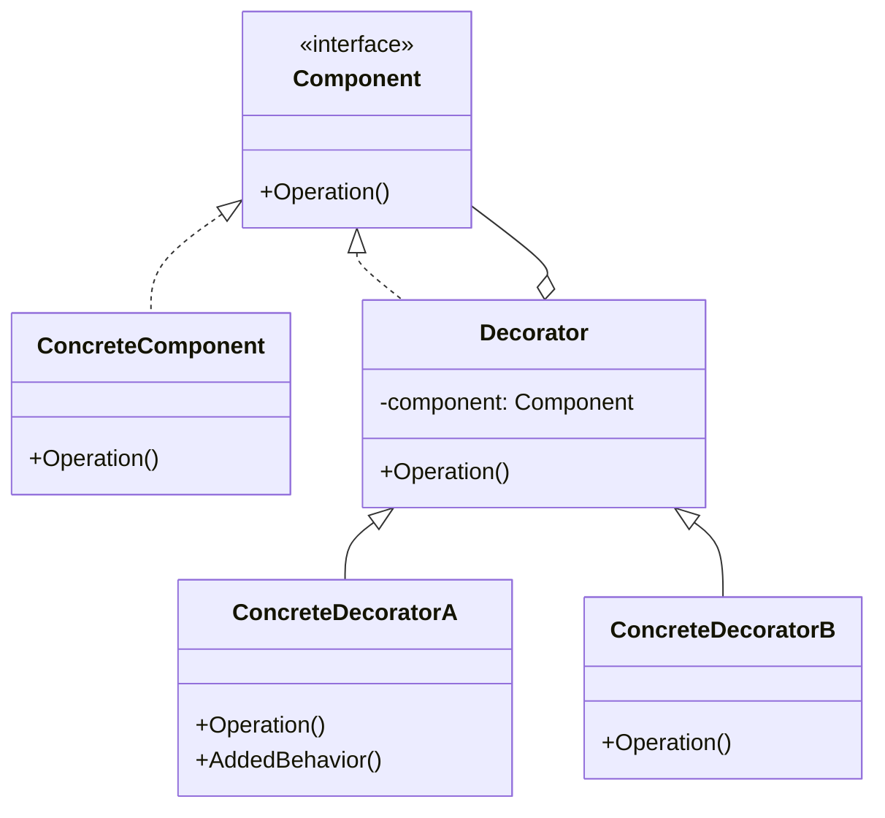
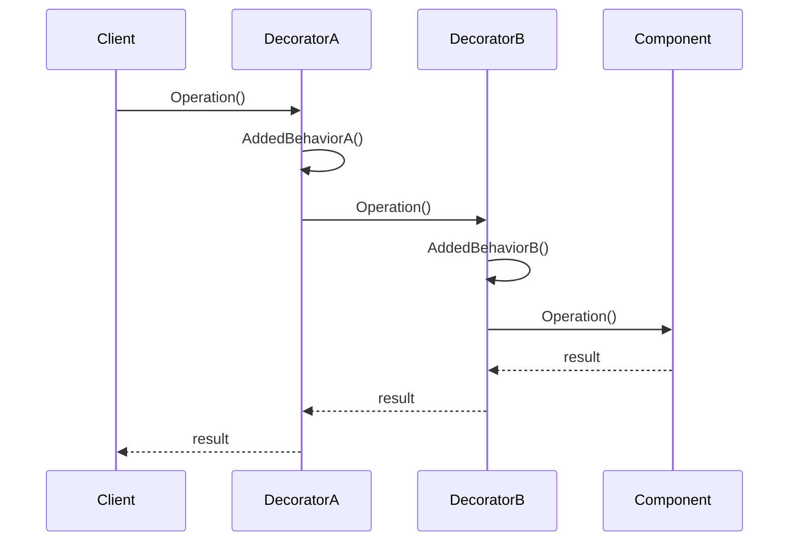

# 装饰器模式 (Decorator Pattern)

## 定义

装饰器模式动态地给对象添加额外的职责，提供了比继承更灵活的扩展方式。

## 意图

- 动态添加功能
- 避免类爆炸
- 遵循开闭原则
- 提供灵活的功能组合
- 替代继承

## 别名

- 包装器（Wrapper）

## 动机

假设你正在开发一个咖啡店系统，有多种咖啡和配料：

```go
// 使用继承的方式（不推荐）
type Coffee interface {
    Cost() float64
    Description() string
}

type SimpleCoffee struct{}
type CoffeeWithMilk struct{}
type CoffeeWithSugar struct{}
type CoffeeWithMilkAndSugar struct{}
type CoffeeWithMilkAndSugarAndWhip struct{}
// ... 组合爆炸！
```

如果有 N 种配料，可能需要 2^N 个类！这就是"类爆炸"问题。

使用装饰器模式：

```go
// 基础组件
type Coffee interface {
    Cost() float64
    Description() string
}

type SimpleCoffee struct{}

func (c *SimpleCoffee) Cost() float64 {
    return 10.0
}

func (c *SimpleCoffee) Description() string {
    return "Simple Coffee"
}

// 装饰器基类
type CoffeeDecorator struct {
    coffee Coffee
}

// 牛奶装饰器
type MilkDecorator struct {
    CoffeeDecorator
}

func (m *MilkDecorator) Cost() float64 {
    return m.coffee.Cost() + 2.0
}

func (m *MilkDecorator) Description() string {
    return m.coffee.Description() + ", Milk"
}

// 使用
coffee := &SimpleCoffee{}
coffeeWithMilk := &MilkDecorator{CoffeeDecorator{coffee}}
coffeeWithMilkAndSugar := &SugarDecorator{CoffeeDecorator{coffeeWithMilk}}
```

现在可以灵活组合任意数量的装饰器，而不需要创建大量的类。

## 结构

### UML 类图



### UML 时序图



## 参与者

- **Component（抽象组件）**: 定义对象的接口
- **ConcreteComponent（具体组件）**: 实现基本功能
- **Decorator（抽象装饰器）**: 持有 Component 的引用，实现 Component 接口
- **ConcreteDecorator（具体装饰器）**: 添加额外的功能

## 协作

1. Decorator 将请求转发给 Component
2. 在转发前后可以添加额外的操作
3. 可以嵌套多个装饰器

## 适用场景

1. **HTTP 中间件**
   - 日志记录
   - 认证授权
   - 限流
   - 缓存

2. **I/O 流处理**
   - 缓冲
   - 压缩
   - 加密
   - 编码转换

3. **UI 组件**
   - 边框
   - 滚动条
   - 阴影效果

4. **功能增强**
   - 性能监控
   - 错误处理
   - 重试机制
   - 数据验证

5. **动态功能组合**
   - 需要灵活组合多个功能
   - 避免类爆炸

## 实现方式

### 1. 传统装饰器模式

```go
package main

import "fmt"

// Component - 抽象组件
type DataSource interface {
    WriteData(data string)
    ReadData() string
}

// ConcreteComponent - 具体组件
type FileDataSource struct {
    filename string
    data     string
}

func NewFileDataSource(filename string) *FileDataSource {
    return &FileDataSource{filename: filename}
}

func (f *FileDataSource) WriteData(data string) {
    f.data = data
    fmt.Printf("Writing data to file: %s\n", f.filename)
}

func (f *FileDataSource) ReadData() string {
    fmt.Printf("Reading data from file: %s\n", f.filename)
    return f.data
}

// Decorator - 装饰器基类
type DataSourceDecorator struct {
    wrappee DataSource
}

func (d *DataSourceDecorator) WriteData(data string) {
    d.wrappee.WriteData(data)
}

func (d *DataSourceDecorator) ReadData() string {
    return d.wrappee.ReadData()
}

// ConcreteDecorator - 加密装饰器
type EncryptionDecorator struct {
    DataSourceDecorator
}

func NewEncryptionDecorator(source DataSource) *EncryptionDecorator {
    return &EncryptionDecorator{
        DataSourceDecorator{wrappee: source},
    }
}

func (e *EncryptionDecorator) WriteData(data string) {
    encrypted := e.encrypt(data)
    e.wrappee.WriteData(encrypted)
}

func (e *EncryptionDecorator) ReadData() string {
    data := e.wrappee.ReadData()
    return e.decrypt(data)
}

func (e *EncryptionDecorator) encrypt(data string) string {
    fmt.Println("Encrypting data")
    return "encrypted(" + data + ")"
}

func (e *EncryptionDecorator) decrypt(data string) string {
    fmt.Println("Decrypting data")
    return data // 简化实现
}

// ConcreteDecorator - 压缩装饰器
type CompressionDecorator struct {
    DataSourceDecorator
}

func NewCompressionDecorator(source DataSource) *CompressionDecorator {
    return &CompressionDecorator{
        DataSourceDecorator{wrappee: source},
    }
}

func (c *CompressionDecorator) WriteData(data string) {
    compressed := c.compress(data)
    c.wrappee.WriteData(compressed)
}

func (c *CompressionDecorator) ReadData() string {
    data := c.wrappee.ReadData()
    return c.decompress(data)
}

func (c *CompressionDecorator) compress(data string) string {
    fmt.Println("Compressing data")
    return "compressed(" + data + ")"
}

func (c *CompressionDecorator) decompress(data string) string {
    fmt.Println("Decompressing data")
    return data // 简化实现
}

func main() {
    // 基础数据源
    source := NewFileDataSource("data.txt")
    
    // 添加加密
    encrypted := NewEncryptionDecorator(source)
    
    // 添加压缩
    compressed := NewCompressionDecorator(encrypted)
    
    // 使用装饰后的对象
    compressed.WriteData("Hello, World!")
    fmt.Println()
    data := compressed.ReadData()
    fmt.Printf("Final data: %s\n", data)
}
```

### 2. 函数式装饰器（Go 推荐）

```go
package main

import (
    "fmt"
    "log"
    "net/http"
    "time"
)

// HandlerFunc 类型
type HandlerFunc func(http.ResponseWriter, *http.Request)

// Middleware 类型
type Middleware func(HandlerFunc) HandlerFunc

// 日志中间件
func LoggingMiddleware() Middleware {
    return func(next HandlerFunc) HandlerFunc {
        return func(w http.ResponseWriter, r *http.Request) {
            start := time.Now()
            log.Printf("Started %s %s", r.Method, r.URL.Path)
            
            next(w, r)
            
            log.Printf("Completed in %v", time.Since(start))
        }
    }
}

// 认证中间件
func AuthMiddleware(token string) Middleware {
    return func(next HandlerFunc) HandlerFunc {
        return func(w http.ResponseWriter, r *http.Request) {
            authToken := r.Header.Get("Authorization")
            if authToken != token {
                http.Error(w, "Unauthorized", http.StatusUnauthorized)
                return
            }
            next(w, r)
        }
    }
}

// 恢复中间件
func RecoveryMiddleware() Middleware {
    return func(next HandlerFunc) HandlerFunc {
        return func(w http.ResponseWriter, r *http.Request) {
            defer func() {
                if err := recover(); err != nil {
                    log.Printf("Panic recovered: %v", err)
                    http.Error(w, "Internal Server Error", http.StatusInternalServerError)
                }
            }()
            next(w, r)
        }
    }
}

// 限流中间件
func RateLimitMiddleware(maxRequests int) Middleware {
    requests := 0
    return func(next HandlerFunc) HandlerFunc {
        return func(w http.ResponseWriter, r *http.Request) {
            requests++
            if requests > maxRequests {
                http.Error(w, "Too Many Requests", http.StatusTooManyRequests)
                return
            }
            next(w, r)
        }
    }
}

// 链式组合中间件
func Chain(handler HandlerFunc, middlewares ...Middleware) HandlerFunc {
    // 从后向前应用中间件
    for i := len(middlewares) - 1; i >= 0; i-- {
        handler = middlewares[i](handler)
    }
    return handler
}

// 业务处理器
func HelloHandler(w http.ResponseWriter, r *http.Request) {
    fmt.Fprintf(w, "Hello, World!")
}

func main() {
    // 组合多个中间件
    handler := Chain(
        HelloHandler,
        RecoveryMiddleware(),
        LoggingMiddleware(),
        AuthMiddleware("secret-token"),
        RateLimitMiddleware(100),
    )
    
    http.HandleFunc("/hello", handler)
    log.Println("Server starting on :8080")
    http.ListenAndServe(":8080", nil)
}
```

### 3. 接口装饰器

```go
package main

import (
    "fmt"
    "time"
)

// Service 接口
type Service interface {
    Execute(data string) (string, error)
}

// 基础服务
type BasicService struct{}

func (s *BasicService) Execute(data string) (string, error) {
    return "Processed: " + data, nil
}

// 日志装饰器
type LoggingDecorator struct {
    service Service
}

func NewLoggingDecorator(service Service) *LoggingDecorator {
    return &LoggingDecorator{service: service}
}

func (d *LoggingDecorator) Execute(data string) (string, error) {
    fmt.Printf("[LOG] Executing with data: %s\n", data)
    result, err := d.service.Execute(data)
    if err != nil {
        fmt.Printf("[LOG] Error: %v\n", err)
    } else {
        fmt.Printf("[LOG] Result: %s\n", result)
    }
    return result, err
}

// 性能监控装饰器
type MetricsDecorator struct {
    service Service
}

func NewMetricsDecorator(service Service) *MetricsDecorator {
    return &MetricsDecorator{service: service}
}

func (d *MetricsDecorator) Execute(data string) (string, error) {
    start := time.Now()
    result, err := d.service.Execute(data)
    duration := time.Since(start)
    fmt.Printf("[METRICS] Execution time: %v\n", duration)
    return result, err
}

// 缓存装饰器
type CacheDecorator struct {
    service Service
    cache   map[string]string
}

func NewCacheDecorator(service Service) *CacheDecorator {
    return &CacheDecorator{
        service: service,
        cache:   make(map[string]string),
    }
}

func (d *CacheDecorator) Execute(data string) (string, error) {
    if cached, ok := d.cache[data]; ok {
        fmt.Printf("[CACHE] Cache hit for: %s\n", data)
        return cached, nil
    }
    
    fmt.Printf("[CACHE] Cache miss for: %s\n", data)
    result, err := d.service.Execute(data)
    if err == nil {
        d.cache[data] = result
    }
    return result, err
}

// 重试装饰器
type RetryDecorator struct {
    service    Service
    maxRetries int
}

func NewRetryDecorator(service Service, maxRetries int) *RetryDecorator {
    return &RetryDecorator{
        service:    service,
        maxRetries: maxRetries,
    }
}

func (d *RetryDecorator) Execute(data string) (string, error) {
    var err error
    var result string
    
    for i := 0; i <= d.maxRetries; i++ {
        if i > 0 {
            fmt.Printf("[RETRY] Attempt %d/%d\n", i, d.maxRetries)
        }
        result, err = d.service.Execute(data)
        if err == nil {
            return result, nil
        }
    }
    
    return "", fmt.Errorf("failed after %d retries: %w", d.maxRetries, err)
}

func main() {
    // 创建基础服务
    service := &BasicService{}
    
    // 逐层装饰
    service = NewCacheDecorator(service)
    service = NewMetricsDecorator(service)
    service = NewLoggingDecorator(service)
    service = NewRetryDecorator(service, 3)
    
    // 使用装饰后的服务
    result, _ := service.Execute("test data")
    fmt.Printf("\nFinal result: %s\n", result)
    
    fmt.Println("\n--- Second call (should hit cache) ---")
    result, _ = service.Execute("test data")
    fmt.Printf("\nFinal result: %s\n", result)
}
```

## 优缺点分析

### 优点

1. **比继承更灵活**
   - 运行时动态组合
   - 可以任意组合装饰器

2. **遵循开闭原则**
   - 添加新功能不修改现有代码
   - 易于扩展

3. **遵循单一职责原则**
   - 每个装饰器只负责一个功能
   - 职责清晰

4. **避免类爆炸**
   - 不需要为每种组合创建类
   - 减少类的数量

5. **功能可组合**
   - 可以灵活组合多个装饰器
   - 顺序可调整

### 缺点

1. **产生很多小对象**
   - 每个装饰器都是一个对象
   - 可能影响性能

2. **调试困难**
   - 多层装饰器嵌套
   - 调用链路复杂

3. **装饰器顺序重要**
   - 不同顺序可能产生不同结果
   - 需要仔细设计

4. **初始化复杂**
   - 需要创建多个装饰器对象
   - 代码可能冗长

## Go 语言实现要点

### 1. 使用函数式装饰器

```go
// ✅ Go 推荐：函数式装饰器
type HandlerFunc func(http.ResponseWriter, *http.Request)
type Middleware func(HandlerFunc) HandlerFunc

func LoggingMiddleware() Middleware {
    return func(next HandlerFunc) HandlerFunc {
        return func(w http.ResponseWriter, r *http.Request) {
            log.Println("Before")
            next(w, r)
            log.Println("After")
        }
    }
}

// ❌ 传统方式：需要更多代码
type Handler interface {
    Handle(w http.ResponseWriter, r *http.Request)
}

type LoggingDecorator struct {
    handler Handler
}
```

### 2. 中间件链模式

```go
// 中间件链
func Chain(handler HandlerFunc, middlewares ...Middleware) HandlerFunc {
    for i := len(middlewares) - 1; i >= 0; i-- {
        handler = middlewares[i](handler)
    }
    return handler
}

// 使用
handler := Chain(
    BusinessHandler,
    LoggingMiddleware(),
    AuthMiddleware(),
    MetricsMiddleware(),
)
```

### 3. 接口装饰器

```go
// 使用接口实现装饰器
type Service interface {
    Do() error
}

type Decorator struct {
    service Service
}

func (d *Decorator) Do() error {
    // 前置处理
    err := d.service.Do()
    // 后置处理
    return err
}
```

### 4. 闭包装饰器

```go
// 使用闭包实现装饰器
func WithLogging(fn func() error) func() error {
    return func() error {
        log.Println("Before")
        err := fn()
        log.Println("After")
        return err
    }
}

// 使用
decorated := WithLogging(func() error {
    // 业务逻辑
    return nil
})
decorated()
```

## 实际应用

### 1. HTTP 中间件系统

```go
package main

import (
    "fmt"
    "log"
    "net/http"
    "time"
)

type Middleware func(http.Handler) http.Handler

// 日志中间件
func Logging(logger *log.Logger) Middleware {
    return func(next http.Handler) http.Handler {
        return http.HandlerFunc(func(w http.ResponseWriter, r *http.Request) {
            start := time.Now()
            logger.Printf("Started %s %s", r.Method, r.URL.Path)
            next.ServeHTTP(w, r)
            logger.Printf("Completed in %v", time.Since(start))
        })
    }
}

// CORS 中间件
func CORS(allowedOrigins []string) Middleware {
    return func(next http.Handler) http.Handler {
        return http.HandlerFunc(func(w http.ResponseWriter, r *http.Request) {
            origin := r.Header.Get("Origin")
            for _, allowed := range allowedOrigins {
                if origin == allowed {
                    w.Header().Set("Access-Control-Allow-Origin", origin)
                    break
                }
            }
            next.ServeHTTP(w, r)
        })
    }
}

// 认证中间件
func Auth(validTokens map[string]bool) Middleware {
    return func(next http.Handler) http.Handler {
        return http.HandlerFunc(func(w http.ResponseWriter, r *http.Request) {
            token := r.Header.Get("Authorization")
            if !validTokens[token] {
                http.Error(w, "Unauthorized", http.StatusUnauthorized)
                return
            }
            next.ServeHTTP(w, r)
        })
    }
}

// 限流中间件
func RateLimit(maxRequests int, window time.Duration) Middleware {
    type client struct {
        requests int
        resetAt  time.Time
    }
    clients := make(map[string]*client)
    
    return func(next http.Handler) http.Handler {
        return http.HandlerFunc(func(w http.ResponseWriter, r *http.Request) {
            ip := r.RemoteAddr
            now := time.Now()
            
            c, exists := clients[ip]
            if !exists || now.After(c.resetAt) {
                clients[ip] = &client{
                    requests: 1,
                    resetAt:  now.Add(window),
                }
                next.ServeHTTP(w, r)
                return
            }
            
            if c.requests >= maxRequests {
                http.Error(w, "Too Many Requests", http.StatusTooManyRequests)
                return
            }
            
            c.requests++
            next.ServeHTTP(w, r)
        })
    }
}

// 链式组合
func Chain(handler http.Handler, middlewares ...Middleware) http.Handler {
    for i := len(middlewares) - 1; i >= 0; i-- {
        handler = middlewares[i](handler)
    }
    return handler
}

func main() {
    logger := log.New(log.Writer(), "[HTTP] ", log.LstdFlags)
    validTokens := map[string]bool{"secret": true}
    
    handler := http.HandlerFunc(func(w http.ResponseWriter, r *http.Request) {
        fmt.Fprintf(w, "Hello, World!")
    })
    
    decorated := Chain(
        handler,
        Logging(logger),
        CORS([]string{"http://localhost:3000"}),
        Auth(validTokens),
        RateLimit(10, time.Minute),
    )
    
    http.Handle("/", decorated)
    log.Println("Server starting on :8080")
    http.ListenAndServe(":8080", nil)
}
```

### 2. 数据库查询装饰器

```go
package main

import (
    "fmt"
    "time"
)

// Query 接口
type Query interface {
    Execute(sql string) ([]map[string]interface{}, error)
}

// 基础查询
type BasicQuery struct{}

func (q *BasicQuery) Execute(sql string) ([]map[string]interface{}, error) {
    fmt.Printf("Executing: %s\n", sql)
    return []map[string]interface{}{{"id": 1}}, nil
}

// 缓存装饰器
type CachedQuery struct {
    query Query
    cache map[string][]map[string]interface{}
    ttl   time.Duration
}

func NewCachedQuery(query Query, ttl time.Duration) *CachedQuery {
    return &CachedQuery{
        query: query,
        cache: make(map[string][]map[string]interface{}),
        ttl:   ttl,
    }
}

func (q *CachedQuery) Execute(sql string) ([]map[string]interface{}, error) {
    if cached, ok := q.cache[sql]; ok {
        fmt.Println("Cache hit")
        return cached, nil
    }
    
    fmt.Println("Cache miss")
    result, err := q.query.Execute(sql)
    if err == nil {
        q.cache[sql] = result
    }
    return result, err
}

// 日志装饰器
type LoggedQuery struct {
    query Query
}

func NewLoggedQuery(query Query) *LoggedQuery {
    return &LoggedQuery{query: query}
}

func (q *LoggedQuery) Execute(sql string) ([]map[string]interface{}, error) {
    start := time.Now()
    result, err := q.query.Execute(sql)
    duration := time.Since(start)
    
    if err != nil {
        fmt.Printf("[ERROR] Query failed in %v: %v\n", duration, err)
    } else {
        fmt.Printf("[INFO] Query succeeded in %v, returned %d rows\n", duration, len(result))
    }
    
    return result, err
}

// 重试装饰器
type RetryQuery struct {
    query      Query
    maxRetries int
    delay      time.Duration
}

func NewRetryQuery(query Query, maxRetries int, delay time.Duration) *RetryQuery {
    return &RetryQuery{
        query:      query,
        maxRetries: maxRetries,
        delay:      delay,
    }
}

func (q *RetryQuery) Execute(sql string) ([]map[string]interface{}, error) {
    var err error
    var result []map[string]interface{}
    
    for i := 0; i <= q.maxRetries; i++ {
        if i > 0 {
            fmt.Printf("Retry attempt %d/%d\n", i, q.maxRetries)
            time.Sleep(q.delay)
        }
        
        result, err = q.query.Execute(sql)
        if err == nil {
            return result, nil
        }
    }
    
    return nil, fmt.Errorf("failed after %d retries: %w", q.maxRetries, err)
}

func main() {
    // 组合多个装饰器
    query := &BasicQuery{}
    query = NewCachedQuery(query, 5*time.Minute)
    query = NewLoggedQuery(query)
    query = NewRetryQuery(query, 3, time.Second)
    
    // 执行查询
    result, _ := query.Execute("SELECT * FROM users")
    fmt.Printf("Result: %v\n\n", result)
    
    // 第二次执行（应该命中缓存）
    result, _ = query.Execute("SELECT * FROM users")
    fmt.Printf("Result: %v\n", result)
}
```

## 使用建议

### 何时使用

✅ **应该使用**:
- 需要动态添加功能
- 需要灵活组合多个功能
- 避免类爆炸
- 实现中间件系统

❌ **不应该使用**:
- 功能固定不变
- 不需要动态组合
- 装饰器顺序复杂难以理解

### 最佳实践

1. **在 Go 中优先使用函数式装饰器**
   ```go
   // ✅ 推荐
   type Middleware func(HandlerFunc) HandlerFunc
   
   // ❌ 不推荐（除非必要）
   type Decorator struct {
       component Component
   }
   ```

2. **保持装饰器简单**
   ```go
   // ✅ 简单的装饰器
   func LoggingMiddleware() Middleware {
       return func(next HandlerFunc) HandlerFunc {
           return func(w http.ResponseWriter, r *http.Request) {
               log.Println("Request")
               next(w, r)
           }
       }
   }
   ```

3. **注意装饰器顺序**
   ```go
   // 顺序很重要！
   handler := Chain(
       BusinessHandler,
       RecoveryMiddleware(),  // 最外层：捕获所有错误
       LoggingMiddleware(),   // 记录日志
       AuthMiddleware(),      // 认证
   )
   ```

4. **提供便捷的组合方法**
   ```go
   func Chain(handler HandlerFunc, middlewares ...Middleware) HandlerFunc {
       for i := len(middlewares) - 1; i >= 0; i-- {
           handler = middlewares[i](handler)
       }
       return handler
   }
   ```

## 常见问题

### Q1: 装饰器模式和代理模式有什么区别？

- **装饰器模式**: 关注功能增强，可以多层嵌套
- **代理模式**: 关注访问控制，通常只有一层

### Q2: 装饰器模式和适配器模式有什么区别？

- **装饰器模式**: 保持接口不变，增强功能
- **适配器模式**: 改变接口，实现兼容

### Q3: 装饰器的顺序重要吗？

非常重要！不同的顺序可能产生不同的结果。例如，认证应该在日志之前，恢复应该在最外层。

### Q4: 如何选择使用继承还是装饰器？

- 功能固定 → 继承
- 需要动态组合 → 装饰器
- Go 语言推荐使用组合而非继承

## 总结

装饰器模式是一个非常强大和灵活的模式，特别适合实现中间件系统和动态功能组合。在 Go 语言中，函数式装饰器是最推荐的实现方式。

**记住**:
- ✅ 在 Go 中使用函数式装饰器
- ✅ 保持装饰器简单和专注
- ✅ 注意装饰器的顺序
- ✅ 提供便捷的组合方法
- ❌ 不要过度嵌套装饰器

