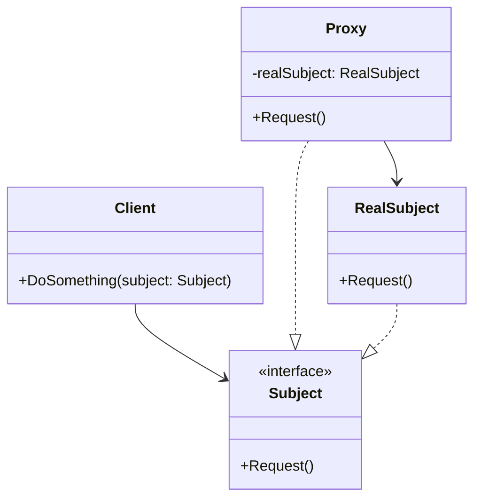
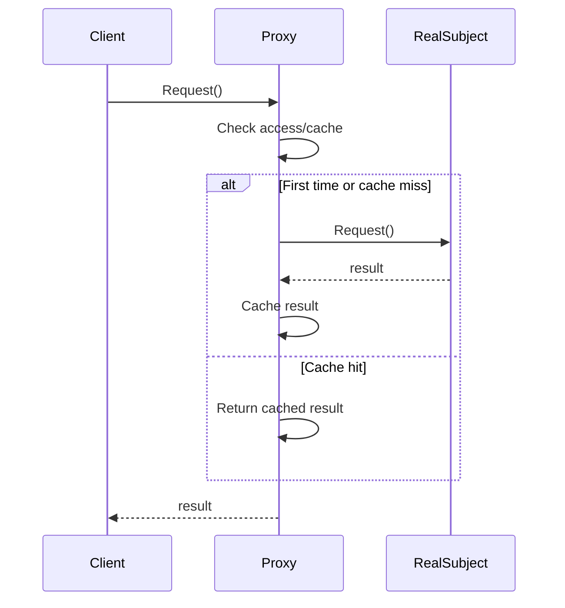

# 代理模式 (Proxy Pattern)

## 定义

代理模式为其他对象提供一种代理以控制对这个对象的访问。

## 意图

- 控制对象访问
- 延迟对象创建
- 添加访问控制
- 实现远程访问
- 提供智能引用

## 别名

- 替身（Surrogate）

## 动机

假设你有一个大型图片对象，加载需要很长时间：

```go
// 不使用代理
type Image struct {
    filename string
    data     []byte
}

func NewImage(filename string) *Image {
    img := &Image{filename: filename}
    img.Load() // 立即加载，即使可能不需要
    return img
}

func (i *Image) Load() {
    // 从磁盘加载大文件，耗时操作
    fmt.Printf("Loading image from %s...\n", i.filename)
    time.Sleep(2 * time.Second)
}

func (i *Image) Display() {
    fmt.Printf("Displaying image: %s\n", i.filename)
}
```

使用代理模式实现延迟加载：

```go
// 使用代理
type ImageProxy struct {
    filename  string
    realImage *Image
}

func NewImageProxy(filename string) *ImageProxy {
    return &ImageProxy{filename: filename}
}

func (p *ImageProxy) Display() {
    if p.realImage == nil {
        p.realImage = NewImage(p.filename) // 延迟加载
    }
    p.realImage.Display()
}
```

现在图片只在真正需要显示时才加载，提高了性能。

## 结构

### UML 类图



### UML 时序图



## 参与者

- **Subject（抽象主题）**: 定义 RealSubject 和 Proxy 的公共接口
- **RealSubject（真实主题）**: 实际的对象
- **Proxy（代理）**: 持有 RealSubject 的引用，控制对它的访问
- **Client（客户端）**: 通过 Subject 接口使用对象

## 协作

1. 客户端通过 Proxy 访问 RealSubject
2. Proxy 在转发请求前后可以执行额外操作
3. Proxy 可以延迟创建 RealSubject

## 代理类型

### 1. 虚拟代理（Virtual Proxy）
延迟创建开销大的对象

### 2. 远程代理（Remote Proxy）
为远程对象提供本地代表

### 3. 保护代理（Protection Proxy）
控制对原始对象的访问权限

### 4. 智能引用（Smart Reference）
在访问对象时执行额外操作

### 5. 缓存代理（Cache Proxy）
为开销大的操作提供缓存

## 适用场景

1. **延迟加载**
   - 对象创建开销大
   - 对象可能不会被使用

2. **访问控制**
   - 需要权限验证
   - 需要访问日志

3. **远程访问**
   - RPC 调用
   - 分布式系统

4. **缓存**
   - 频繁访问的数据
   - 计算开销大的操作

5. **智能引用**
   - 引用计数
   - 对象生命周期管理

## 实现方式

### 1. 虚拟代理（延迟加载）

```go
package main

import (
    "fmt"
    "time"
)

// Subject - 抽象主题
type Image interface {
    Display()
}

// RealSubject - 真实主题
type RealImage struct {
    filename string
}

func NewRealImage(filename string) *RealImage {
    img := &RealImage{filename: filename}
    img.loadFromDisk()
    return img
}

func (i *RealImage) loadFromDisk() {
    fmt.Printf("Loading image from disk: %s\n", i.filename)
    time.Sleep(2 * time.Second) // 模拟耗时操作
}

func (i *RealImage) Display() {
    fmt.Printf("Displaying image: %s\n", i.filename)
}

// Proxy - 虚拟代理
type ImageProxy struct {
    filename  string
    realImage *RealImage
}

func NewImageProxy(filename string) *ImageProxy {
    return &ImageProxy{filename: filename}
}

func (p *ImageProxy) Display() {
    if p.realImage == nil {
        fmt.Println("Creating real image on first access...")
        p.realImage = NewRealImage(p.filename)
    }
    p.realImage.Display()
}

func main() {
    fmt.Println("Creating image proxies...")
    image1 := NewImageProxy("photo1.jpg")
    image2 := NewImageProxy("photo2.jpg")
    
    fmt.Println("\nDisplaying image1 (first time):")
    image1.Display()
    
    fmt.Println("\nDisplaying image1 (second time):")
    image1.Display()
    
    fmt.Println("\nDisplaying image2:")
    image2.Display()
}
```

### 2. 保护代理（访问控制）

```go
package main

import (
    "fmt"
)

// Subject - 抽象主题
type Document interface {
    Read() string
    Write(content string) error
}

// RealSubject - 真实文档
type RealDocument struct {
    content string
}

func (d *RealDocument) Read() string {
    return d.content
}

func (d *RealDocument) Write(content string) error {
    d.content = content
    return nil
}

// Proxy - 保护代理
type ProtectedDocument struct {
    document *RealDocument
    user     string
    role     string
}

func NewProtectedDocument(user, role string) *ProtectedDocument {
    return &ProtectedDocument{
        document: &RealDocument{content: "Secret document"},
        user:     user,
        role:     role,
    }
}

func (p *ProtectedDocument) Read() string {
    fmt.Printf("User %s (role: %s) is reading document\n", p.user, p.role)
    return p.document.Read()
}

func (p *ProtectedDocument) Write(content string) error {
    if p.role != "admin" {
        return fmt.Errorf("access denied: user %s does not have write permission", p.user)
    }
    fmt.Printf("User %s (role: %s) is writing document\n", p.user, p.role)
    return p.document.Write(content)
}

func main() {
    // 普通用户
    userDoc := NewProtectedDocument("john", "user")
    fmt.Println("Content:", userDoc.Read())
    err := userDoc.Write("New content")
    if err != nil {
        fmt.Println("Error:", err)
    }
    
    fmt.Println()
    
    // 管理员
    adminDoc := NewProtectedDocument("admin", "admin")
    fmt.Println("Content:", adminDoc.Read())
    err = adminDoc.Write("New content")
    if err != nil {
        fmt.Println("Error:", err)
    } else {
        fmt.Println("Write successful")
        fmt.Println("New content:", adminDoc.Read())
    }
}
```

### 3. 缓存代理

```go
package main

import (
    "fmt"
    "time"
)

// Subject - 抽象主题
type DataService interface {
    GetData(key string) (string, error)
}

// RealSubject - 真实数据服务
type RealDataService struct{}

func (s *RealDataService) GetData(key string) (string, error) {
    fmt.Printf("Fetching data from database for key: %s\n", key)
    time.Sleep(1 * time.Second) // 模拟数据库查询
    return fmt.Sprintf("Data for %s", key), nil
}

// Proxy - 缓存代理
type CacheProxy struct {
    service   DataService
    cache     map[string]cacheEntry
    cacheTTL  time.Duration
}

type cacheEntry struct {
    data      string
    timestamp time.Time
}

func NewCacheProxy(service DataService, ttl time.Duration) *CacheProxy {
    return &CacheProxy{
        service:  service,
        cache:    make(map[string]cacheEntry),
        cacheTTL: ttl,
    }
}

func (p *CacheProxy) GetData(key string) (string, error) {
    // 检查缓存
    if entry, ok := p.cache[key]; ok {
        if time.Since(entry.timestamp) < p.cacheTTL {
            fmt.Printf("Cache hit for key: %s\n", key)
            return entry.data, nil
        }
        fmt.Printf("Cache expired for key: %s\n", key)
    } else {
        fmt.Printf("Cache miss for key: %s\n", key)
    }
    
    // 从真实服务获取数据
    data, err := p.service.GetData(key)
    if err != nil {
        return "", err
    }
    
    // 更新缓存
    p.cache[key] = cacheEntry{
        data:      data,
        timestamp: time.Now(),
    }
    
    return data, nil
}

func main() {
    service := &RealDataService{}
    proxy := NewCacheProxy(service, 5*time.Second)
    
    // 第一次访问
    fmt.Println("First access:")
    data, _ := proxy.GetData("user:123")
    fmt.Printf("Result: %s\n\n", data)
    
    // 第二次访问（缓存命中）
    fmt.Println("Second access:")
    data, _ = proxy.GetData("user:123")
    fmt.Printf("Result: %s\n\n", data)
    
    // 等待缓存过期
    fmt.Println("Waiting for cache to expire...")
    time.Sleep(6 * time.Second)
    
    // 第三次访问（缓存过期）
    fmt.Println("Third access:")
    data, _ = proxy.GetData("user:123")
    fmt.Printf("Result: %s\n", data)
}
```

### 4. 远程代理（RPC）

```go
package main

import (
    "fmt"
    "time"
)

// Subject - 抽象主题
type UserService interface {
    GetUser(id int) (*User, error)
    CreateUser(name string) (*User, error)
}

type User struct {
    ID   int
    Name string
}

// RealSubject - 远程服务（模拟）
type RemoteUserService struct {
    serverURL string
}

func NewRemoteUserService(url string) *RemoteUserService {
    return &RemoteUserService{serverURL: url}
}

func (s *RemoteUserService) GetUser(id int) (*User, error) {
    fmt.Printf("Making RPC call to %s/users/%d\n", s.serverURL, id)
    time.Sleep(500 * time.Millisecond) // 模拟网络延迟
    return &User{ID: id, Name: fmt.Sprintf("User%d", id)}, nil
}

func (s *RemoteUserService) CreateUser(name string) (*User, error) {
    fmt.Printf("Making RPC call to %s/users (POST)\n", s.serverURL)
    time.Sleep(500 * time.Millisecond) // 模拟网络延迟
    return &User{ID: 100, Name: name}, nil
}

// Proxy - RPC 代理
type UserServiceProxy struct {
    service UserService
    cache   map[int]*User
}

func NewUserServiceProxy(serverURL string) *UserServiceProxy {
    return &UserServiceProxy{
        service: NewRemoteUserService(serverURL),
        cache:   make(map[int]*User),
    }
}

func (p *UserServiceProxy) GetUser(id int) (*User, error) {
    // 检查缓存
    if user, ok := p.cache[id]; ok {
        fmt.Println("Returning cached user")
        return user, nil
    }
    
    // 调用远程服务
    user, err := p.service.GetUser(id)
    if err != nil {
        return nil, err
    }
    
    // 缓存结果
    p.cache[id] = user
    return user, nil
}

func (p *UserServiceProxy) CreateUser(name string) (*User, error) {
    user, err := p.service.CreateUser(name)
    if err != nil {
        return nil, err
    }
    
    // 缓存新创建的用户
    p.cache[user.ID] = user
    return user, nil
}

func main() {
    proxy := NewUserServiceProxy("https://api.example.com")
    
    // 第一次获取用户（远程调用）
    fmt.Println("First GetUser call:")
    user, _ := proxy.GetUser(1)
    fmt.Printf("User: %+v\n\n", user)
    
    // 第二次获取用户（缓存命中）
    fmt.Println("Second GetUser call:")
    user, _ = proxy.GetUser(1)
    fmt.Printf("User: %+v\n\n", user)
    
    // 创建用户
    fmt.Println("CreateUser call:")
    newUser, _ := proxy.CreateUser("Alice")
    fmt.Printf("Created user: %+v\n", newUser)
}
```

### 5. 智能引用代理

```go
package main

import (
    "fmt"
    "sync"
)

// Subject - 抽象主题
type Resource interface {
    Use()
}

// RealSubject - 真实资源
type RealResource struct {
    name string
}

func (r *RealResource) Use() {
    fmt.Printf("Using resource: %s\n", r.name)
}

// Proxy - 智能引用代理
type SmartReferenceProxy struct {
    resource   *RealResource
    refCount   int
    mu         sync.Mutex
    accessLog  []string
}

func NewSmartReferenceProxy(name string) *SmartReferenceProxy {
    return &SmartReferenceProxy{
        resource:  &RealResource{name: name},
        refCount:  0,
        accessLog: make([]string, 0),
    }
}

func (p *SmartReferenceProxy) Use() {
    p.mu.Lock()
    defer p.mu.Unlock()
    
    // 增加引用计数
    p.refCount++
    
    // 记录访问日志
    logEntry := fmt.Sprintf("Access #%d", p.refCount)
    p.accessLog = append(p.accessLog, logEntry)
    
    fmt.Printf("Reference count: %d\n", p.refCount)
    
    // 使用真实资源
    p.resource.Use()
}

func (p *SmartReferenceProxy) GetRefCount() int {
    p.mu.Lock()
    defer p.mu.Unlock()
    return p.refCount
}

func (p *SmartReferenceProxy) GetAccessLog() []string {
    p.mu.Lock()
    defer p.mu.Unlock()
    return append([]string{}, p.accessLog...)
}

func main() {
    proxy := NewSmartReferenceProxy("Database Connection")
    
    // 多次使用资源
    for i := 0; i < 5; i++ {
        proxy.Use()
        fmt.Println()
    }
    
    // 显示统计信息
    fmt.Printf("Total references: %d\n", proxy.GetRefCount())
    fmt.Println("Access log:")
    for _, log := range proxy.GetAccessLog() {
        fmt.Printf("  - %s\n", log)
    }
}
```

## 优缺点分析

### 优点

1. **控制对象访问**
   - 可以在访问前后添加逻辑
   - 实现权限控制

2. **延迟初始化**
   - 提高性能
   - 节省资源

3. **远程访问**
   - 隐藏网络细节
   - 提供本地接口

4. **缓存功能**
   - 减少重复计算
   - 提高响应速度

5. **符合开闭原则**
   - 添加新代理不影响现有代码
   - 易于扩展

### 缺点

1. **增加响应时间**
   - 额外的间接层
   - 可能影响性能

2. **增加系统复杂度**
   - 需要额外的代理类
   - 代码量增加

3. **可能导致过度设计**
   - 简单场景不需要代理
   - 增加维护成本

## Go 语言实现要点

### 1. 使用接口和组合

```go
// ✅ Go 推荐：接口和组合
type Subject interface {
    Request() string
}

type Proxy struct {
    realSubject Subject
}

func (p *Proxy) Request() string {
    // 前置处理
    result := p.realSubject.Request()
    // 后置处理
    return result
}
```

### 2. 延迟初始化

```go
type Proxy struct {
    realSubject Subject
    mu          sync.Mutex
}

func (p *Proxy) Request() string {
    p.mu.Lock()
    defer p.mu.Unlock()
    
    if p.realSubject == nil {
        p.realSubject = NewRealSubject()
    }
    
    return p.realSubject.Request()
}
```

### 3. 线程安全

```go
type CacheProxy struct {
    service DataService
    cache   map[string]string
    mu      sync.RWMutex
}

func (p *CacheProxy) GetData(key string) string {
    // 读锁
    p.mu.RLock()
    if data, ok := p.cache[key]; ok {
        p.mu.RUnlock()
        return data
    }
    p.mu.RUnlock()
    
    // 写锁
    p.mu.Lock()
    defer p.mu.Unlock()
    
    data := p.service.GetData(key)
    p.cache[key] = data
    return data
}
```

### 4. 函数式代理

```go
// 使用函数包装实现代理
type ServiceFunc func(string) (string, error)

func WithCache(fn ServiceFunc) ServiceFunc {
    cache := make(map[string]string)
    return func(key string) (string, error) {
        if data, ok := cache[key]; ok {
            return data, nil
        }
        data, err := fn(key)
        if err == nil {
            cache[key] = data
        }
        return data, err
    }
}
```

## 实际应用

### 1. 数据库连接池代理

```go
package main

import (
    "fmt"
    "sync"
    "time"
)

// Database 接口
type Database interface {
    Query(sql string) ([]map[string]interface{}, error)
    Close() error
}

// 真实数据库连接
type RealDatabase struct {
    id int
}

func (db *RealDatabase) Query(sql string) ([]map[string]interface{}, error) {
    fmt.Printf("DB[%d] Executing: %s\n", db.id, sql)
    time.Sleep(100 * time.Millisecond)
    return []map[string]interface{}{{"result": "data"}}, nil
}

func (db *RealDatabase) Close() error {
    fmt.Printf("DB[%d] Closing connection\n", db.id)
    return nil
}

// 连接池代理
type DatabasePool struct {
    connections chan *RealDatabase
    maxSize     int
    currentSize int
    mu          sync.Mutex
}

func NewDatabasePool(maxSize int) *DatabasePool {
    return &DatabasePool{
        connections: make(chan *RealDatabase, maxSize),
        maxSize:     maxSize,
        currentSize: 0,
    }
}

func (pool *DatabasePool) getConnection() *RealDatabase {
    select {
    case conn := <-pool.connections:
        fmt.Println("Reusing existing connection")
        return conn
    default:
        pool.mu.Lock()
        defer pool.mu.Unlock()
        
        if pool.currentSize < pool.maxSize {
            pool.currentSize++
            fmt.Printf("Creating new connection (total: %d)\n", pool.currentSize)
            return &RealDatabase{id: pool.currentSize}
        }
        
        fmt.Println("Waiting for available connection...")
        return <-pool.connections
    }
}

func (pool *DatabasePool) releaseConnection(conn *RealDatabase) {
    select {
    case pool.connections <- conn:
        fmt.Println("Connection returned to pool")
    default:
        fmt.Println("Pool full, closing connection")
        conn.Close()
        pool.mu.Lock()
        pool.currentSize--
        pool.mu.Unlock()
    }
}

func (pool *DatabasePool) Query(sql string) ([]map[string]interface{}, error) {
    conn := pool.getConnection()
    defer pool.releaseConnection(conn)
    return conn.Query(sql)
}

func main() {
    pool := NewDatabasePool(2)
    
    var wg sync.WaitGroup
    for i := 0; i < 5; i++ {
        wg.Add(1)
        go func(id int) {
            defer wg.Done()
            result, _ := pool.Query(fmt.Sprintf("SELECT * FROM table WHERE id=%d", id))
            fmt.Printf("Query %d result: %v\n", id, result)
        }(i)
    }
    
    wg.Wait()
}
```

### 2. HTTP 请求代理（带重试和缓存）

```go
package main

import (
    "fmt"
    "time"
)

// HTTP 客户端接口
type HTTPClient interface {
    Get(url string) (string, error)
}

// 真实 HTTP 客户端
type RealHTTPClient struct{}

func (c *RealHTTPClient) Get(url string) (string, error) {
    fmt.Printf("Making HTTP request to: %s\n", url)
    time.Sleep(500 * time.Millisecond)
    return fmt.Sprintf("Response from %s", url), nil
}

// HTTP 代理（带缓存和重试）
type HTTPClientProxy struct {
    client     HTTPClient
    cache      map[string]cacheEntry
    maxRetries int
    retryDelay time.Duration
}

type cacheEntry struct {
    data      string
    timestamp time.Time
    ttl       time.Duration
}

func NewHTTPClientProxy(client HTTPClient, maxRetries int) *HTTPClientProxy {
    return &HTTPClientProxy{
        client:     client,
        cache:      make(map[string]cacheEntry),
        maxRetries: maxRetries,
        retryDelay: time.Second,
    }
}

func (p *HTTPClientProxy) Get(url string) (string, error) {
    // 检查缓存
    if entry, ok := p.cache[url]; ok {
        if time.Since(entry.timestamp) < entry.ttl {
            fmt.Println("Cache hit")
            return entry.data, nil
        }
    }
    
    // 带重试的请求
    var err error
    var data string
    
    for i := 0; i <= p.maxRetries; i++ {
        if i > 0 {
            fmt.Printf("Retry attempt %d/%d\n", i, p.maxRetries)
            time.Sleep(p.retryDelay)
        }
        
        data, err = p.client.Get(url)
        if err == nil {
            // 缓存成功的响应
            p.cache[url] = cacheEntry{
                data:      data,
                timestamp: time.Now(),
                ttl:       5 * time.Minute,
            }
            return data, nil
        }
    }
    
    return "", fmt.Errorf("failed after %d retries: %w", p.maxRetries, err)
}

func main() {
    client := &RealHTTPClient{}
    proxy := NewHTTPClientProxy(client, 3)
    
    // 第一次请求
    fmt.Println("First request:")
    data, _ := proxy.Get("https://api.example.com/data")
    fmt.Printf("Result: %s\n\n", data)
    
    // 第二次请求（缓存命中）
    fmt.Println("Second request:")
    data, _ = proxy.Get("https://api.example.com/data")
    fmt.Printf("Result: %s\n", data)
}
```

## 使用建议

### 何时使用

✅ **应该使用**:
- 需要延迟加载
- 需要访问控制
- 需要缓存
- 需要远程访问
- 需要智能引用

❌ **不应该使用**:
- 对象简单不需要控制
- 不需要额外功能
- 性能要求极高

### 最佳实践

1. **使用接口定义主题**
   ```go
   // ✅ 使用接口
   type Subject interface {
       Request() string
   }
   
   type Proxy struct {
       subject Subject
   }
   ```

2. **延迟初始化要线程安全**
   ```go
   type Proxy struct {
       subject Subject
       mu      sync.Mutex
   }
   
   func (p *Proxy) getSubject() Subject {
       p.mu.Lock()
       defer p.mu.Unlock()
       
       if p.subject == nil {
           p.subject = NewRealSubject()
       }
       return p.subject
   }
   ```

3. **缓存要考虑过期**
   ```go
   type cacheEntry struct {
       data      interface{}
       timestamp time.Time
       ttl       time.Duration
   }
   ```

4. **提供清晰的代理接口**
   ```go
   // ✅ 清晰的接口
   type CacheProxy struct {
       service DataService
       cache   Cache
   }
   
   func (p *CacheProxy) GetData(key string) (string, error)
   func (p *CacheProxy) ClearCache()
   func (p *CacheProxy) GetCacheStats() Stats
   ```

## 常见问题

### Q1: 代理模式和装饰器模式有什么区别？

- **代理模式**: 关注访问控制，通常只有一层
- **装饰器模式**: 关注功能增强，可以多层嵌套

### Q2: 代理模式和适配器模式有什么区别？

- **代理模式**: 接口相同，控制访问
- **适配器模式**: 接口不同，实现转换

### Q3: 什么时候使用虚拟代理？

当对象创建开销大，且可能不会被使用时。

### Q4: 代理会影响性能吗？

会有轻微的性能开销，但通过缓存等优化可以提高整体性能。

## 总结

代理模式是一个非常实用的结构型模式，特别适合实现访问控制、延迟加载和缓存。在 Go 语言中，使用接口和组合可以很优雅地实现代理模式。

**记住**:
- ✅ 使用接口定义主题
- ✅ 延迟初始化要线程安全
- ✅ 缓存要考虑过期
- ✅ 提供清晰的代理接口
- ❌ 不要过度使用代理

