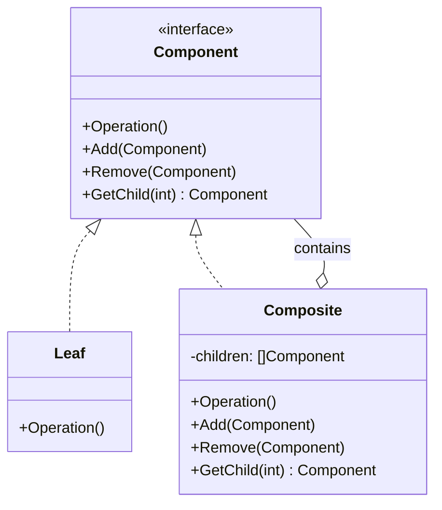
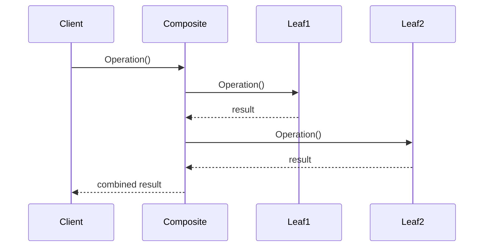

# 组合模式 (Composite Pattern)

## 定义

组合模式是一种结构型设计模式，它将对象组合成树形结构以表示"部分-整体"的层次结构。组合模式使得客户端对单个对象和组合对象的使用具有一致性。

## 意图

- 表示对象的部分-整体层次结构
- 使客户端能够统一对待单个对象和组合对象
- 简化客户端代码，无需区分叶子节点和容器节点

## 别名

- 部分-整体模式 (Part-Whole Pattern)

## 动机

在软件开发中，我们经常需要处理树形结构的数据，例如文件系统、组织架构、UI 组件树等。这些结构中既有叶子节点（不包含子节点），也有容器节点（包含子节点）。

如果没有组合模式，客户端需要区分叶子节点和容器节点，导致代码复杂且难以维护。组合模式通过定义统一的接口，使客户端可以一致地处理所有节点。

**示例场景**: 文件系统

在文件系统中，文件是叶子节点，目录是容器节点。用户希望能够统一地对文件和目录执行操作（如获取大小、显示信息），而不需要关心它们的具体类型。

## 结构

### UML 类图



### UML 时序图



## 参与者

- **Component (组件接口)**: 定义组合中所有对象的通用接口，声明用于访问和管理子组件的方法
- **Leaf (叶子节点)**: 表示组合中的叶子对象，叶子节点没有子节点，实现 Component 接口的基本操作
- **Composite (容器节点)**: 表示有子节点的组件，存储子组件，实现与子组件相关的操作
- **Client (客户端)**: 通过 Component 接口操作组合结构中的对象

## 协作

- 客户端通过 Component 接口与组合结构中的对象交互
- 如果接收者是叶子节点，直接处理请求
- 如果接收者是容器节点，通常将请求转发给子组件，并可能在转发前后执行一些辅助操作
- 容器节点递归地调用子组件的操作，形成树形遍历

## 适用场景

1. **表示对象的部分-整体层次结构**
   - 文件系统（文件和目录）
   - 组织架构（员工和部门）
   - UI 组件树（控件和容器）

2. **希望客户端统一对待单个对象和组合对象**
   - 不需要区分叶子节点和容器节点
   - 简化客户端代码

3. **需要递归组合对象**
   - 树形结构的遍历
   - 层次结构的计算

## 优点

- ✅ **简化客户端代码**: 客户端无需区分叶子节点和容器节点，统一处理
- ✅ **易于扩展**: 可以轻松添加新的组件类型
- ✅ **符合开闭原则**: 新增组件不影响现有代码
- ✅ **灵活的树形结构**: 可以构建复杂的树形结构

## 缺点

- ❌ **设计过于宽泛**: 难以限制组合中的组件类型
- ❌ **类型安全问题**: 在编译时难以限制容器只能包含特定类型的组件
- ❌ **可能违反单一职责原则**: Component 接口可能包含过多职责

## 实现要点

### 透明性 vs 安全性

组合模式有两种实现方式：

1. **透明方式**: 在 Component 接口中声明所有管理子组件的方法
   - 优点: 客户端无需区分叶子和容器
   - 缺点: 叶子节点也需要实现管理子组件的方法（可能返回错误）

2. **安全方式**: 只在 Composite 中声明管理子组件的方法
   - 优点: 类型安全，叶子节点不需要实现不相关的方法
   - 缺点: 客户端需要区分叶子和容器

### Go 语言实现

在 Go 语言中，通常采用安全方式实现组合模式：

```go
// Component 接口定义通用操作
type Component interface {
    Operation() string
    GetName() string
}

// Leaf 叶子节点
type Leaf struct {
    name string
}

func (l *Leaf) Operation() string {
    return "Leaf: " + l.name
}

func (l *Leaf) GetName() string {
    return l.name
}

// Composite 容器节点
type Composite struct {
    name     string
    children []Component
}

func (c *Composite) Operation() string {
    result := "Composite: " + c.name + "\n"
    for _, child := range c.children {
        result += "  " + child.Operation() + "\n"
    }
    return result
}

func (c *Composite) GetName() string {
    return c.name
}

func (c *Composite) Add(component Component) {
    c.children = append(c.children, component)
}

func (c *Composite) Remove(component Component) {
    for i, child := range c.children {
        if child == component {
            c.children = append(c.children[:i], c.children[i+1:]...)
            break
        }
    }
}

func (c *Composite) GetChildren() []Component {
    return c.children
}
```

### 代码示例

```go
package main

import "fmt"

// Component 组件接口
type Component interface {
    Display(indent string)
}

// File 文件（叶子节点）
type File struct {
    name string
    size int
}

func (f *File) Display(indent string) {
    fmt.Printf("%s- File: %s (%d KB)\n", indent, f.name, f.size)
}

// Directory 目录（容器节点）
type Directory struct {
    name     string
    children []Component
}

func (d *Directory) Display(indent string) {
    fmt.Printf("%s+ Directory: %s\n", indent, d.name)
    for _, child := range d.children {
        child.Display(indent + "  ")
    }
}

func (d *Directory) Add(component Component) {
    d.children = append(d.children, component)
}

func main() {
    // 创建文件
    file1 := &File{name: "document.txt", size: 10}
    file2 := &File{name: "image.png", size: 500}
    file3 := &File{name: "video.mp4", size: 2000}

    // 创建目录
    root := &Directory{name: "root"}
    docs := &Directory{name: "documents"}
    media := &Directory{name: "media"}

    // 构建树形结构
    root.Add(docs)
    root.Add(media)
    docs.Add(file1)
    media.Add(file2)
    media.Add(file3)

    // 统一显示
    root.Display("")
}
```

## 真实应用案例

1. **文件系统**
   - 文件和目录的统一管理
   - 递归计算目录大小
   - 树形显示文件结构

2. **组织架构**
   - 员工和部门的层次结构
   - 计算部门总人数
   - 显示组织结构图

3. **UI 组件树**
   - 控件和容器的统一处理
   - 事件传播
   - 布局计算

4. **抽象语法树 (AST)**
   - 编译器中的语法树表示
   - 表达式求值
   - 代码生成

5. **菜单系统**
   - 菜单项和子菜单
   - 递归渲染
   - 权限控制

## 相关模式

- **装饰器模式**: 结构相似，但意图不同。装饰器关注动态添加职责，组合关注部分-整体结构
- **迭代器模式**: 常与组合模式一起使用，用于遍历组合结构
- **访问者模式**: 可以在组合结构上定义新操作，而不改变组合类
- **责任链模式**: 组合模式的树形结构可以作为责任链的基础

## 推荐阅读

1. **《设计模式：可复用面向对象软件的基础》** - GoF
   - 第 4.3 节：Composite 模式

2. **《Head First 设计模式》**
   - 第 9 章：组合模式

3. **在线资源**
   - [Refactoring.Guru - Composite Pattern](https://refactoring.guru/design-patterns/composite)
   - [Go by Example - Composite Pattern](https://github.com/tmrts/go-patterns/blob/master/structural/composite.md)

## 开源项目参考

1. **Go AST (抽象语法树)**
   - `go/ast` 包使用组合模式表示语法树
   - 节点类型实现 `ast.Node` 接口

2. **HTML DOM**
   - DOM 树是组合模式的经典应用
   - 元素节点和文本节点统一处理

3. **Kubernetes API Objects**
   - Pod、Deployment 等资源对象的层次结构
   - 统一的资源管理接口

## 实践建议

1. **选择合适的实现方式**
   - 如果类型安全更重要，使用安全方式
   - 如果简化客户端更重要，使用透明方式

2. **考虑性能**
   - 大型树形结构可能导致性能问题
   - 考虑使用缓存优化递归操作

3. **提供遍历方法**
   - 实现迭代器或访问者模式
   - 支持深度优先和广度优先遍历

4. **处理循环引用**
   - 在 Add 方法中检查循环引用
   - 使用访问标记避免无限递归

5. **考虑并发安全**
   - 如果需要并发访问，添加适当的锁机制
   - 使用不可变对象避免并发问题
