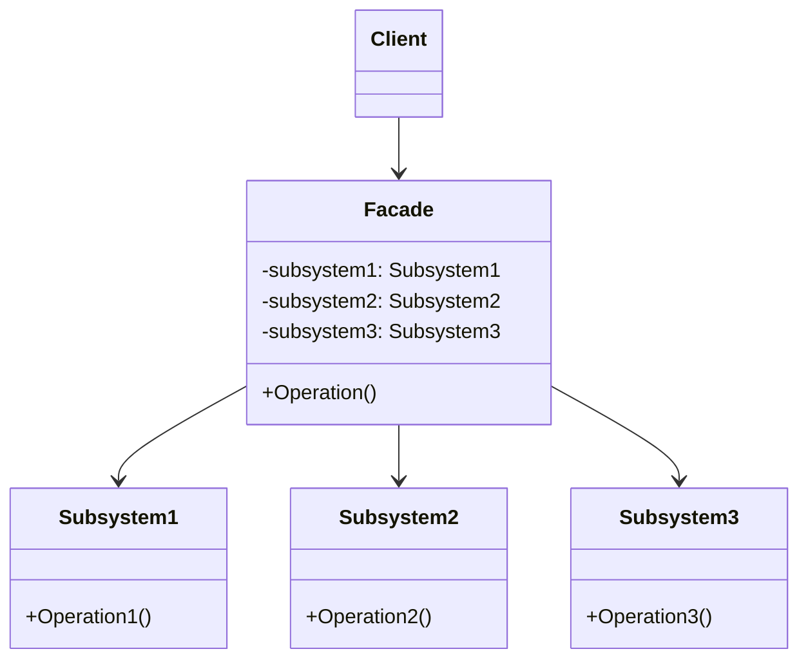
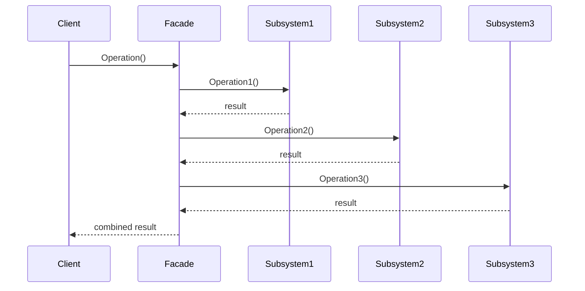

# 外观模式 (Facade Pattern)

## 定义

外观模式是一种结构型设计模式，它为子系统中的一组接口提供一个统一的高层接口，使子系统更容易使用。外观模式定义了一个高层接口，这个接口使得子系统更加容易使用。

## 意图

- 为复杂的子系统提供一个简单的接口
- 降低客户端与子系统之间的耦合度
- 定义子系统的入口点

## 别名

- 门面模式

## 动机

在软件开发中，我们经常需要与复杂的子系统交互。这些子系统可能包含大量的类和接口，使用起来非常复杂。如果客户端直接与子系统的各个组件交互，会导致：

1. 客户端代码复杂，难以理解和维护
2. 客户端与子系统高度耦合
3. 子系统的变化会影响所有客户端

外观模式通过提供一个统一的高层接口，隐藏子系统的复杂性，使客户端更容易使用子系统。

**示例场景**: 家庭影院系统

一个家庭影院系统包含多个子系统：DVD 播放器、投影仪、音响、灯光等。如果要看电影，需要执行一系列复杂的操作：打开投影仪、调整音响、关闭灯光、播放 DVD 等。外观模式可以提供一个简单的 `watchMovie()` 方法，封装所有这些操作。

## 结构

### UML 类图



### UML 时序图



## 参与者

- **Facade (外观类)**: 知道哪些子系统类负责处理请求，将客户端的请求委派给适当的子系统对象
- **Subsystem Classes (子系统类)**: 实现子系统的功能，处理 Facade 对象指派的任务，没有 Facade 的任何信息
- **Client (客户端)**: 通过 Facade 与子系统通信

## 协作

- 客户端通过 Facade 与子系统通信，而不是直接与子系统的各个类交互
- Facade 将客户端的请求转发给适当的子系统对象
- 子系统类实现具体的功能，但不知道 Facade 的存在
- 客户端仍然可以直接访问子系统类（如果需要）

## 适用场景

1. **为复杂的子系统提供简单接口**
   - 子系统包含大量类和接口
   - 大多数客户端只需要使用子系统的一小部分功能

2. **降低客户端与子系统的耦合**
   - 客户端不应该依赖子系统的内部结构
   - 子系统的变化不应该影响客户端

3. **定义子系统的分层结构**
   - 使用外观模式定义每一层的入口点
   - 层与层之间通过外观进行通信

4. **简化第三方库的使用**
   - 封装复杂的第三方库
   - 提供符合项目需求的简化接口

## 优点

- ✅ **简化接口**: 为复杂的子系统提供简单易用的接口
- ✅ **降低耦合**: 客户端与子系统解耦，子系统的变化不影响客户端
- ✅ **提高灵活性**: 客户端仍可以直接访问子系统（如果需要）
- ✅ **更好的分层**: 有助于建立层次化的系统结构
- ✅ **易于维护**: 集中管理子系统的访问

## 缺点

- ❌ **可能成为"上帝类"**: 外观类可能变得过于庞大和复杂
- ❌ **不符合开闭原则**: 增加新的子系统功能可能需要修改外观类
- ❌ **可能限制功能**: 简化的接口可能无法满足所有客户端的需求

## 实现要点

### Go 语言实现

在 Go 语言中，外观模式通常通过结构体和方法实现：

```go
// 子系统 1
type CPU struct{}

func (c *CPU) Freeze() {
    fmt.Println("CPU: Freezing...")
}

func (c *CPU) Jump(position int64) {
    fmt.Printf("CPU: Jumping to position %d\n", position)
}

func (c *CPU) Execute() {
    fmt.Println("CPU: Executing...")
}

// 子系统 2
type Memory struct{}

func (m *Memory) Load(position int64, data []byte) {
    fmt.Printf("Memory: Loading data at position %d\n", position)
}

// 子系统 3
type HardDrive struct{}

func (h *HardDrive) Read(lba int64, size int) []byte {
    fmt.Printf("HardDrive: Reading %d bytes from LBA %d\n", size, lba)
    return make([]byte, size)
}

// 外观类
type ComputerFacade struct {
    cpu       *CPU
    memory    *Memory
    hardDrive *HardDrive
}

func NewComputerFacade() *ComputerFacade {
    return &ComputerFacade{
        cpu:       &CPU{},
        memory:    &Memory{},
        hardDrive: &HardDrive{},
    }
}

func (c *ComputerFacade) Start() {
    fmt.Println("Starting computer...")
    c.cpu.Freeze()
    c.memory.Load(0, c.hardDrive.Read(0, 1024))
    c.cpu.Jump(0)
    c.cpu.Execute()
    fmt.Println("Computer started successfully!")
}
```

### 代码示例

```go
package main

import "fmt"

// 子系统：DVD 播放器
type DVDPlayer struct{}

func (d *DVDPlayer) On() {
    fmt.Println("DVD Player: Turning on")
}

func (d *DVDPlayer) Play(movie string) {
    fmt.Printf("DVD Player: Playing '%s'\n", movie)
}

func (d *DVDPlayer) Off() {
    fmt.Println("DVD Player: Turning off")
}

// 子系统：投影仪
type Projector struct{}

func (p *Projector) On() {
    fmt.Println("Projector: Turning on")
}

func (p *Projector) WideScreenMode() {
    fmt.Println("Projector: Setting wide screen mode")
}

func (p *Projector) Off() {
    fmt.Println("Projector: Turning off")
}

// 子系统：音响
type SoundSystem struct{}

func (s *SoundSystem) On() {
    fmt.Println("Sound System: Turning on")
}

func (s *SoundSystem) SetVolume(level int) {
    fmt.Printf("Sound System: Setting volume to %d\n", level)
}

func (s *SoundSystem) Off() {
    fmt.Println("Sound System: Turning off")
}

// 子系统：灯光
type Lights struct{}

func (l *Lights) Dim(level int) {
    fmt.Printf("Lights: Dimming to %d%%\n", level)
}

func (l *Lights) On() {
    fmt.Println("Lights: Turning on")
}

// 外观类：家庭影院
type HomeTheaterFacade struct {
    dvd         *DVDPlayer
    projector   *Projector
    sound       *SoundSystem
    lights      *Lights
}

func NewHomeTheaterFacade() *HomeTheaterFacade {
    return &HomeTheaterFacade{
        dvd:       &DVDPlayer{},
        projector: &Projector{},
        sound:     &SoundSystem{},
        lights:    &Lights{},
    }
}

func (h *HomeTheaterFacade) WatchMovie(movie string) {
    fmt.Println("\n=== Preparing to watch movie ===")
    h.lights.Dim(10)
    h.projector.On()
    h.projector.WideScreenMode()
    h.sound.On()
    h.sound.SetVolume(5)
    h.dvd.On()
    h.dvd.Play(movie)
    fmt.Println("=== Enjoy your movie! ===\n")
}

func (h *HomeTheaterFacade) EndMovie() {
    fmt.Println("\n=== Shutting down movie theater ===")
    h.dvd.Off()
    h.sound.Off()
    h.projector.Off()
    h.lights.On()
    fmt.Println("=== Movie theater is shut down ===\n")
}

func main() {
    homeTheater := NewHomeTheaterFacade()
    
    // 简单的接口调用
    homeTheater.WatchMovie("The Matrix")
    
    // 模拟观影
    fmt.Println("... watching movie ...")
    
    homeTheater.EndMovie()
}
```

## 真实应用案例

1. **API 网关**
   - 统一多个微服务的访问接口
   - 处理认证、限流、日志等横切关注点
   - 简化客户端与后端服务的交互

2. **数据库访问层**
   - 封装复杂的数据库操作
   - 提供简单的 CRUD 接口
   - 隐藏 SQL 细节

3. **日志系统**
   - 封装多个日志库（文件、控制台、远程）
   - 提供统一的日志接口
   - 简化日志配置

4. **支付系统**
   - 封装多个支付渠道（支付宝、微信、银行卡）
   - 提供统一的支付接口
   - 处理支付流程的复杂性

5. **Kubernetes Client-Go**
   - 封装 Kubernetes API 的复杂性
   - 提供简化的客户端接口
   - 处理认证、序列化等细节

## 相关模式

- **适配器模式**: 适配器改变接口以匹配客户端期望，外观简化接口但不改变接口
- **抽象工厂模式**: 可以与外观模式一起使用，提供创建子系统对象的接口
- **中介者模式**: 中介者封装对象之间的交互，外观封装子系统的接口
- **单例模式**: 外观类通常实现为单例

## 推荐阅读

1. **《设计模式：可复用面向对象软件的基础》** - GoF
   - 第 4.5 节：Facade 模式

2. **《Head First 设计模式》**
   - 第 7 章：外观模式

3. **在线资源**
   - [Refactoring.Guru - Facade Pattern](https://refactoring.guru/design-patterns/facade)
   - [Go by Example - Facade Pattern](https://github.com/tmrts/go-patterns/blob/master/structural/facade.md)

## 开源项目参考

1. **Kubernetes Client-Go**
   - 封装 Kubernetes API 的复杂性
   - 提供简化的客户端接口

2. **AWS SDK**
   - 封装 AWS 服务的 REST API
   - 提供高层次的服务接口

3. **GORM (Go ORM)**
   - 封装数据库操作的复杂性
   - 提供简单的 CRUD 接口

## 实践建议

1. **保持外观类简单**
   - 外观类应该只负责委派，不包含业务逻辑
   - 如果外观类过于复杂，考虑拆分为多个外观类

2. **不要限制客户端访问子系统**
   - 外观模式不应该阻止客户端直接访问子系统
   - 提供外观作为便捷方式，而不是唯一方式

3. **使用分层外观**
   - 对于大型系统，使用多层外观
   - 高层外观调用低层外观

4. **考虑使用接口**
   - 定义外观接口，便于测试和替换
   - 支持多种外观实现

5. **处理错误**
   - 外观类应该统一处理子系统的错误
   - 提供清晰的错误信息给客户端

6. **文档化**
   - 清楚地文档化外观提供的功能
   - 说明哪些子系统功能被封装

7. **版本管理**
   - 当子系统升级时，外观可以提供向后兼容的接口
   - 使用外观隔离版本变化的影响
