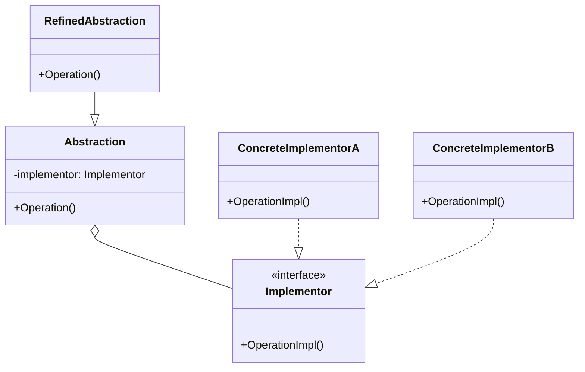
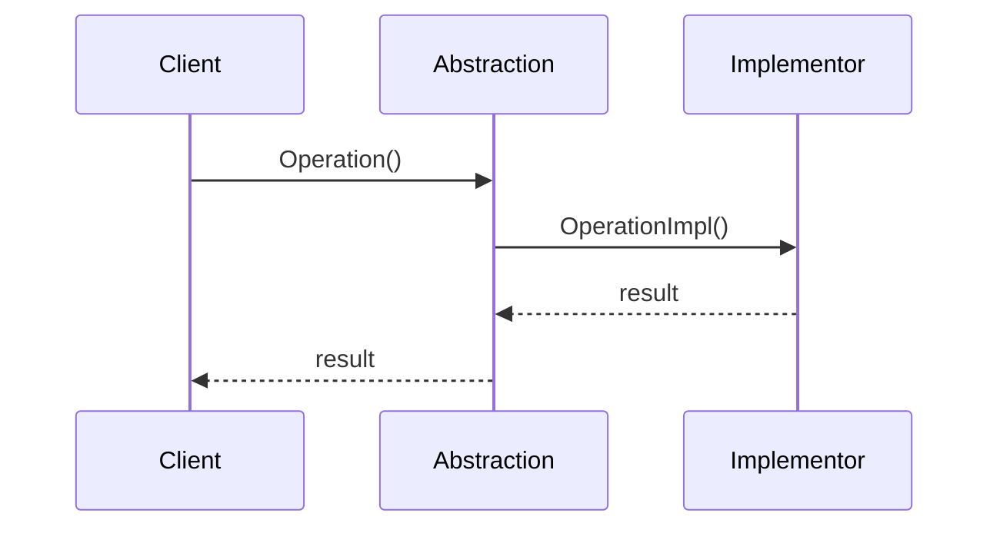

# 桥接模式 (Bridge Pattern)

## 定义

桥接模式是一种结构型设计模式，它将抽象部分与实现部分分离，使它们都可以独立变化。桥接模式通过组合关系代替继承关系，避免了类爆炸问题。

## 意图

- 将抽象与实现解耦，使两者可以独立变化
- 通过组合关系代替继承关系
- 支持多维度的变化

## 别名

- Handle/Body 模式

## 动机

在软件开发中，我们经常遇到需要在多个维度上扩展的情况。例如，一个图形系统需要支持多种形状（圆形、矩形）和多种渲染方式（矢量、光栅）。

如果使用继承，我们需要创建：
- VectorCircle, RasterCircle
- VectorRectangle, RasterRectangle

当形状和渲染方式增加时，类的数量会呈指数级增长（类爆炸）。

桥接模式通过将形状（抽象）和渲染方式（实现）分离，使用组合关系连接它们，避免了类爆炸问题。

**示例场景**: 跨平台 GUI 框架

一个 GUI 框架需要支持多种控件（按钮、文本框）和多个平台（Windows、Linux、macOS）。使用桥接模式，可以将控件的抽象与平台的实现分离，使两者可以独立变化。

## 结构

### UML 类图



### UML 时序图



## 参与者

- **Abstraction (抽象类)**: 定义抽象类的接口，维护一个指向 Implementor 类型对象的引用
- **RefinedAbstraction (扩充抽象类)**: 扩展 Abstraction 定义的接口
- **Implementor (实现类接口)**: 定义实现类的接口，该接口不一定要与 Abstraction 的接口完全一致
- **ConcreteImplementor (具体实现类)**: 实现 Implementor 接口，提供具体的实现

## 协作

- Abstraction 将客户端的请求转发给它的 Implementor 对象
- Implementor 提供具体的实现
- 客户端通过 Abstraction 与系统交互，不需要知道具体的实现细节

## 适用场景

1. **避免抽象和实现之间的永久绑定**
   - 需要在运行时切换实现
   - 实现可以动态配置

2. **抽象和实现都需要独立扩展**
   - 增加新的抽象不影响实现
   - 增加新的实现不影响抽象

3. **避免类爆炸**
   - 多个维度的变化
   - 使用继承会导致类数量激增

4. **跨平台应用**
   - 支持多个操作系统
   - 支持多种数据库

5. **多种实现方式**
   - 支持多种渲染引擎
   - 支持多种通信协议

## 优点

- ✅ **分离抽象和实现**: 两者可以独立变化，互不影响
- ✅ **避免类爆炸**: 使用组合代替继承，减少类的数量
- ✅ **提高可扩展性**: 可以独立扩展抽象和实现
- ✅ **符合开闭原则**: 新增抽象或实现不影响现有代码
- ✅ **符合单一职责原则**: 抽象和实现各自负责不同的职责
- ✅ **运行时切换实现**: 可以动态改变对象的实现

## 缺点

- ❌ **增加系统复杂度**: 需要正确识别系统中的两个独立变化维度
- ❌ **理解难度**: 桥接模式的理解和设计需要一定的经验
- ❌ **增加类的数量**: 虽然避免了类爆炸，但仍需要额外的接口和类

## 实现要点

### Go 语言实现

在 Go 语言中，桥接模式通过接口和组合实现：

```go
// Implementor 接口
type DrawAPI interface {
    DrawCircle(x, y, radius int)
}

// ConcreteImplementor A
type RedCircle struct{}

func (r *RedCircle) DrawCircle(x, y, radius int) {
    fmt.Printf("Drawing red circle at (%d, %d) with radius %d\n", x, y, radius)
}

// ConcreteImplementor B
type GreenCircle struct{}

func (g *GreenCircle) DrawCircle(x, y, radius int) {
    fmt.Printf("Drawing green circle at (%d, %d) with radius %d\n", x, y, radius)
}

// Abstraction
type Shape struct {
    drawAPI DrawAPI
}

func (s *Shape) SetDrawAPI(drawAPI DrawAPI) {
    s.drawAPI = drawAPI
}

// RefinedAbstraction
type Circle struct {
    Shape
    x, y, radius int
}

func NewCircle(x, y, radius int, drawAPI DrawAPI) *Circle {
    return &Circle{
        Shape:  Shape{drawAPI: drawAPI},
        x:      x,
        y:      y,
        radius: radius,
    }
}

func (c *Circle) Draw() {
    c.drawAPI.DrawCircle(c.x, c.y, c.radius)
}
```

### 代码示例

```go
package main

import "fmt"

// Implementor 接口：消息发送器
type MessageSender interface {
    Send(message string) error
}

// ConcreteImplementor A：邮件发送器
type EmailSender struct {
    server string
}

func NewEmailSender(server string) *EmailSender {
    return &EmailSender{server: server}
}

func (e *EmailSender) Send(message string) error {
    fmt.Printf("[Email via %s] Sending: %s\n", e.server, message)
    return nil
}

// ConcreteImplementor B：短信发送器
type SMSSender struct {
    gateway string
}

func NewSMSSender(gateway string) *SMSSender {
    return &SMSSender{gateway: gateway}
}

func (s *SMSSender) Send(message string) error {
    fmt.Printf("[SMS via %s] Sending: %s\n", s.gateway, message)
    return nil
}

// Abstraction：消息
type Message struct {
    sender MessageSender
    content string
}

func (m *Message) SetSender(sender MessageSender) {
    m.sender = sender
}

func (m *Message) SetContent(content string) {
    m.content = content
}

// RefinedAbstraction A：普通消息
type NormalMessage struct {
    Message
}

func NewNormalMessage(sender MessageSender) *NormalMessage {
    return &NormalMessage{
        Message: Message{sender: sender},
    }
}

func (n *NormalMessage) Send() error {
    fmt.Println("--- Normal Message ---")
    return n.sender.Send(n.content)
}

// RefinedAbstraction B：紧急消息
type UrgentMessage struct {
    Message
}

func NewUrgentMessage(sender MessageSender) *UrgentMessage {
    return &UrgentMessage{
        Message: Message{sender: sender},
    }
}

func (u *UrgentMessage) Send() error {
    fmt.Println("--- URGENT Message ---")
    urgentContent := "[URGENT] " + u.content
    return u.sender.Send(urgentContent)
}

func main() {
    // 创建发送器
    emailSender := NewEmailSender("smtp.example.com")
    smsSender := NewSMSSender("sms.gateway.com")

    // 普通邮件消息
    normalEmail := NewNormalMessage(emailSender)
    normalEmail.SetContent("Hello, this is a normal email")
    normalEmail.Send()

    fmt.Println()

    // 紧急短信消息
    urgentSMS := NewUrgentMessage(smsSender)
    urgentSMS.SetContent("System alert!")
    urgentSMS.Send()

    fmt.Println()

    // 运行时切换发送器
    normalEmail.SetSender(smsSender)
    normalEmail.SetContent("Now sending via SMS")
    normalEmail.Send()
}
```

## 真实应用案例

1. **数据库驱动**
   - Go 的 `database/sql` 包
   - 抽象：SQL 操作接口
   - 实现：MySQL、PostgreSQL、SQLite 驱动

2. **日志系统**
   - 抽象：日志级别和格式
   - 实现：文件、控制台、远程日志服务

3. **图形渲染**
   - 抽象：图形对象（圆形、矩形）
   - 实现：渲染引擎（OpenGL、DirectX、软件渲染）

4. **跨平台 GUI**
   - 抽象：控件（按钮、文本框）
   - 实现：平台（Windows、Linux、macOS）

5. **消息队列**
   - 抽象：消息类型和优先级
   - 实现：RabbitMQ、Kafka、Redis

## 相关模式

- **抽象工厂模式**: 可以用来创建和配置特定的桥接
- **适配器模式**: 适配器使不兼容的接口协同工作，桥接分离抽象和实现
- **策略模式**: 策略模式关注算法的替换，桥接关注抽象和实现的分离
- **状态模式**: 可以与桥接模式结合，状态对象可以使用桥接模式

## 推荐阅读

1. **《设计模式：可复用面向对象软件的基础》** - GoF
   - 第 4.2 节：Bridge 模式

2. **《Head First 设计模式》**
   - 桥接模式章节

3. **在线资源**
   - [Refactoring.Guru - Bridge Pattern](https://refactoring.guru/design-patterns/bridge)
   - [Go by Example - Bridge Pattern](https://github.com/tmrts/go-patterns/blob/master/structural/bridge.md)

## 开源项目参考

1. **Go database/sql**
   - 标准库中的桥接模式经典实现
   - 抽象的 SQL 接口和具体的数据库驱动

2. **JDBC (Java)**
   - Java 数据库连接的桥接模式实现
   - 抽象的 JDBC API 和具体的数据库驱动

3. **图形库**
   - 抽象的图形 API 和具体的渲染引擎

## 实践建议

1. **识别独立变化的维度**
   - 分析系统中哪些部分需要独立变化
   - 确定抽象和实现的边界

2. **使用接口定义实现层**
   - 实现层应该是接口，而不是抽象类
   - 便于添加新的实现

3. **通过依赖注入传入实现**
   - 在构造函数中传入实现对象
   - 支持运行时切换实现

4. **保持抽象和实现的独立性**
   - 抽象不应该依赖具体实现
   - 实现不应该依赖具体抽象

5. **考虑使用工厂模式**
   - 使用工厂创建桥接对象
   - 隐藏对象创建的复杂性

6. **文档化维度**
   - 清楚地文档化系统的变化维度
   - 说明如何扩展抽象和实现

7. **避免过度设计**
   - 只有在确实需要多维度变化时才使用桥接模式
   - 简单的场景使用简单的设计

## 桥接模式 vs 策略模式

虽然两者都使用组合，但关注点不同：

| 特性 | 桥接模式 | 策略模式 |
|------|----------|----------|
| 意图 | 分离抽象和实现 | 封装算法族 |
| 变化维度 | 多维度 | 单一维度 |
| 关系 | 抽象持有实现 | 上下文持有策略 |
| 使用场景 | 跨平台、多实现 | 算法选择 |

## 桥接模式 vs 适配器模式

| 特性 | 桥接模式 | 适配器模式 |
|------|----------|------------|
| 意图 | 分离抽象和实现 | 转换接口 |
| 时机 | 设计阶段 | 维护阶段 |
| 结构 | 预先设计 | 事后补救 |
| 目的 | 支持扩展 | 兼容现有代码 |
