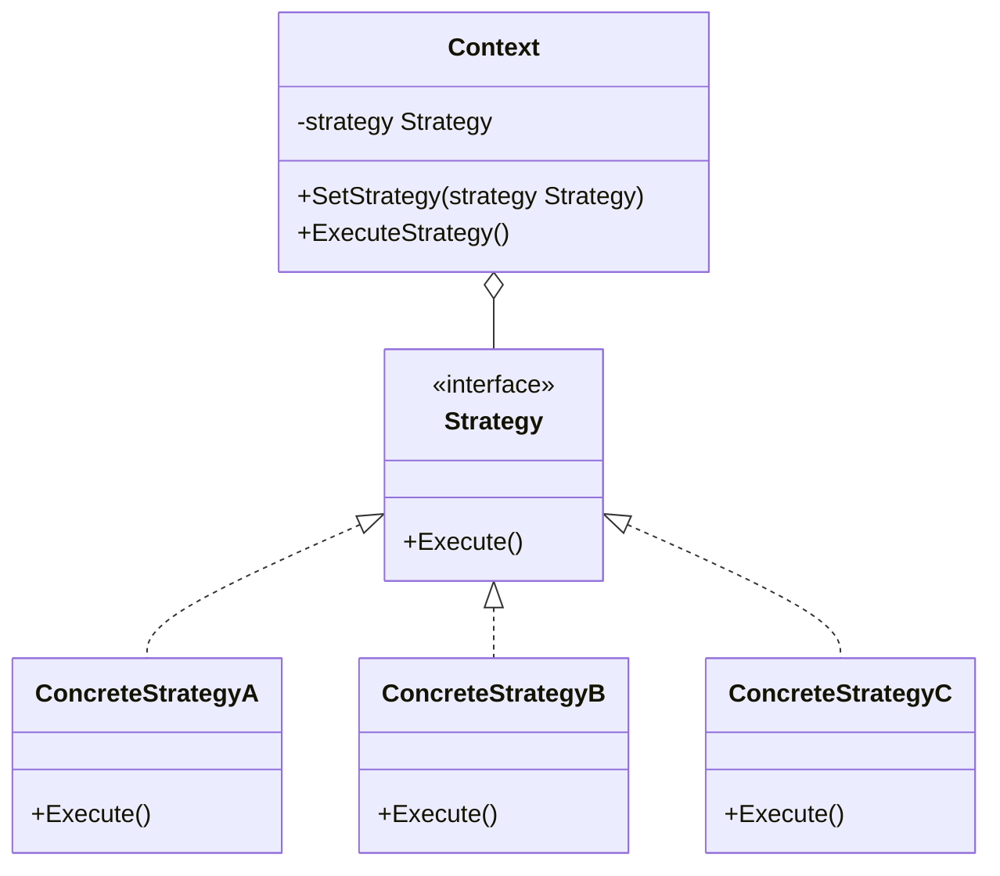
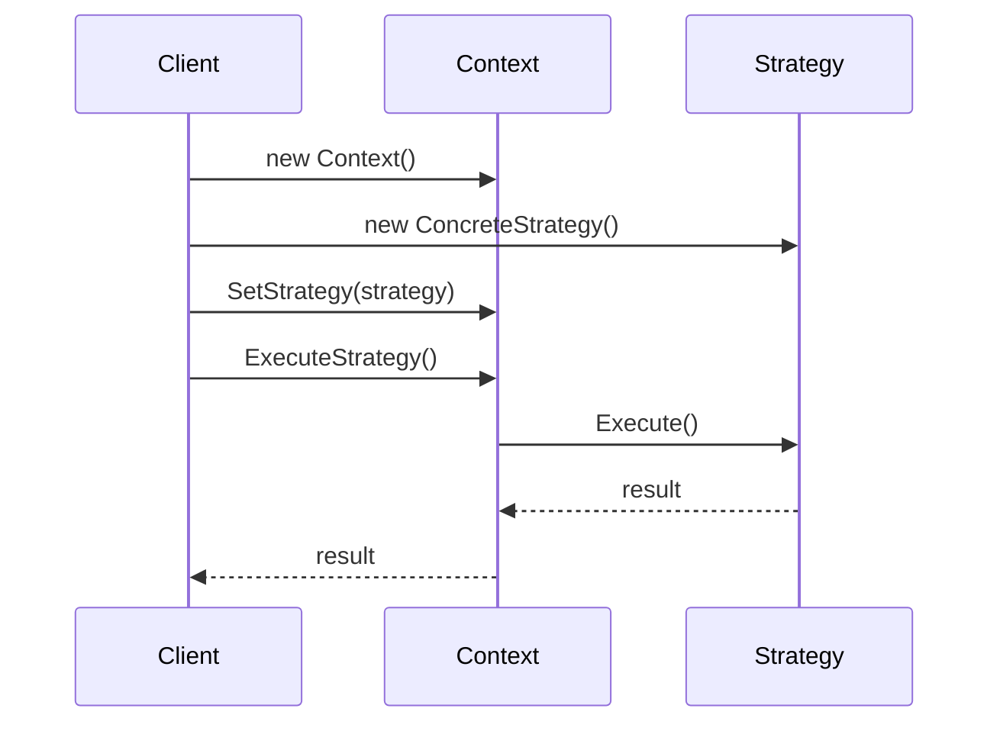

# 策略模式 (Strategy Pattern)

## 定义

策略模式定义了一系列算法，把它们一个个封装起来，并且使它们可以相互替换。策略模式让算法的变化独立于使用算法的客户。

## 意图

- 定义一系列算法，将每个算法封装起来，并让它们可以互换
- 让算法的变化独立于使用算法的客户
- 消除大量的条件语句
- 提供相同行为的不同实现

## 别名

- Policy Pattern（策略模式）

## 动机

假设我们正在开发一个电商系统，需要支持多种支付方式：支付宝、微信支付、银行卡支付。如果使用传统的 if-else 或 switch 语句：

```go
func processPayment(method string, amount float64) {
    if method == "alipay" {
        // 支付宝支付逻辑
    } else if method == "wechat" {
        // 微信支付逻辑
    } else if method == "card" {
        // 银行卡支付逻辑
    }
}
```

这种方式存在以下问题：
1. 违反开闭原则：添加新支付方式需要修改现有代码
2. 代码臃肿：随着支付方式增加，条件语句会越来越多
3. 难以测试：每种支付方式的逻辑耦合在一起
4. 难以复用：无法单独复用某种支付方式的逻辑

策略模式通过将每种支付方式封装成独立的策略类，解决了这些问题。

## 结构

### UML 类图



### UML 时序图



## 参与者

- **Strategy（策略接口）**: 定义所有支持的算法的公共接口，Context 使用这个接口来调用具体策略定义的算法
- **ConcreteStrategy（具体策略）**: 实现 Strategy 接口，提供具体的算法实现
- **Context（上下文）**: 维护一个对 Strategy 对象的引用，可以定义一个接口来让 Strategy 访问它的数据

## 协作

1. Context 将客户的请求转发给它的 Strategy 对象
2. Context 可以将算法所需的数据传递给 Strategy
3. Strategy 可以访问 Context 的数据（如果需要）
4. 客户端通常创建并传递一个 ConcreteStrategy 对象给 Context
5. 客户端可以在运行时切换 Context 使用的 Strategy

## 适用场景

1. **多个类只在行为上有差异**: 当许多相关的类仅仅是行为有异，可以使用策略模式配置一个类的多种行为
2. **需要算法的不同变体**: 当需要使用一个算法的不同变体时
3. **避免条件语句**: 当一个类定义了多种行为，并且这些行为在类的操作中以多个条件语句的形式出现时
4. **算法使用客户不应该知道的数据**: 策略模式可以避免暴露复杂的、与算法相关的数据结构

### 实际应用场景

- **支付系统**: 支付宝、微信、银行卡等不同支付方式
- **排序算法**: 快速排序、归并排序、冒泡排序等
- **压缩算法**: ZIP、RAR、7Z 等不同压缩方式
- **路由策略**: 最短路径、最快路径、避开拥堵等
- **价格计算**: 普通会员、VIP 会员、超级 VIP 等不同折扣策略
- **日志记录**: 文件日志、数据库日志、远程日志等

## 优点

- ✅ **算法可以自由切换**: 策略模式提供了管理相关算法族的办法
- ✅ **避免使用多重条件判断**: 消除了大量的 if-else 或 switch 语句
- ✅ **扩展性良好**: 符合开闭原则，添加新策略不需要修改现有代码
- ✅ **提高算法的保密性和安全性**: 策略模式可以避免暴露复杂的、与算法相关的数据结构

## 缺点

- ❌ **客户端必须知道所有的策略类**: 客户端必须了解各种策略的区别，以便选择合适的策略
- ❌ **策略类数量增多**: 每个策略都是一个类，复用的可能性很小，类数目会增多
- ❌ **增加了对象的数目**: 策略模式会产生很多策略对象

## 实现要点

### Go 语言实现

在 Go 语言中，策略模式的实现非常简洁，主要有两种方式：

#### 方式 1: 使用接口

```go
// 策略接口
type PaymentStrategy interface {
    Pay(amount float64) error
}

// 具体策略：支付宝
type AlipayStrategy struct{}

func (a *AlipayStrategy) Pay(amount float64) error {
    fmt.Printf("使用支付宝支付 %.2f 元\n", amount)
    return nil
}

// 具体策略：微信支付
type WechatStrategy struct{}

func (w *WechatStrategy) Pay(amount float64) error {
    fmt.Printf("使用微信支付 %.2f 元\n", amount)
    return nil
}

// 上下文
type PaymentContext struct {
    strategy PaymentStrategy
}

func (p *PaymentContext) SetStrategy(strategy PaymentStrategy) {
    p.strategy = strategy
}

func (p *PaymentContext) ExecutePayment(amount float64) error {
    if p.strategy == nil {
        return errors.New("未设置支付策略")
    }
    return p.strategy.Pay(amount)
}
```

#### 方式 2: 使用函数类型

Go 语言的函数是一等公民，可以直接使用函数类型作为策略：

```go
// 策略函数类型
type PaymentFunc func(amount float64) error

// 具体策略函数
func AlipayPayment(amount float64) error {
    fmt.Printf("使用支付宝支付 %.2f 元\n", amount)
    return nil
}

func WechatPayment(amount float64) error {
    fmt.Printf("使用微信支付 %.2f 元\n", amount)
    return nil
}

// 上下文
type PaymentProcessor struct {
    paymentFunc PaymentFunc
}

func (p *PaymentProcessor) SetPaymentFunc(fn PaymentFunc) {
    p.paymentFunc = fn
}

func (p *PaymentProcessor) Process(amount float64) error {
    if p.paymentFunc == nil {
        return errors.New("未设置支付函数")
    }
    return p.paymentFunc(amount)
}
```

### 代码示例

```go
package main

import (
    "fmt"
)

// 策略接口
type SortStrategy interface {
    Sort([]int) []int
}

// 冒泡排序策略
type BubbleSort struct{}

func (b *BubbleSort) Sort(data []int) []int {
    result := make([]int, len(data))
    copy(result, data)
    
    n := len(result)
    for i := 0; i < n-1; i++ {
        for j := 0; j < n-i-1; j++ {
            if result[j] > result[j+1] {
                result[j], result[j+1] = result[j+1], result[j]
            }
        }
    }
    return result
}

// 快速排序策略
type QuickSort struct{}

func (q *QuickSort) Sort(data []int) []int {
    result := make([]int, len(data))
    copy(result, data)
    q.quickSort(result, 0, len(result)-1)
    return result
}

func (q *QuickSort) quickSort(arr []int, low, high int) {
    if low < high {
        pi := q.partition(arr, low, high)
        q.quickSort(arr, low, pi-1)
        q.quickSort(arr, pi+1, high)
    }
}

func (q *QuickSort) partition(arr []int, low, high int) int {
    pivot := arr[high]
    i := low - 1
    for j := low; j < high; j++ {
        if arr[j] < pivot {
            i++
            arr[i], arr[j] = arr[j], arr[i]
        }
    }
    arr[i+1], arr[high] = arr[high], arr[i+1]
    return i + 1
}

// 排序上下文
type Sorter struct {
    strategy SortStrategy
}

func (s *Sorter) SetStrategy(strategy SortStrategy) {
    s.strategy = strategy
}

func (s *Sorter) Sort(data []int) []int {
    return s.strategy.Sort(data)
}

func main() {
    data := []int{64, 34, 25, 12, 22, 11, 90}
    
    sorter := &Sorter{}
    
    // 使用冒泡排序
    sorter.SetStrategy(&BubbleSort{})
    fmt.Println("冒泡排序:", sorter.Sort(data))
    
    // 使用快速排序
    sorter.SetStrategy(&QuickSort{})
    fmt.Println("快速排序:", sorter.Sort(data))
}
```

## 真实应用案例

### 1. Go 标准库 - sort 包

Go 标准库的 `sort` 包使用了策略模式，允许用户自定义排序策略：

```go
type Interface interface {
    Len() int
    Less(i, j int) bool
    Swap(i, j int)
}

func Sort(data Interface) {
    // 排序实现
}
```

### 2. Kubernetes - 调度策略

Kubernetes 的调度器使用策略模式来选择 Pod 应该运行在哪个节点上：

```go
type SchedulerAlgorithm interface {
    Schedule(pod *v1.Pod, nodeLister algorithm.NodeLister) (string, error)
}
```

### 3. 电商系统 - 促销策略

```go
type PromotionStrategy interface {
    CalculatePrice(originalPrice float64) float64
}

type NoPromotion struct{}
func (n *NoPromotion) CalculatePrice(price float64) float64 {
    return price
}

type PercentageDiscount struct {
    Percentage float64
}
func (p *PercentageDiscount) CalculatePrice(price float64) float64 {
    return price * (1 - p.Percentage)
}

type FixedDiscount struct {
    Amount float64
}
func (f *FixedDiscount) CalculatePrice(price float64) float64 {
    result := price - f.Amount
    if result < 0 {
        return 0
    }
    return result
}
```

## 相关模式

- **状态模式**: 策略模式和状态模式的结构相似，但意图不同。策略模式让客户选择不同的算法，状态模式让对象在不同状态下有不同的行为
- **工厂模式**: 可以使用工厂模式来创建策略对象
- **模板方法模式**: 模板方法模式在类中定义算法骨架，策略模式将整个算法封装成对象
- **命令模式**: 命令模式封装请求，策略模式封装算法

## 推荐阅读

- 《设计模式：可复用面向对象软件的基础》第 5.9 节
- 《Head First 设计模式》第 1 章
- 《重构：改善既有代码的设计》- 以多态取代条件表达式

## 开源项目参考

- **Go 标准库 sort 包**: https://golang.org/pkg/sort/
- **Kubernetes Scheduler**: https://github.com/kubernetes/kubernetes/tree/master/pkg/scheduler
- **Go-patterns**: https://github.com/tmrts/go-patterns

## 实践建议

1. **优先使用函数类型**: 在 Go 中，如果策略比较简单，优先使用函数类型而不是接口
2. **避免过度设计**: 不要为了使用策略模式而使用，只有当确实需要在运行时切换算法时才使用
3. **考虑使用配置**: 可以将策略的选择配置化，而不是硬编码在代码中
4. **注意性能**: 如果策略对象创建成本高，考虑使用对象池或单例模式
5. **提供默认策略**: 为 Context 提供一个合理的默认策略，避免空指针错误

## 总结

策略模式是一种非常实用的设计模式，它将算法的定义和使用分离，使得算法可以独立于使用它的客户而变化。在 Go 语言中，由于函数是一等公民，策略模式的实现更加简洁和灵活。

**核心思想**: 封装变化，将算法族封装成独立的策略，让它们可以互相替换。

**使用时机**: 当你有多个相似的算法，并且需要在运行时动态选择时。

**Go 语言特色**: 可以使用接口或函数类型实现，函数类型更加简洁。
