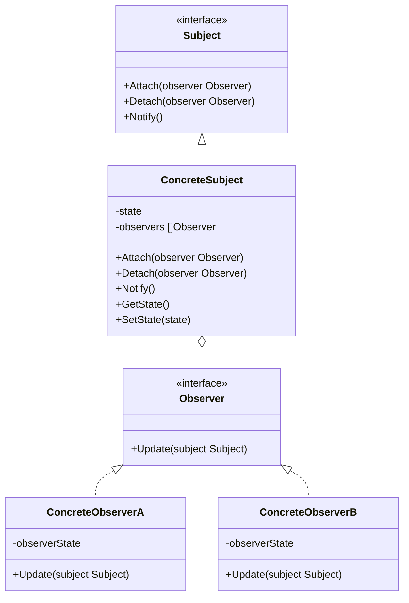
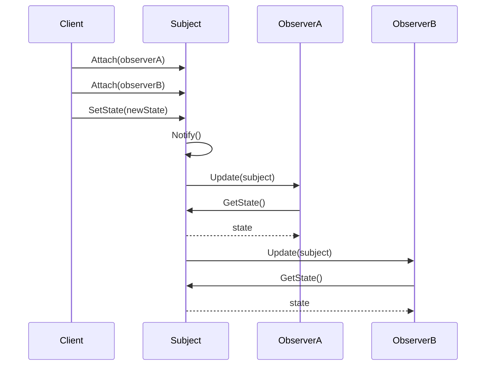

# 观察者模式 (Observer Pattern)

## 定义

观察者模式定义了对象间的一种一对多的依赖关系，当一个对象的状态发生改变时，所有依赖于它的对象都得到通知并被自动更新。

## 意图

- 定义对象间的一对多依赖关系
- 当一个对象状态改变时，所有依赖者都会收到通知并自动更新
- 实现松耦合的事件驱动系统
- 支持广播通信

## 别名

- Publish-Subscribe Pattern（发布-订阅模式）
- Dependents Pattern（依赖模式）
- Event-Subscriber Pattern（事件-订阅者模式）

## 动机

假设我们正在开发一个天气监测系统，需要在温度变化时通知多个显示设备（手机 App、网页、LED 显示屏）。如果使用传统方式：

```go
type WeatherStation struct {
    temperature float64
    mobileApp   *MobileApp
    webDisplay  *WebDisplay
    ledDisplay  *LEDDisplay
}

func (w *WeatherStation) SetTemperature(temp float64) {
    w.temperature = temp
    // 手动通知每个显示设备
    w.mobileApp.Update(temp)
    w.webDisplay.Update(temp)
    w.ledDisplay.Update(temp)
}
```

这种方式存在以下问题：
1. **紧耦合**: WeatherStation 必须知道所有显示设备的具体类型
2. **难以扩展**: 添加新的显示设备需要修改 WeatherStation 的代码
3. **违反开闭原则**: 对修改开放，对扩展关闭
4. **难以维护**: 显示设备的增删需要修改多处代码

观察者模式通过定义一个统一的观察者接口，让主题（Subject）和观察者（Observer）之间松耦合，解决了这些问题。

## 结构

### UML 类图



### UML 时序图



## 参与者

- **Subject（主题/被观察者）**: 知道它的观察者，提供注册和删除观察者的接口
- **Observer（观察者）**: 定义一个更新接口，使得在主题状态改变时能够得到通知
- **ConcreteSubject（具体主题）**: 存储具体的状态，当状态改变时通知所有观察者
- **ConcreteObserver（具体观察者）**: 实现 Observer 接口，保持一个指向 ConcreteSubject 的引用，存储与主题状态一致的状态

## 协作

1. ConcreteSubject 在状态发生改变时通知它的观察者
2. ConcreteObserver 可以向 ConcreteSubject 查询信息
3. ConcreteObserver 使用这些信息来更新自己的状态

### 推模型 vs 拉模型

**推模型（Push Model）**: 主题向观察者推送详细信息
```go
type Observer interface {
    Update(temperature float64, humidity float64, pressure float64)
}
```

**拉模型（Pull Model）**: 主题只通知观察者，观察者自己拉取需要的信息
```go
type Observer interface {
    Update(subject Subject)
}
```

## 适用场景

1. **一个对象的改变需要同时改变其他对象**: 而且不知道具体有多少对象需要改变
2. **一个对象必须通知其他对象**: 而它又不能假定其他对象是谁
3. **需要在系统中创建一个触发链**: A 对象的行为影响 B 对象，B 对象的行为影响 C 对象...

### 实际应用场景

- **GUI 事件处理**: 按钮点击、鼠标移动等事件的监听
- **消息队列**: 发布-订阅消息系统
- **数据绑定**: MVC/MVVM 架构中的数据绑定
- **日志系统**: 多个日志处理器监听日志事件
- **股票价格监控**: 股票价格变化时通知所有订阅者
- **社交媒体**: 用户发布动态时通知所有关注者

## 优点

- ✅ **松耦合**: 主题和观察者之间是抽象耦合，易于扩展
- ✅ **支持广播通信**: 主题会自动通知所有已注册的观察者
- ✅ **符合开闭原则**: 增加新的观察者无需修改主题的代码
- ✅ **建立触发机制**: 可以建立一套触发机制

## 缺点

- ❌ **可能导致内存泄漏**: 如果观察者没有正确注销，会导致内存泄漏
- ❌ **通知顺序不确定**: 观察者不知道其他观察者的存在，可能导致意外的更新顺序
- ❌ **可能导致循环依赖**: 如果观察者和主题之间存在循环依赖，可能导致系统崩溃
- ❌ **性能问题**: 如果观察者数量很多，通知所有观察者可能会影响性能

## 实现要点

### Go 语言实现

在 Go 语言中，观察者模式的实现有多种方式：

#### 方式 1: 使用接口

```go
// 观察者接口
type Observer interface {
    Update(data interface{})
}

// 主题接口
type Subject interface {
    Attach(observer Observer)
    Detach(observer Observer)
    Notify()
}

// 具体主题
type ConcreteSubject struct {
    observers []Observer
    state     interface{}
}

func (s *ConcreteSubject) Attach(observer Observer) {
    s.observers = append(s.observers, observer)
}

func (s *ConcreteSubject) Detach(observer Observer) {
    for i, obs := range s.observers {
        if obs == observer {
            s.observers = append(s.observers[:i], s.observers[i+1:]...)
            break
        }
    }
}

func (s *ConcreteSubject) Notify() {
    for _, observer := range s.observers {
        observer.Update(s.state)
    }
}

func (s *ConcreteSubject) SetState(state interface{}) {
    s.state = state
    s.Notify()
}
```

#### 方式 2: 使用 Channel

Go 语言的 channel 天然支持观察者模式：

```go
type EventBus struct {
    subscribers map[string][]chan interface{}
    mu          sync.RWMutex
}

func NewEventBus() *EventBus {
    return &EventBus{
        subscribers: make(map[string][]chan interface{}),
    }
}

func (eb *EventBus) Subscribe(topic string) <-chan interface{} {
    eb.mu.Lock()
    defer eb.mu.Unlock()
    
    ch := make(chan interface{}, 1)
    eb.subscribers[topic] = append(eb.subscribers[topic], ch)
    return ch
}

func (eb *EventBus) Publish(topic string, data interface{}) {
    eb.mu.RLock()
    defer eb.mu.RUnlock()
    
    for _, ch := range eb.subscribers[topic] {
        select {
        case ch <- data:
        default:
            // 如果 channel 已满，跳过
        }
    }
}
```

### 代码示例

```go
package main

import (
    "fmt"
    "sync"
)

// 观察者接口
type Observer interface {
    Update(temperature float64)
    GetID() string
}

// 主题接口
type Subject interface {
    Attach(observer Observer)
    Detach(observer Observer)
    Notify()
}

// 天气站（具体主题）
type WeatherStation struct {
    observers   []Observer
    temperature float64
    mu          sync.RWMutex
}

func NewWeatherStation() *WeatherStation {
    return &WeatherStation{
        observers: make([]Observer, 0),
    }
}

func (w *WeatherStation) Attach(observer Observer) {
    w.mu.Lock()
    defer w.mu.Unlock()
    w.observers = append(w.observers, observer)
    fmt.Printf("观察者 %s 已注册\n", observer.GetID())
}

func (w *WeatherStation) Detach(observer Observer) {
    w.mu.Lock()
    defer w.mu.Unlock()
    
    for i, obs := range w.observers {
        if obs.GetID() == observer.GetID() {
            w.observers = append(w.observers[:i], w.observers[i+1:]...)
            fmt.Printf("观察者 %s 已注销\n", observer.GetID())
            break
        }
    }
}

func (w *WeatherStation) Notify() {
    w.mu.RLock()
    defer w.mu.RUnlock()
    
    for _, observer := range w.observers {
        observer.Update(w.temperature)
    }
}

func (w *WeatherStation) SetTemperature(temp float64) {
    w.mu.Lock()
    w.temperature = temp
    w.mu.Unlock()
    
    fmt.Printf("\n天气站: 温度更新为 %.1f°C\n", temp)
    w.Notify()
}

// 手机显示（具体观察者）
type MobileDisplay struct {
    id string
}

func NewMobileDisplay(id string) *MobileDisplay {
    return &MobileDisplay{id: id}
}

func (m *MobileDisplay) Update(temperature float64) {
    fmt.Printf("手机显示 [%s]: 当前温度 %.1f°C\n", m.id, temperature)
}

func (m *MobileDisplay) GetID() string {
    return m.id
}

// 网页显示（具体观察者）
type WebDisplay struct {
    id string
}

func NewWebDisplay(id string) *WebDisplay {
    return &WebDisplay{id: id}
}

func (w *WebDisplay) Update(temperature float64) {
    fmt.Printf("网页显示 [%s]: 当前温度 %.1f°C\n", w.id, temperature)
}

func (w *WebDisplay) GetID() string {
    return w.id
}

func main() {
    // 创建天气站
    station := NewWeatherStation()
    
    // 创建观察者
    mobile := NewMobileDisplay("Mobile-001")
    web := NewWebDisplay("Web-001")
    
    // 注册观察者
    station.Attach(mobile)
    station.Attach(web)
    
    // 更新温度
    station.SetTemperature(25.5)
    station.SetTemperature(28.0)
    
    // 注销一个观察者
    fmt.Println()
    station.Detach(mobile)
    
    // 再次更新温度
    station.SetTemperature(30.5)
}
```

## 真实应用案例

### 1. Go 标准库 - context 包

Go 的 context 包使用了观察者模式来传播取消信号：

```go
ctx, cancel := context.WithCancel(context.Background())

go func() {
    <-ctx.Done() // 观察取消信号
    fmt.Println("收到取消信号")
}()

cancel() // 通知所有观察者
```

### 2. NATS - 消息系统

NATS 是一个高性能的发布-订阅消息系统：

```go
nc, _ := nats.Connect(nats.DefaultURL)

// 订阅（观察者）
nc.Subscribe("updates", func(m *nats.Msg) {
    fmt.Printf("收到消息: %s\n", string(m.Data))
})

// 发布（主题）
nc.Publish("updates", []byte("Hello World"))
```

### 3. 日志系统

```go
type LogEvent struct {
    Level   string
    Message string
    Time    time.Time
}

type LogHandler interface {
    Handle(event LogEvent)
}

type Logger struct {
    handlers []LogHandler
}

func (l *Logger) AddHandler(handler LogHandler) {
    l.handlers = append(l.handlers, handler)
}

func (l *Logger) Log(level, message string) {
    event := LogEvent{
        Level:   level,
        Message: message,
        Time:    time.Now(),
    }
    
    for _, handler := range l.handlers {
        handler.Handle(event)
    }
}

type ConsoleHandler struct{}

func (c *ConsoleHandler) Handle(event LogEvent) {
    fmt.Printf("[%s] %s: %s\n", event.Time.Format("15:04:05"), event.Level, event.Message)
}

type FileHandler struct {
    file *os.File
}

func (f *FileHandler) Handle(event LogEvent) {
    fmt.Fprintf(f.file, "[%s] %s: %s\n", event.Time.Format("15:04:05"), event.Level, event.Message)
}
```

## 相关模式

- **中介者模式**: 中介者模式通过引入中介者对象来封装对象间的交互，观察者模式通过引入主题和观察者来分离对象
- **单例模式**: 主题对象通常是单例的
- **命令模式**: 可以使用命令模式来实现撤销功能
- **发布-订阅模式**: 观察者模式的变体，通过消息中间件进一步解耦

## 观察者模式 vs 发布-订阅模式

虽然两者经常被混用，但它们有细微的区别：

| 特性 | 观察者模式 | 发布-订阅模式 |
|------|-----------|--------------|
| 耦合度 | 主题知道观察者 | 发布者和订阅者完全解耦 |
| 中间件 | 无 | 有消息中间件/事件总线 |
| 通知方式 | 主题直接通知观察者 | 通过中间件转发 |
| 适用场景 | 同一进程内 | 可跨进程、跨网络 |

## 推荐阅读

- 《设计模式：可复用面向对象软件的基础》第 5.7 节
- 《Head First 设计模式》第 2 章
- 《企业应用架构模式》- 事件驱动架构

## 开源项目参考

- **NATS**: https://github.com/nats-io/nats.go
- **EventBus**: https://github.com/asaskevich/EventBus
- **Go Context**: https://golang.org/pkg/context/

## 实践建议

1. **避免内存泄漏**: 确保观察者在不再需要时及时注销
2. **使用 Channel**: 在 Go 中，优先考虑使用 channel 实现观察者模式
3. **异步通知**: 对于耗时的观察者，考虑使用 goroutine 异步通知
4. **错误处理**: 一个观察者的错误不应该影响其他观察者
5. **避免循环依赖**: 观察者不应该在更新时修改主题的状态
6. **使用 Context**: 利用 context 包来管理观察者的生命周期

## 线程安全

在 Go 中实现观察者模式时，需要特别注意线程安全：

```go
type SafeSubject struct {
    observers []Observer
    mu        sync.RWMutex
}

func (s *SafeSubject) Attach(observer Observer) {
    s.mu.Lock()
    defer s.mu.Unlock()
    s.observers = append(s.observers, observer)
}

func (s *SafeSubject) Notify() {
    s.mu.RLock()
    observers := make([]Observer, len(s.observers))
    copy(observers, s.observers)
    s.mu.RUnlock()
    
    for _, observer := range observers {
        observer.Update()
    }
}
```

## 总结

观察者模式是一种非常实用的设计模式，它定义了对象间的一对多依赖关系，使得当一个对象状态改变时，所有依赖它的对象都会得到通知。在 Go 语言中，可以使用接口或 channel 来实现观察者模式，channel 的方式更加符合 Go 的并发模型。

**核心思想**: 定义一对多的依赖关系，实现松耦合的事件驱动系统。

**使用时机**: 当一个对象的改变需要同时改变其他对象，而且不知道具体有多少对象需要改变时。

**Go 语言特色**: 可以使用 channel 和 goroutine 实现高效的异步观察者模式。
