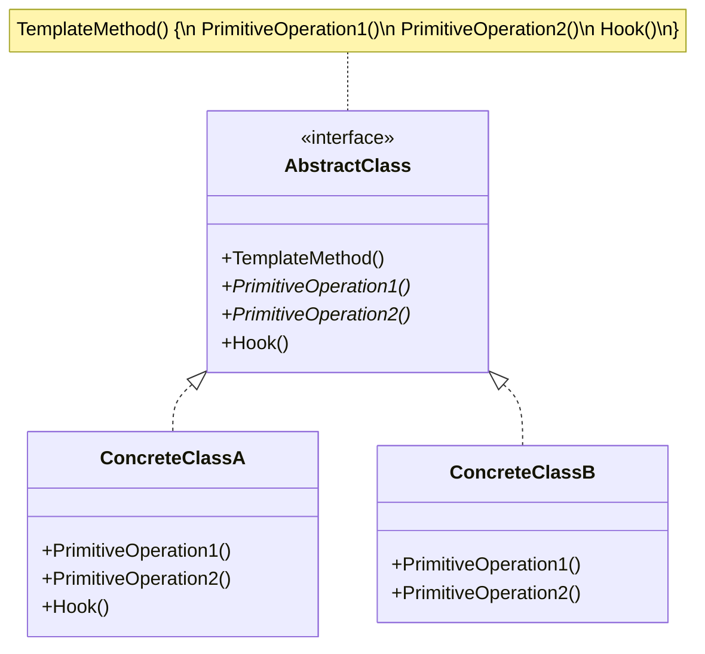
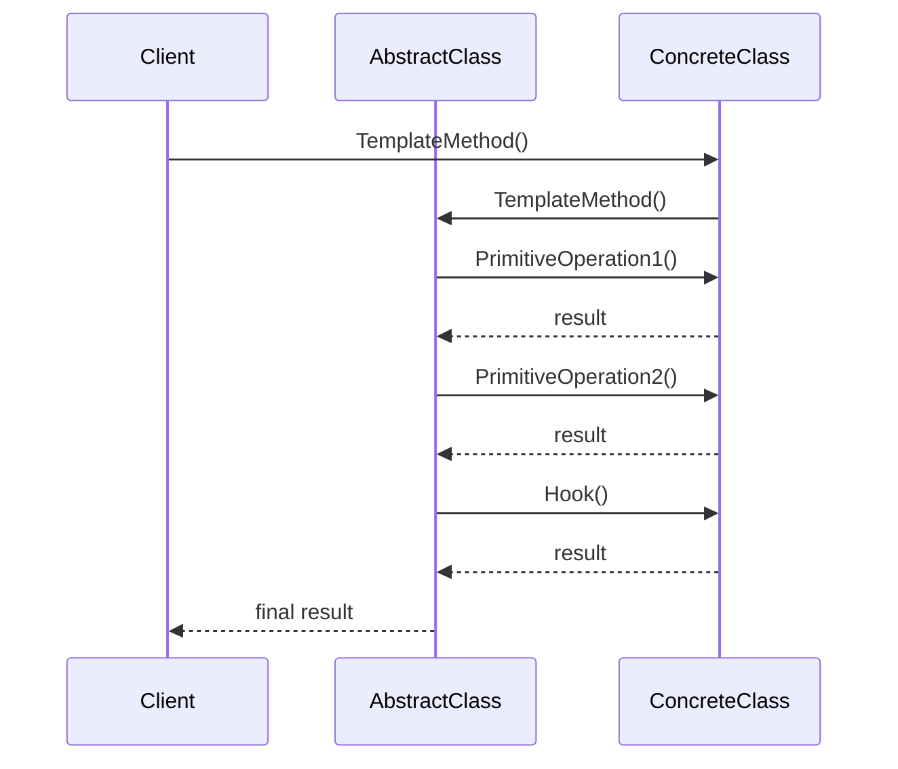

# 模板方法模式 (Template Method Pattern)

## 定义

模板方法模式在一个方法中定义一个算法的骨架，而将一些步骤延迟到子类中。模板方法使得子类可以在不改变算法结构的情况下，重新定义算法的某些特定步骤。

## 意图

- 定义一个操作中的算法骨架，将某些步骤延迟到子类中实现
- 使得子类可以不改变算法结构的情况下重定义算法的某些特定步骤
- 实现代码复用，将不变的行为搬移到父类
- 通过钩子方法提供扩展点

## 别名

- Template Pattern（模板模式）

## 动机

假设我们正在开发一个数据处理系统，需要处理不同格式的数据（CSV、JSON、XML）。虽然数据格式不同，但处理流程是相同的：

1. 读取数据
2. 解析数据
3. 验证数据
4. 处理数据
5. 保存结果

如果为每种格式都写一套完整的处理流程：

```go
func ProcessCSV() {
    // 读取 CSV 文件
    // 解析 CSV 数据
    // 验证数据
    // 处理数据
    // 保存结果
}

func ProcessJSON() {
    // 读取 JSON 文件
    // 解析 JSON 数据
    // 验证数据
    // 处理数据
    // 保存结果
}
```

这种方式存在以下问题：
1. **代码重复**: 验证、处理、保存等步骤的代码重复
2. **难以维护**: 修改流程需要修改多处代码
3. **不易扩展**: 添加新格式需要复制大量代码
4. **违反 DRY 原则**: Don't Repeat Yourself

模板方法模式通过将算法的骨架定义在基类中，将可变的步骤延迟到子类实现，解决了这些问题。

## 结构

### UML 类图



### UML 时序图



## 参与者

- **AbstractClass（抽象类）**: 定义抽象的原语操作，具体的子类将重定义它们以实现算法的各个步骤；实现一个模板方法，定义算法的骨架
- **ConcreteClass（具体类）**: 实现原语操作以完成算法中与特定子类相关的步骤

## 协作

1. ConcreteClass 依赖 AbstractClass 来实现算法中不变的步骤
2. AbstractClass 调用 ConcreteClass 实现的原语操作
3. 这是一种控制反转（IoC）的体现：父类调用子类的方法

## 适用场景

1. **一次性实现算法的不变部分**: 将可变的行为留给子类来实现
2. **各子类中公共的行为应被提取出来**: 集中到一个公共父类中以避免代码重复
3. **控制子类扩展**: 模板方法只在特定点调用钩子操作，只允许在这些点进行扩展

### 实际应用场景

- **框架设计**: Web 框架的请求处理流程、测试框架的测试执行流程
- **工作流引擎**: 定义工作流的执行步骤
- **数据处理**: ETL（提取、转换、加载）流程
- **游戏开发**: 游戏循环（初始化、更新、渲染、清理）
- **编译器**: 词法分析、语法分析、语义分析、代码生成
- **HTTP 处理**: 请求解析、认证、业务处理、响应生成

## 优点

- ✅ **代码复用**: 将不变的行为搬移到父类，去除子类中的重复代码
- ✅ **控制扩展点**: 通过钩子方法控制子类的扩展
- ✅ **符合开闭原则**: 不修改模板方法，只扩展某些步骤
- ✅ **符合依赖倒置原则**: 父类调用子类的操作，实现控制反转

## 缺点

- ❌ **增加系统复杂度**: 每个不同的实现都需要一个子类
- ❌ **违反里氏替换原则**: 子类可能会影响父类的行为
- ❌ **难以理解**: 控制流程在父类和子类之间跳转，可能难以理解

## 实现要点

### Go 语言实现

Go 语言没有继承，但可以通过接口和组合来实现模板方法模式：

#### 方式 1: 使用接口

```go
// 定义原语操作接口
type DataProcessor interface {
    ReadData() ([]byte, error)
    ParseData([]byte) (interface{}, error)
    ProcessData(interface{}) (interface{}, error)
}

// 模板方法
type DataProcessorTemplate struct {
    processor DataProcessor
}

func (t *DataProcessorTemplate) Process() error {
    // 1. 读取数据
    data, err := t.processor.ReadData()
    if err != nil {
        return err
    }
    
    // 2. 解析数据
    parsed, err := t.processor.ParseData(data)
    if err != nil {
        return err
    }
    
    // 3. 处理数据
    result, err := t.processor.ProcessData(parsed)
    if err != nil {
        return err
    }
    
    // 4. 保存结果（公共步骤）
    return t.saveResult(result)
}

func (t *DataProcessorTemplate) saveResult(result interface{}) error {
    fmt.Printf("保存结果: %v\n", result)
    return nil
}
```

#### 方式 2: 使用函数类型

```go
// 定义步骤函数类型
type StepFunc func() error

// 模板方法
type Workflow struct {
    steps []StepFunc
}

func (w *Workflow) Execute() error {
    for i, step := range w.steps {
        fmt.Printf("执行步骤 %d\n", i+1)
        if err := step(); err != nil {
            return fmt.Errorf("步骤 %d 失败: %w", i+1, err)
        }
    }
    return nil
}

// 创建工作流
func NewDataProcessWorkflow(read, parse, process StepFunc) *Workflow {
    return &Workflow{
        steps: []StepFunc{read, parse, process},
    }
}
```

### 代码示例

```go
package main

import (
    "fmt"
)

// 数据处理器接口（定义原语操作）
type DataProcessor interface {
    ReadData() string
    ParseData(string) map[string]interface{}
    ValidateData(map[string]interface{}) bool
}

// 数据处理模板
type DataProcessorTemplate struct {
    processor DataProcessor
}

func NewDataProcessorTemplate(processor DataProcessor) *DataProcessorTemplate {
    return &DataProcessorTemplate{processor: processor}
}

// 模板方法（定义算法骨架）
func (t *DataProcessorTemplate) Process() {
    fmt.Println("=== 开始数据处理流程 ===\n")
    
    // 步骤 1: 读取数据
    fmt.Println("步骤 1: 读取数据")
    data := t.processor.ReadData()
    fmt.Printf("读取到数据: %s\n\n", data)
    
    // 步骤 2: 解析数据
    fmt.Println("步骤 2: 解析数据")
    parsed := t.processor.ParseData(data)
    fmt.Printf("解析结果: %v\n\n", parsed)
    
    // 步骤 3: 验证数据
    fmt.Println("步骤 3: 验证数据")
    if !t.processor.ValidateData(parsed) {
        fmt.Println("数据验证失败\n")
        return
    }
    fmt.Println("数据验证成功\n")
    
    // 步骤 4: 处理数据（公共步骤）
    fmt.Println("步骤 4: 处理数据")
    t.processData(parsed)
    
    // 步骤 5: 保存结果（公共步骤）
    fmt.Println("步骤 5: 保存结果")
    t.saveResult(parsed)
    
    fmt.Println("\n=== 数据处理流程完成 ===")
}

// 公共步骤：处理数据
func (t *DataProcessorTemplate) processData(data map[string]interface{}) {
    fmt.Println("执行通用数据处理逻辑")
}

// 公共步骤：保存结果
func (t *DataProcessorTemplate) saveResult(data map[string]interface{}) {
    fmt.Println("保存处理结果到数据库")
}

// CSV 数据处理器（具体实现）
type CSVProcessor struct{}

func (c *CSVProcessor) ReadData() string {
    return "name,age,city\nAlice,30,Beijing\nBob,25,Shanghai"
}

func (c *CSVProcessor) ParseData(data string) map[string]interface{} {
    return map[string]interface{}{
        "format": "CSV",
        "rows":   2,
        "data":   data,
    }
}

func (c *CSVProcessor) ValidateData(data map[string]interface{}) bool {
    rows, ok := data["rows"].(int)
    return ok && rows > 0
}

// JSON 数据处理器（具体实现）
type JSONProcessor struct{}

func (j *JSONProcessor) ReadData() string {
    return `{"users": [{"name": "Alice", "age": 30}, {"name": "Bob", "age": 25}]}`
}

func (j *JSONProcessor) ParseData(data string) map[string]interface{} {
    return map[string]interface{}{
        "format": "JSON",
        "count":  2,
        "data":   data,
    }
}

func (j *JSONProcessor) ValidateData(data map[string]interface{}) bool {
    count, ok := data["count"].(int)
    return ok && count > 0
}

func main() {
    // 处理 CSV 数据
    fmt.Println("【CSV 数据处理】")
    csvProcessor := &CSVProcessor{}
    csvTemplate := NewDataProcessorTemplate(csvProcessor)
    csvTemplate.Process()
    
    fmt.Println("\n" + strings.Repeat("=", 50) + "\n")
    
    // 处理 JSON 数据
    fmt.Println("【JSON 数据处理】")
    jsonProcessor := &JSONProcessor{}
    jsonTemplate := NewDataProcessorTemplate(jsonProcessor)
    jsonTemplate.Process()
}
```

## 钩子方法

钩子方法（Hook Method）是模板方法模式的一个重要特性，它提供了可选的扩展点：

```go
type DataProcessor interface {
    ReadData() string
    ParseData(string) map[string]interface{}
    ValidateData(map[string]interface{}) bool
    
    // 钩子方法：可选的预处理步骤
    BeforeProcess() bool  // 返回 false 可以跳过处理
    
    // 钩子方法：可选的后处理步骤
    AfterProcess()
}

// 默认实现
type BaseProcessor struct{}

func (b *BaseProcessor) BeforeProcess() bool {
    return true  // 默认不跳过
}

func (b *BaseProcessor) AfterProcess() {
    // 默认什么都不做
}

// 模板方法中使用钩子
func (t *DataProcessorTemplate) Process() {
    // 调用钩子方法
    if !t.processor.BeforeProcess() {
        fmt.Println("跳过处理")
        return
    }
    
    // ... 执行处理步骤 ...
    
    // 调用钩子方法
    t.processor.AfterProcess()
}
```

## 真实应用案例

### 1. Go 标准库 - http.Handler

Go 的 HTTP 处理器使用了模板方法模式：

```go
type Handler interface {
    ServeHTTP(ResponseWriter, *Request)
}

// 中间件模板
func LoggingMiddleware(next http.Handler) http.Handler {
    return http.HandlerFunc(func(w http.ResponseWriter, r *http.Request) {
        // 前置处理
        start := time.Now()
        
        // 调用下一个处理器（模板方法）
        next.ServeHTTP(w, r)
        
        // 后置处理
        duration := time.Since(start)
        log.Printf("%s %s %v", r.Method, r.URL.Path, duration)
    })
}
```

### 2. 测试框架

```go
type TestCase interface {
    SetUp()
    RunTest()
    TearDown()
}

type TestRunner struct {
    testCase TestCase
}

func (r *TestRunner) Run() {
    // 模板方法
    r.testCase.SetUp()
    defer r.testCase.TearDown()
    r.testCase.RunTest()
}
```

### 3. 游戏循环

```go
type Game interface {
    Initialize()
    Update(deltaTime float64)
    Render()
    Cleanup()
}

type GameEngine struct {
    game Game
}

func (e *GameEngine) Run() {
    e.game.Initialize()
    defer e.game.Cleanup()
    
    ticker := time.NewTicker(16 * time.Millisecond) // 60 FPS
    defer ticker.Stop()
    
    for range ticker.C {
        e.game.Update(0.016)
        e.game.Render()
    }
}
```

## 相关模式

- **策略模式**: 策略模式改变整个算法，模板方法模式只改变算法的某些步骤
- **工厂方法模式**: 工厂方法模式是模板方法模式的一种特殊情况
- **装饰器模式**: 装饰器模式在运行时添加行为，模板方法模式在编译时定义算法骨架

## 模板方法模式 vs 策略模式

| 特性 | 模板方法模式 | 策略模式 |
|------|-------------|---------|
| 意图 | 定义算法骨架 | 封装算法族 |
| 变化点 | 算法的某些步骤 | 整个算法 |
| 实现方式 | 继承/接口 | 组合 |
| 灵活性 | 编译时确定 | 运行时切换 |
| 代码复用 | 父类复用 | 策略复用 |

## 推荐阅读

- 《设计模式：可复用面向对象软件的基础》第 5.10 节
- 《重构：改善既有代码的设计》- 以多态取代条件表达式
- 《企业应用架构模式》- 模板方法

## 开源项目参考

- **Go 标准库 http 包**: https://golang.org/pkg/net/http/
- **Gin 框架**: https://github.com/gin-gonic/gin
- **GORM**: https://github.com/go-gorm/gorm

## 实践建议

1. **明确不变和可变部分**: 仔细分析哪些步骤是不变的，哪些是可变的
2. **使用钩子方法**: 提供钩子方法让子类可以选择性地扩展
3. **避免过度设计**: 不要为了使用模板方法而使用，只有当确实有公共流程时才使用
4. **文档化流程**: 清晰地文档化算法的执行流程和各个步骤的职责
5. **考虑使用函数**: 在 Go 中，如果步骤比较简单，可以使用函数类型代替接口
6. **保持步骤简单**: 每个步骤应该职责单一，易于理解和测试

## Go 语言特色实现

### 使用选项模式

```go
type ProcessOption func(*ProcessConfig)

type ProcessConfig struct {
    beforeHook func()
    afterHook  func()
    validate   bool
}

func WithBeforeHook(hook func()) ProcessOption {
    return func(c *ProcessConfig) {
        c.beforeHook = hook
    }
}

func WithAfterHook(hook func()) ProcessOption {
    return func(c *ProcessConfig) {
        c.afterHook = hook
    }
}

func Process(data string, opts ...ProcessOption) {
    config := &ProcessConfig{validate: true}
    for _, opt := range opts {
        opt(config)
    }
    
    if config.beforeHook != nil {
        config.beforeHook()
    }
    
    // 处理逻辑
    
    if config.afterHook != nil {
        config.afterHook()
    }
}
```

## 总结

模板方法模式是一种非常实用的设计模式，它通过定义算法的骨架，将某些步骤延迟到子类实现，实现了代码复用和控制反转。在 Go 语言中，虽然没有继承，但可以通过接口和组合来实现模板方法模式，甚至可以使用函数类型来实现更加灵活的模板方法。

**核心思想**: 定义算法骨架，将可变的步骤延迟到子类实现。

**使用时机**: 当多个类有相同的处理流程，但某些步骤的实现不同时。

**Go 语言特色**: 可以使用接口、函数类型或选项模式实现，更加灵活。
