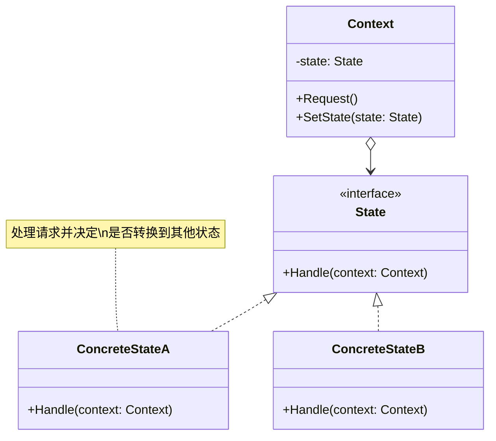
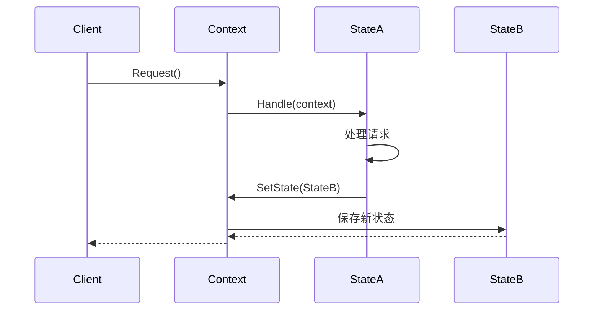

# 状态模式 (State Pattern)

## 定义

状态模式允许对象在内部状态改变时改变它的行为，对象看起来好像修改了它的类。

## 意图

状态模式的主要意图是：
- 将与特定状态相关的行为局部化
- 将不同状态的行为分割开来
- 使状态转换显式化
- 让状态对象可以被共享

## 别名

- Objects for States（状态对象）

## 动机

考虑一个订单系统，订单有多个状态：待支付、已支付、已发货、已完成、已取消。每个状态下，订单的行为是不同的：

- **待支付状态**: 可以支付、可以取消
- **已支付状态**: 可以发货、可以退款
- **已发货状态**: 可以确认收货、可以申请退货
- **已完成状态**: 可以评价、可以申请售后
- **已取消状态**: 不能进行任何操作

如果使用传统的条件语句实现，代码会充满大量的 if-else 或 switch-case：

```go
func (o *Order) Process() {
    if o.state == "pending" {
        // 待支付逻辑
    } else if o.state == "paid" {
        // 已支付逻辑
    } else if o.state == "shipped" {
        // 已发货逻辑
    } else if o.state == "completed" {
        // 已完成逻辑
    } else if o.state == "cancelled" {
        // 已取消逻辑
    }
}
```

这种实现方式的问题：
1. 代码难以维护和扩展
2. 添加新状态需要修改多处代码
3. 状态转换逻辑分散在各处
4. 违反开闭原则

状态模式通过将每个状态封装成独立的类来解决这些问题。

## 结构

### UML 类图



### UML 时序图



## 参与者

- **Context（上下文）**: 
  - 定义客户感兴趣的接口
  - 维护一个 ConcreteState 子类的实例，这个实例定义当前状态
  
- **State（状态接口）**: 
  - 定义一个接口以封装与 Context 的一个特定状态相关的行为
  
- **ConcreteState（具体状态）**: 
  - 每一个子类实现一个与 Context 的一个状态相关的行为
  - 负责处理状态转换

## 协作

1. Context 将与状态相关的请求委托给当前的 ConcreteState 对象处理
2. Context 可将自身作为参数传递给处理该请求的状态对象，使状态对象可以访问 Context
3. Context 是客户使用的主要接口，客户可以用状态对象来配置一个 Context
4. Context 或 ConcreteState 子类都可以决定哪个状态是另一个状态的后继者，以及在何种条件下进行状态转换

## 适用场景

在以下情况下可以使用状态模式：

1. **对象的行为取决于它的状态**，并且它必须在运行时根据状态改变它的行为
2. **代码中包含大量与对象状态有关的条件语句**，这些条件语句的出现会导致代码的可维护性和灵活性变差
3. **状态转换逻辑复杂**，需要将状态转换逻辑集中管理
4. **需要避免使用大量的条件分支语句**

典型应用场景：
- 订单状态管理
- 工作流引擎
- 游戏角色状态
- TCP 连接状态
- 文档审批流程
- 电梯控制系统

## 优点

- ✅ **封装状态转换规则**: 将状态转换逻辑封装在状态类中，便于管理和维护
- ✅ **消除条件语句**: 用多态替代大量的条件分支语句，代码更清晰
- ✅ **符合开闭原则**: 添加新状态不需要修改现有代码，只需添加新的状态类
- ✅ **状态对象可共享**: 如果状态对象没有实例变量，可以被多个 Context 共享
- ✅ **使状态转换显式化**: 状态转换变成了对象之间的关系，更容易理解和维护
- ✅ **职责分离**: 每个状态类只关注自己的行为，符合单一职责原则

## 缺点

- ❌ **增加类的数量**: 每个状态都需要一个类，状态多时会导致类数量增加
- ❌ **增加系统复杂度**: 引入了额外的抽象层，增加了系统的复杂度
- ❌ **状态转换逻辑分散**: 状态转换逻辑分散在各个状态类中，可能难以理解整体流程
- ❌ **不适合状态很少的情况**: 如果只有 2-3 个状态，使用状态模式可能过度设计

## 实现要点

### Go 语言实现

在 Go 语言中实现状态模式的关键点：

1. **使用接口定义状态行为**
```go
type State interface {
    Handle(context *Context)
    String() string
}
```

2. **上下文持有当前状态**
```go
type Context struct {
    state State
}

func (c *Context) SetState(state State) {
    c.state = state
}

func (c *Context) Request() {
    c.state.Handle(c)
}
```

3. **具体状态实现接口**
```go
type ConcreteStateA struct{}

func (s *ConcreteStateA) Handle(context *Context) {
    // 处理逻辑
    // 可能会改变 context 的状态
    context.SetState(&ConcreteStateB{})
}
```

4. **Go 特有的实现技巧**
   - 使用空结构体节省内存（如果状态无数据）
   - 使用单例模式共享状态对象
   - 使用函数类型简化简单状态的实现

### 代码示例

```go
package main

import "fmt"

// State 状态接口
type State interface {
    Handle(context *Context)
    String() string
}

// Context 上下文
type Context struct {
    state State
}

func NewContext() *Context {
    return &Context{
        state: &PendingState{},
    }
}

func (c *Context) SetState(state State) {
    fmt.Printf("状态转换: %s -> %s\n", c.state, state)
    c.state = state
}

func (c *Context) Request() {
    c.state.Handle(c)
}

func (c *Context) GetState() string {
    return c.state.String()
}

// PendingState 待处理状态
type PendingState struct{}

func (s *PendingState) Handle(context *Context) {
    fmt.Println("处理待处理状态的请求")
    // 转换到处理中状态
    context.SetState(&ProcessingState{})
}

func (s *PendingState) String() string {
    return "待处理"
}

// ProcessingState 处理中状态
type ProcessingState struct{}

func (s *ProcessingState) Handle(context *Context) {
    fmt.Println("处理处理中状态的请求")
    // 转换到已完成状态
    context.SetState(&CompletedState{})
}

func (s *ProcessingState) String() string {
    return "处理中"
}

// CompletedState 已完成状态
type CompletedState struct{}

func (s *CompletedState) Handle(context *Context) {
    fmt.Println("处理已完成状态的请求")
    fmt.Println("已经是最终状态，无需转换")
}

func (s *CompletedState) String() string {
    return "已完成"
}

func main() {
    fmt.Println("=== 状态模式示例 ===\n")
    
    context := NewContext()
    fmt.Printf("初始状态: %s\n\n", context.GetState())
    
    // 第一次请求
    context.Request()
    fmt.Printf("当前状态: %s\n\n", context.GetState())
    
    // 第二次请求
    context.Request()
    fmt.Printf("当前状态: %s\n\n", context.GetState())
    
    // 第三次请求
    context.Request()
    fmt.Printf("当前状态: %s\n\n", context.GetState())
    
    fmt.Println("=== 示例结束 ===")
}
```

## 真实应用案例

### 1. TCP 连接状态管理

TCP 协议有多个连接状态：CLOSED、LISTEN、SYN_SENT、SYN_RECEIVED、ESTABLISHED、FIN_WAIT_1、FIN_WAIT_2、CLOSE_WAIT、CLOSING、LAST_ACK、TIME_WAIT。每个状态下对数据包的处理方式不同。

### 2. 订单系统

电商系统中的订单有完整的生命周期：待支付、已支付、待发货、已发货、待收货、已完成、已取消、退款中、已退款等。每个状态下允许的操作不同。

### 3. 工作流引擎

审批流程中的文档状态：草稿、待审批、审批中、已通过、已拒绝、已归档。不同状态下的操作权限和流转规则不同。

### 4. 游戏角色状态

游戏角色的状态：正常、受伤、中毒、眩晕、死亡、复活中。每个状态下角色的行为和属性不同。

## 相关模式

### 与策略模式的关系

**相似点**:
- 结构相似，都使用组合和委托
- 都使用接口定义行为

**不同点**:
- **状态模式**: 关注状态的改变，状态之间有转换关系，通常由状态对象控制转换
- **策略模式**: 关注算法的替换，策略之间是平等的，由客户端选择策略

### 与单例模式的关系

状态对象通常可以设计为单例，因为它们通常不包含实例变量，可以被多个 Context 共享。

### 与享元模式的关系

如果状态对象没有内部状态，可以使用享元模式共享状态对象，减少内存开销。

## 实现变体

### 1. 状态转换由 Context 控制

```go
func (c *Context) Pay() {
    if _, ok := c.state.(*PendingState); ok {
        c.SetState(&PaidState{})
    }
}
```

### 2. 状态转换由 State 控制

```go
func (s *PendingState) Pay(context *Context) {
    context.SetState(&PaidState{})
}
```

### 3. 使用状态表

```go
var stateTransitions = map[string]map[string]State{
    "pending": {
        "pay": &PaidState{},
        "cancel": &CancelledState{},
    },
    "paid": {
        "ship": &ShippedState{},
        "refund": &RefundedState{},
    },
}
```

## 推荐阅读

1. **《设计模式：可复用面向对象软件的基础》** - GoF
   - 第 5.8 节：State 模式

2. **《Head First 设计模式》**
   - 第 10 章：状态模式

3. **在线资源**
   - [Refactoring Guru - State Pattern](https://refactoring.guru/design-patterns/state)
   - [SourceMaking - State Pattern](https://sourcemaking.com/design_patterns/state)

## 开源项目参考

1. **Kubernetes Pod 生命周期**
   - Pod 的状态管理：Pending、Running、Succeeded、Failed、Unknown

2. **Docker 容器状态**
   - 容器状态：Created、Running、Paused、Restarting、Removing、Exited、Dead

3. **Gin 框架的上下文状态**
   - 请求处理过程中的状态管理

## 最佳实践

1. **明确状态转换规则**: 清晰定义哪些状态可以转换到哪些状态
2. **避免状态爆炸**: 合理划分状态，避免状态过多
3. **考虑状态共享**: 无状态的状态对象可以共享
4. **记录状态历史**: 对于需要审计的场景，记录状态变更历史
5. **处理非法转换**: 对非法的状态转换进行检查和处理
6. **使用枚举或常量**: 定义状态常量，避免硬编码字符串
7. **提供状态查询接口**: 允许外部查询当前状态
8. **考虑并发安全**: 多线程环境下需要考虑状态转换的并发安全

## 总结

状态模式是一种强大的行为型模式，它通过将状态封装成独立的类，消除了大量的条件分支语句，使代码更加清晰和易于维护。在处理具有复杂状态转换逻辑的对象时，状态模式是一个很好的选择。

关键要点：
- 将状态封装成独立的类
- 状态转换逻辑由状态对象管理
- 用多态替代条件语句
- 符合开闭原则，易于扩展
