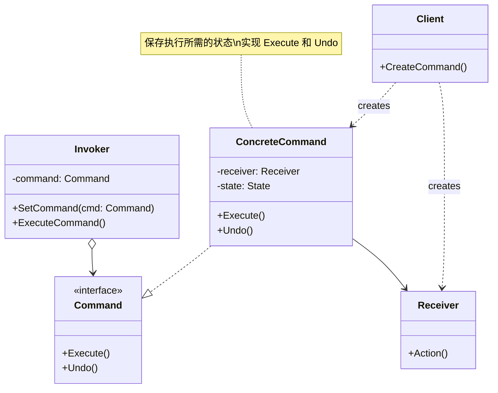
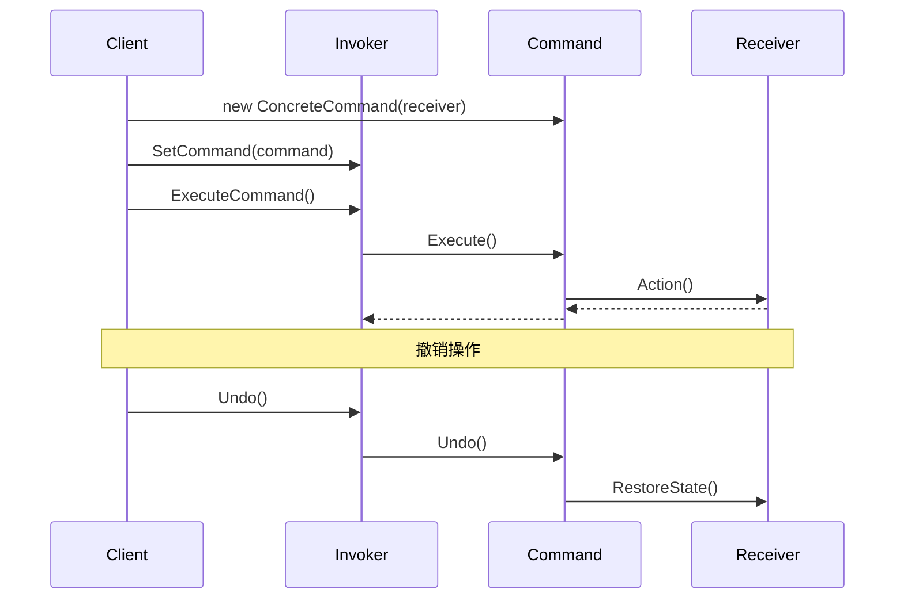

# 命令模式 (Command Pattern)

## 定义

命令模式将请求封装成对象，从而使你可以用不同的请求对客户进行参数化，对请求排队或记录请求日志，以及支持可撤销的操作。

## 意图

命令模式的主要意图是：
- 将请求的发送者和接收者解耦
- 支持请求的排队、记录和撤销
- 支持事务操作
- 支持宏命令（组合多个命令）

## 别名

- Action（动作）
- Transaction（事务）

## 动机

考虑一个文本编辑器，用户可以执行各种操作：插入文本、删除文本、复制、粘贴、撤销、重做等。如果直接在 UI 代码中实现这些操作，会导致：

1. UI 代码和业务逻辑耦合
2. 难以实现撤销/重做功能
3. 难以记录操作历史
4. 难以实现宏命令（批量操作）

传统实现方式：

```go
func (e *Editor) HandleButton(button string) {
    switch button {
    case "copy":
        e.Copy()
    case "paste":
        e.Paste()
    case "undo":
        // 如何实现撤销？
    }
}
```

这种实现的问题：
- 操作和 UI 紧密耦合
- 无法记录操作历史
- 难以实现撤销功能
- 无法复用操作逻辑

命令模式通过将每个操作封装成命令对象来解决这些问题。

## 结构

### UML 类图



### UML 时序图



## 参与者

- **Command（命令接口）**: 
  - 声明执行操作的接口
  - 通常包含 Execute() 和 Undo() 方法
  
- **ConcreteCommand（具体命令）**: 
  - 实现 Command 接口
  - 持有 Receiver 的引用
  - 实现 Execute() 方法，调用 Receiver 的相应操作
  - 保存执行所需的状态，用于撤销操作
  
- **Invoker（调用者）**: 
  - 要求命令执行请求
  - 持有命令对象的引用
  
- **Receiver（接收者）**: 
  - 知道如何实施与执行一个请求相关的操作
  - 任何类都可能作为接收者
  
- **Client（客户端）**: 
  - 创建具体命令对象并设定它的接收者

## 协作

1. Client 创建 ConcreteCommand 对象并指定它的 Receiver
2. Invoker 存储 ConcreteCommand 对象
3. Invoker 通过调用 Command 的 Execute() 方法来提交请求
4. ConcreteCommand 调用 Receiver 的操作来执行请求
5. 如果需要撤销，ConcreteCommand 调用 Undo() 方法恢复状态

## 适用场景

在以下情况下可以使用命令模式：

1. **需要将请求调用者和请求接收者解耦**，使调用者和接收者不直接交互
2. **需要在不同的时刻指定、排列和执行请求**，命令对象可以有与原始请求独立的生命周期
3. **需要支持撤销操作**，命令的 Execute 操作可存储状态以便在 Undo 操作中反转
4. **需要支持日志记录**，可以记录命令的执行历史，系统崩溃时可以重新执行这些命令
5. **需要支持事务操作**，可以将一组命令组合成一个事务
6. **需要用构建在原语操作上的高层操作构造一个系统**

典型应用场景：
- 文本编辑器的撤销/重做
- 任务队列和异步处理
- 数据库事务管理
- GUI 按钮和菜单项
- 宏命令和批处理
- 远程过程调用（RPC）

## 优点

- ✅ **解耦调用者和接收者**: 调用者不需要知道接收者的具体实现
- ✅ **支持撤销和重做**: 通过保存状态，可以实现操作的撤销和重做
- ✅ **支持命令的组合**: 可以将多个命令组合成宏命令
- ✅ **支持命令的排队**: 可以将命令放入队列中延迟执行
- ✅ **支持日志记录**: 可以记录命令的执行历史
- ✅ **符合开闭原则**: 添加新命令不需要修改现有代码
- ✅ **支持事务操作**: 可以实现命令的批量执行和回滚

## 缺点

- ❌ **增加类的数量**: 每个命令都需要一个类，命令多时会导致类数量增加
- ❌ **增加系统复杂度**: 引入了额外的抽象层
- ❌ **可能导致内存开销**: 如果需要保存大量历史命令，可能占用较多内存

## 实现要点

### Go 语言实现

在 Go 语言中实现命令模式的关键点：

1. **定义命令接口**
```go
type Command interface {
    Execute() error
    Undo() error
}
```

2. **实现具体命令**
```go
type ConcreteCommand struct {
    receiver *Receiver
    state    interface{} // 保存状态用于撤销
}

func (c *ConcreteCommand) Execute() error {
    // 保存当前状态
    c.state = c.receiver.GetState()
    // 执行操作
    return c.receiver.Action()
}

func (c *ConcreteCommand) Undo() error {
    // 恢复状态
    return c.receiver.SetState(c.state)
}
```

3. **实现调用者**
```go
type Invoker struct {
    history []Command
    current int
}

func (i *Invoker) Execute(cmd Command) error {
    if err := cmd.Execute(); err != nil {
        return err
    }
    i.history = append(i.history[:i.current], cmd)
    i.current++
    return nil
}

func (i *Invoker) Undo() error {
    if i.current == 0 {
        return errors.New("nothing to undo")
    }
    i.current--
    return i.history[i.current].Undo()
}
```

4. **Go 特有的实现技巧**
   - 使用函数类型简化简单命令
   - 使用闭包捕获状态
   - 使用 context 传递取消信号

### 代码示例

```go
package main

import (
    "fmt"
    "errors"
)

// Command 命令接口
type Command interface {
    Execute() error
    Undo() error
    String() string
}

// Receiver 接收者 - 文本编辑器
type TextEditor struct {
    content string
}

func (e *TextEditor) GetContent() string {
    return e.content
}

func (e *TextEditor) SetContent(content string) {
    e.content = content
}

// InsertCommand 插入命令
type InsertCommand struct {
    editor   *TextEditor
    text     string
    position int
    backup   string
}

func NewInsertCommand(editor *TextEditor, text string, position int) *InsertCommand {
    return &InsertCommand{
        editor:   editor,
        text:     text,
        position: position,
    }
}

func (c *InsertCommand) Execute() error {
    c.backup = c.editor.GetContent()
    content := c.editor.GetContent()
    if c.position > len(content) {
        return errors.New("position out of range")
    }
    newContent := content[:c.position] + c.text + content[c.position:]
    c.editor.SetContent(newContent)
    return nil
}

func (c *InsertCommand) Undo() error {
    c.editor.SetContent(c.backup)
    return nil
}

func (c *InsertCommand) String() string {
    return fmt.Sprintf("Insert '%s' at position %d", c.text, c.position)
}

// DeleteCommand 删除命令
type DeleteCommand struct {
    editor *TextEditor
    start  int
    end    int
    backup string
}

func NewDeleteCommand(editor *TextEditor, start, end int) *DeleteCommand {
    return &DeleteCommand{
        editor: editor,
        start:  start,
        end:    end,
    }
}

func (c *DeleteCommand) Execute() error {
    c.backup = c.editor.GetContent()
    content := c.editor.GetContent()
    if c.start > len(content) || c.end > len(content) || c.start > c.end {
        return errors.New("invalid range")
    }
    newContent := content[:c.start] + content[c.end:]
    c.editor.SetContent(newContent)
    return nil
}

func (c *DeleteCommand) Undo() error {
    c.editor.SetContent(c.backup)
    return nil
}

func (c *DeleteCommand) String() string {
    return fmt.Sprintf("Delete from %d to %d", c.start, c.end)
}

// CommandManager 命令管理器（调用者）
type CommandManager struct {
    history []Command
    current int
}

func NewCommandManager() *CommandManager {
    return &CommandManager{
        history: make([]Command, 0),
        current: 0,
    }
}

func (m *CommandManager) Execute(cmd Command) error {
    if err := cmd.Execute(); err != nil {
        return err
    }
    // 清除当前位置之后的历史
    m.history = m.history[:m.current]
    m.history = append(m.history, cmd)
    m.current++
    fmt.Printf("执行命令: %s\n", cmd)
    return nil
}

func (m *CommandManager) Undo() error {
    if m.current == 0 {
        return errors.New("nothing to undo")
    }
    m.current--
    cmd := m.history[m.current]
    fmt.Printf("撤销命令: %s\n", cmd)
    return cmd.Undo()
}

func (m *CommandManager) Redo() error {
    if m.current >= len(m.history) {
        return errors.New("nothing to redo")
    }
    cmd := m.history[m.current]
    if err := cmd.Execute(); err != nil {
        return err
    }
    m.current++
    fmt.Printf("重做命令: %s\n", cmd)
    return nil
}

func main() {
    fmt.Println("=== 命令模式示例 - 文本编辑器 ===\n")
    
    editor := &TextEditor{}
    manager := NewCommandManager()
    
    // 插入 "Hello"
    cmd1 := NewInsertCommand(editor, "Hello", 0)
    manager.Execute(cmd1)
    fmt.Printf("内容: '%s'\n\n", editor.GetContent())
    
    // 插入 " World"
    cmd2 := NewInsertCommand(editor, " World", 5)
    manager.Execute(cmd2)
    fmt.Printf("内容: '%s'\n\n", editor.GetContent())
    
    // 插入 "!"
    cmd3 := NewInsertCommand(editor, "!", 11)
    manager.Execute(cmd3)
    fmt.Printf("内容: '%s'\n\n", editor.GetContent())
    
    // 撤销最后一个操作
    manager.Undo()
    fmt.Printf("内容: '%s'\n\n", editor.GetContent())
    
    // 撤销倒数第二个操作
    manager.Undo()
    fmt.Printf("内容: '%s'\n\n", editor.GetContent())
    
    // 重做
    manager.Redo()
    fmt.Printf("内容: '%s'\n\n", editor.GetContent())
    
    // 删除部分内容
    cmd4 := NewDeleteCommand(editor, 0, 5)
    manager.Execute(cmd4)
    fmt.Printf("内容: '%s'\n\n", editor.GetContent())
    
    // 撤销删除
    manager.Undo()
    fmt.Printf("内容: '%s'\n\n", editor.GetContent())
    
    fmt.Println("=== 示例结束 ===")
}
```

## 真实应用案例

### 1. Git 版本控制

Git 的每个提交（commit）都可以看作一个命令，包含了对代码的修改。可以通过 revert 撤销某个提交，通过 cherry-pick 重新应用某个提交。

### 2. 数据库事务

数据库的事务操作可以看作命令的组合，支持提交（commit）和回滚（rollback）。

### 3. 任务队列

消息队列（如 RabbitMQ、Kafka）中的消息可以看作命令，消费者执行这些命令。

### 4. GUI 应用

图形界面应用中的菜单项、按钮、快捷键都可以绑定到命令对象，实现操作的统一管理和撤销功能。

## 相关模式

### 与备忘录模式的关系

命令模式可以使用备忘录模式来保存命令执行前的状态，用于撤销操作。

### 与组合模式的关系

可以使用组合模式实现宏命令（MacroCommand），将多个命令组合成一个命令。

### 与原型模式的关系

可以使用原型模式复制命令对象，用于实现命令的克隆和重放。

## 实现变体

### 1. 函数式命令

使用函数类型简化命令实现：

```go
type CommandFunc func() error
type UndoFunc func() error

type FuncCommand struct {
    execute CommandFunc
    undo    UndoFunc
}

func (c *FuncCommand) Execute() error {
    return c.execute()
}

func (c *FuncCommand) Undo() error {
    return c.undo()
}
```

### 2. 宏命令

组合多个命令：

```go
type MacroCommand struct {
    commands []Command
}

func (m *MacroCommand) Execute() error {
    for _, cmd := range m.commands {
        if err := cmd.Execute(); err != nil {
            return err
        }
    }
    return nil
}

func (m *MacroCommand) Undo() error {
    // 逆序撤销
    for i := len(m.commands) - 1; i >= 0; i-- {
        if err := m.commands[i].Undo(); err != nil {
            return err
        }
    }
    return nil
}
```

### 3. 异步命令

支持异步执行：

```go
type AsyncCommand struct {
    command Command
}

func (a *AsyncCommand) ExecuteAsync() <-chan error {
    ch := make(chan error, 1)
    go func() {
        ch <- a.command.Execute()
    }()
    return ch
}
```

## 推荐阅读

1. **《设计模式：可复用面向对象软件的基础》** - GoF
   - 第 5.2 节：Command 模式

2. **《Head First 设计模式》**
   - 第 6 章：命令模式

3. **在线资源**
   - [Refactoring Guru - Command Pattern](https://refactoring.guru/design-patterns/command)
   - [SourceMaking - Command Pattern](https://sourcemaking.com/design_patterns/command)

## 开源项目参考

1. **Cobra（CLI 框架）**
   - 每个命令都是一个 Command 对象

2. **Kubernetes Controller**
   - 使用命令模式处理资源的创建、更新、删除

3. **Redis 命令系统**
   - 每个 Redis 命令都是一个命令对象

## 最佳实践

1. **保存必要的状态**: 只保存撤销所需的最小状态
2. **考虑内存限制**: 限制历史命令的数量，避免内存溢出
3. **处理不可逆操作**: 对于不可逆的操作，明确标识或禁止撤销
4. **支持命令的序列化**: 对于需要持久化的场景，支持命令的序列化
5. **使用命令队列**: 对于异步处理，使用队列管理命令
6. **实现命令的优先级**: 对于有优先级需求的场景，支持命令的优先级
7. **考虑并发安全**: 多线程环境下需要考虑命令执行的并发安全
8. **提供命令的描述**: 为每个命令提供清晰的描述，便于日志记录和调试

## 总结

命令模式是一种强大的行为型模式，它通过将请求封装成对象，实现了请求的发送者和接收者的解耦，并支持请求的排队、记录和撤销。在需要实现撤销/重做功能、任务队列或事务操作的场景中，命令模式是一个很好的选择。

关键要点：
- 将请求封装成命令对象
- 支持命令的撤销和重做
- 支持命令的组合和排队
- 实现请求的发送者和接收者的解耦
