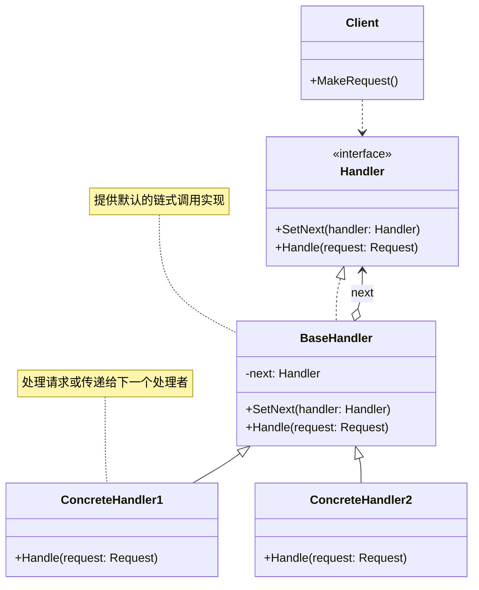
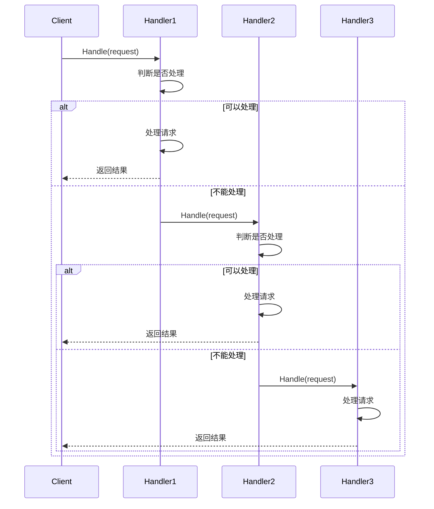

# 责任链模式 (Chain of Responsibility Pattern)

## 定义

责任链模式使多个对象都有机会处理请求，从而避免请求的发送者和接收者之间的耦合关系。将这些对象连成一条链，并沿着这条链传递该请求，直到有一个对象处理它为止。

## 意图

责任链模式的主要意图是：
- 解耦请求的发送者和接收者
- 让多个对象都有机会处理请求
- 动态组织处理者链
- 避免请求发送者与接收者之间的耦合

## 别名

- Chain of Responsibility（职责链）
- Pipeline（管道）

## 动机

考虑一个请求审批系统，不同级别的请求需要不同级别的管理者审批：

- 金额 < 1000：部门经理审批
- 金额 < 5000：总监审批
- 金额 < 10000：副总经理审批
- 金额 >= 10000：总经理审批

传统实现方式：

```go
func ApproveRequest(amount float64) {
    if amount < 1000 {
        // 部门经理审批
    } else if amount < 5000 {
        // 总监审批
    } else if amount < 10000 {
        // 副总经理审批
    } else {
        // 总经理审批
    }
}
```

这种实现的问题：
1. 请求发送者需要知道所有处理者
2. 处理逻辑耦合在一起
3. 难以动态调整审批流程
4. 违反开闭原则

责任链模式通过将处理者组织成链式结构来解决这些问题。

## 结构

### UML 类图



### UML 时序图



## 参与者

- **Handler（处理者接口）**: 
  - 定义处理请求的接口
  - 可选：实现设置后继者的方法
  
- **ConcreteHandler（具体处理者）**: 
  - 实现 Handler 接口
  - 处理它所负责的请求
  - 可访问它的后继者
  - 如果可以处理请求，就处理；否则将请求转发给后继者
  
- **Client（客户端）**: 
  - 向链上的具体处理者对象提交请求

## 协作

1. 当客户提交一个请求时，请求沿链传递直至有一个 ConcreteHandler 对象负责处理它
2. 每个处理者决定是否处理请求，或者将请求传递给链上的下一个处理者
3. 请求可能到达链的末端都得不到处理

## 适用场景

在以下情况下可以使用责任链模式：

1. **有多个对象可以处理一个请求**，哪个对象处理该请求运行时自动确定
2. **想在不明确指定接收者的情况下向多个对象中的一个提交请求**
3. **可处理一个请求的对象集合应被动态指定**
4. **需要动态组织处理流程**

典型应用场景：
- HTTP 中间件（日志、认证、限流、CORS）
- 审批流程（多级审批）
- 异常处理链
- 过滤器链（Servlet Filter）
- 事件冒泡（DOM 事件）
- 日志处理（不同级别的日志处理器）

## 优点

- ✅ **降低耦合度**: 请求发送者不需要知道哪个处理者会处理请求
- ✅ **增强灵活性**: 可以动态添加或删除处理者，改变链的顺序
- ✅ **职责分离**: 每个处理者只关注自己的职责
- ✅ **符合开闭原则**: 添加新的处理者不需要修改现有代码
- ✅ **符合单一职责原则**: 每个处理者只处理特定类型的请求

## 缺点

- ❌ **请求可能不被处理**: 如果链配置不当，请求可能到达链的末端都得不到处理
- ❌ **性能问题**: 请求可能需要遍历整个链才能被处理
- ❌ **调试困难**: 运行时的链式结构可能难以调试和理解
- ❌ **可能形成循环**: 如果链配置不当，可能形成循环引用

## 实现要点

### Go 语言实现

在 Go 语言中实现责任链模式的关键点：

1. **定义处理者接口**
```go
type Handler interface {
    SetNext(handler Handler) Handler
    Handle(request Request) error
}
```

2. **实现基础处理者**
```go
type BaseHandler struct {
    next Handler
}

func (h *BaseHandler) SetNext(handler Handler) Handler {
    h.next = handler
    return handler
}

func (h *BaseHandler) Handle(request Request) error {
    if h.next != nil {
        return h.next.Handle(request)
    }
    return nil
}
```

3. **实现具体处理者**
```go
type ConcreteHandler struct {
    BaseHandler
}

func (h *ConcreteHandler) Handle(request Request) error {
    if h.canHandle(request) {
        // 处理请求
        return h.process(request)
    }
    // 传递给下一个处理者
    return h.BaseHandler.Handle(request)
}
```

4. **Go 特有的实现技巧**
   - 使用函数类型简化处理者
   - 使用闭包捕获上下文
   - 使用 context 传递请求上下文

### 代码示例

```go
package main

import (
    "fmt"
    "errors"
)

// Request 请求
type Request struct {
    Amount float64
    Purpose string
}

// Handler 处理者接口
type Handler interface {
    SetNext(handler Handler) Handler
    Handle(request *Request) error
}

// BaseHandler 基础处理者
type BaseHandler struct {
    next Handler
}

func (h *BaseHandler) SetNext(handler Handler) Handler {
    h.next = handler
    return handler
}

func (h *BaseHandler) Handle(request *Request) error {
    if h.next != nil {
        return h.next.Handle(request)
    }
    return errors.New("no handler can process this request")
}

// ManagerHandler 部门经理处理者
type ManagerHandler struct {
    BaseHandler
    name string
}

func NewManagerHandler(name string) *ManagerHandler {
    return &ManagerHandler{name: name}
}

func (h *ManagerHandler) Handle(request *Request) error {
    if request.Amount < 1000 {
        fmt.Printf("[%s] 审批通过: %.2f 元 - %s\n", h.name, request.Amount, request.Purpose)
        return nil
    }
    fmt.Printf("[%s] 无权审批: %.2f 元，转交上级\n", h.name, request.Amount)
    return h.BaseHandler.Handle(request)
}

// DirectorHandler 总监处理者
type DirectorHandler struct {
    BaseHandler
    name string
}

func NewDirectorHandler(name string) *DirectorHandler {
    return &DirectorHandler{name: name}
}

func (h *DirectorHandler) Handle(request *Request) error {
    if request.Amount < 5000 {
        fmt.Printf("[%s] 审批通过: %.2f 元 - %s\n", h.name, request.Amount, request.Purpose)
        return nil
    }
    fmt.Printf("[%s] 无权审批: %.2f 元，转交上级\n", h.name, request.Amount)
    return h.BaseHandler.Handle(request)
}

// VPHandler 副总经理处理者
type VPHandler struct {
    BaseHandler
    name string
}

func NewVPHandler(name string) *VPHandler {
    return &VPHandler{name: name}
}

func (h *VPHandler) Handle(request *Request) error {
    if request.Amount < 10000 {
        fmt.Printf("[%s] 审批通过: %.2f 元 - %s\n", h.name, request.Amount, request.Purpose)
        return nil
    }
    fmt.Printf("[%s] 无权审批: %.2f 元，转交上级\n", h.name, request.Amount)
    return h.BaseHandler.Handle(request)
}

// CEOHandler 总经理处理者
type CEOHandler struct {
    BaseHandler
    name string
}

func NewCEOHandler(name string) *CEOHandler {
    return &CEOHandler{name: name}
}

func (h *CEOHandler) Handle(request *Request) error {
    if request.Amount < 50000 {
        fmt.Printf("[%s] 审批通过: %.2f 元 - %s\n", h.name, request.Amount, request.Purpose)
        return nil
    }
    fmt.Printf("[%s] 金额过大，需要董事会审批\n", h.name)
    return errors.New("amount too large, need board approval")
}

func main() {
    fmt.Println("=== 责任链模式示例 - 审批流程 ===\n")
    
    // 构建责任链
    manager := NewManagerHandler("张经理")
    director := NewDirectorHandler("李总监")
    vp := NewVPHandler("王副总")
    ceo := NewCEOHandler("刘总经理")
    
    manager.SetNext(director).SetNext(vp).SetNext(ceo)
    
    // 测试不同金额的请求
    requests := []*Request{
        {Amount: 500, Purpose: "购买办公用品"},
        {Amount: 3000, Purpose: "团队建设活动"},
        {Amount: 8000, Purpose: "购买服务器"},
        {Amount: 20000, Purpose: "市场推广费用"},
        {Amount: 60000, Purpose: "新项目投资"},
    }
    
    for i, req := range requests {
        fmt.Printf("请求 %d: %.2f 元 - %s\n", i+1, req.Amount, req.Purpose)
        if err := manager.Handle(req); err != nil {
            fmt.Printf("审批失败: %v\n", err)
        }
        fmt.Println()
    }
    
    fmt.Println("=== 示例结束 ===")
}
```

## 真实应用案例

### 1. HTTP 中间件

Web 框架（如 Gin、Echo）中的中间件链，每个中间件处理请求的某个方面（日志、认证、限流等）。

```go
// Gin 框架的中间件
router.Use(Logger(), Auth(), RateLimit())
```

### 2. Servlet Filter

Java Web 中的过滤器链，用于处理 HTTP 请求和响应。

### 3. 日志处理

不同级别的日志处理器组成责任链，根据日志级别决定是否处理。

### 4. 异常处理

异常处理链，不同的处理器处理不同类型的异常。

## 相关模式

### 与组合模式的关系

责任链模式常与组合模式一起使用，组合模式可以用来构建复杂的处理者结构。

### 与装饰器模式的关系

两者结构相似，但意图不同：
- **责任链模式**: 关注请求的传递和处理
- **装饰器模式**: 关注功能的动态添加

### 与命令模式的关系

可以使用命令模式封装请求，然后在责任链中传递命令对象。

## 实现变体

### 1. 纯责任链

请求必须被某个处理者处理，通常在链的末尾添加默认处理者。

```go
type DefaultHandler struct {
    BaseHandler
}

func (h *DefaultHandler) Handle(request *Request) error {
    fmt.Println("默认处理器处理请求")
    return nil
}
```

### 2. 不纯责任链

请求可以被多个处理者处理，每个处理者处理后继续传递。

```go
func (h *LogHandler) Handle(request *Request) error {
    // 记录日志
    log.Printf("Request: %v", request)
    // 继续传递
    return h.BaseHandler.Handle(request)
}
```

### 3. 函数式责任链

使用函数类型简化实现：

```go
type HandlerFunc func(*Request) error

type Chain struct {
    handlers []HandlerFunc
}

func (c *Chain) Handle(request *Request) error {
    for _, handler := range c.handlers {
        if err := handler(request); err != nil {
            return err
        }
    }
    return nil
}
```

### 4. 中间件模式

常见于 Web 框架：

```go
type Middleware func(http.Handler) http.Handler

func Chain(middlewares ...Middleware) Middleware {
    return func(next http.Handler) http.Handler {
        for i := len(middlewares) - 1; i >= 0; i-- {
            next = middlewares[i](next)
        }
        return next
    }
}
```

## 推荐阅读

1. **《设计模式：可复用面向对象软件的基础》** - GoF
   - 第 5.1 节：Chain of Responsibility 模式

2. **《Head First 设计模式》**
   - 第 7 章：责任链模式

3. **在线资源**
   - [Refactoring Guru - Chain of Responsibility](https://refactoring.guru/design-patterns/chain-of-responsibility)
   - [SourceMaking - Chain of Responsibility](https://sourcemaking.com/design_patterns/chain_of_responsibility)

## 开源项目参考

1. **Gin 框架**
   - 中间件链的实现

2. **gRPC**
   - 拦截器链（Interceptor Chain）

3. **Netty**
   - ChannelPipeline 和 ChannelHandler

## 最佳实践

1. **提供默认处理者**: 在链的末尾添加默认处理者，确保请求总是被处理
2. **避免循环引用**: 确保链是单向的，不形成环
3. **考虑性能**: 避免链过长，影响性能
4. **支持短路**: 允许处理者中断链的传递
5. **记录处理路径**: 对于调试，记录请求经过的处理者
6. **使用构建器**: 使用构建器模式简化链的构建
7. **考虑并发安全**: 多线程环境下需要考虑链的并发安全
8. **提供链的可视化**: 对于复杂的链，提供可视化工具

## 总结

责任链模式是一种强大的行为型模式，它通过将处理者组织成链式结构，实现了请求的发送者和接收者的解耦，并支持动态组织处理流程。在需要实现多级处理、中间件或过滤器的场景中，责任链模式是一个很好的选择。

关键要点：
- 将处理者组织成链式结构
- 请求沿链传递直到被处理
- 支持动态添加和移除处理者
- 实现请求的发送者和接收者的解耦
