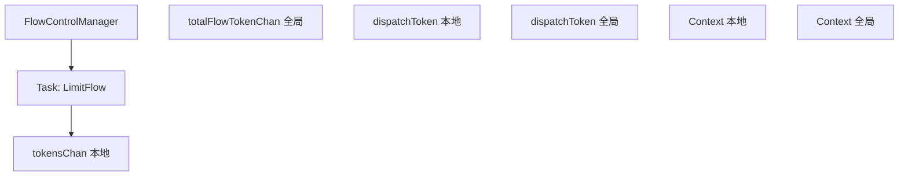
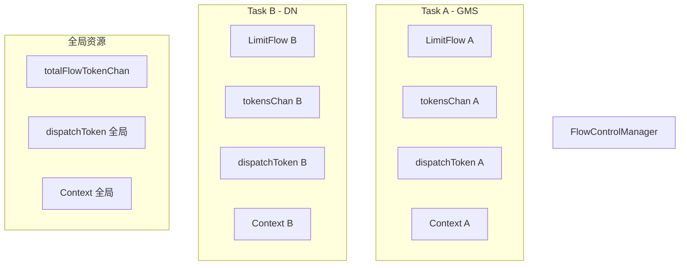
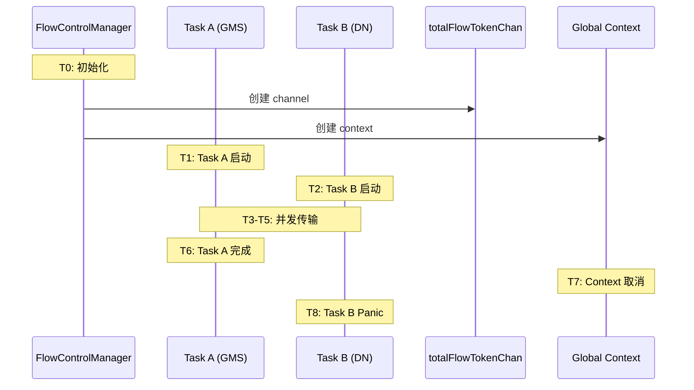
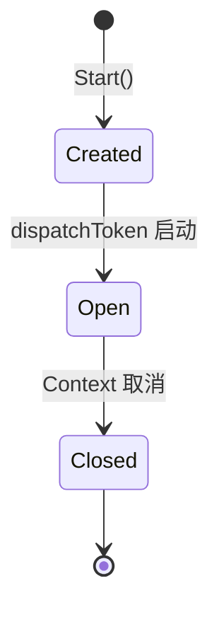
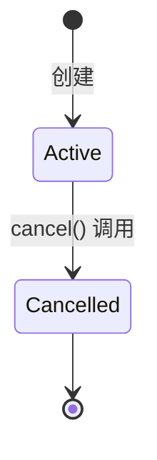
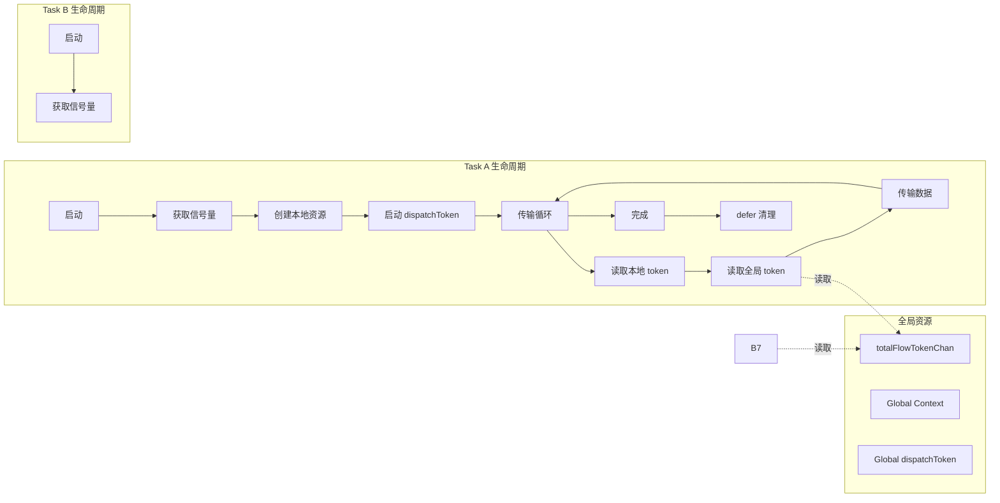
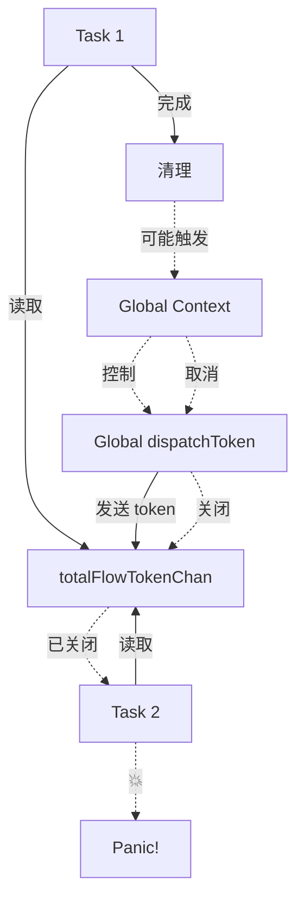
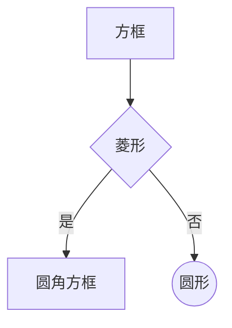
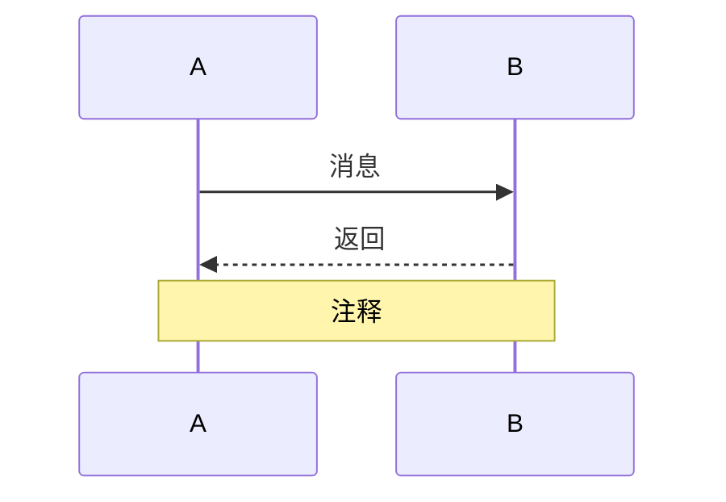
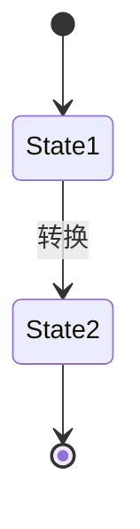

# 数据流图绘制练习

## 目标

通过绘制数据流图，理解 HPFS Bug 中各个组件之间的交互关系。

## 练习 1: 正常流程（单任务）

绘制单个任务的数据流图。

### 组件

- FlowControlManager
- Task (LimitFlow)
- tokensChan (本地)
- totalFlowTokenChan (全局)
- dispatchToken goroutine (本地)
- dispatchToken goroutine (全局)
- Context (本地)
- Context (全局)

### 任务

使用 Mermaid 语法绘制流程图：



**提示**:
- 使用 `-->` 表示数据流
- 使用 `-->|标签|` 添加说明
- 使用 `-.->` 表示控制流

## 练习 2: Bug 流程（并发任务）

绘制两个并发任务的数据流图，展示 bug 触发过程。



## 练习 3: 时序数据流图

绘制带时序的数据流图，展示 bug 触发的完整过程。



## 练习 4: 状态转换图

绘制 channel 和 context 的状态转换图。

### totalFlowTokenChan 状态转换



### Context 状态转换



## 练习 5: 组件交互图

绘制详细的组件交互图，包含所有关键操作。



## 练习 6: 问题定位图

在数据流图上标注问题点。

使用以下符号：
- 🔴 严重问题
- 🟡 潜在问题
- 🟢 正常操作



## 练习 7: 对比图

绘制修复前后的对比图。

### 修复前（有 Bug）

```mermaid
graph TD
    %% TODO: 绘制有 bug 的架构
```

### 修复后（方案 A：禁用全局流控）

```mermaid
graph TD
    %% TODO: 绘制修复后的架构
```

### 修复后（方案 B：引用计数）

```mermaid
graph TD
    %% TODO: 绘制使用引用计数的架构
```

## 验证清单

完成练习后，检查你的图表是否：

- [ ] 包含所有关键组件
- [ ] 正确表示数据流向
- [ ] 清晰标注控制流
- [ ] 展示并发关系
- [ ] 标注问题点
- [ ] 易于理解

## 提示

### Mermaid 语法参考

**流程图**:


**序列图**:


**状态图**:


## 参考资料

- [Mermaid 文档](https://mermaid.js.org/)
- [HPFS Bug 流程图](../../review/HPFS_BUG_FLOW_DIAGRAM.md)
- [Go Concurrency Patterns](https://go.dev/blog/pipelines)

## 下一步

完成数据流图练习后：
1. 对比你的图表和参考文档
2. 继续模块 2 的练习
3. 开始实现最小复现程序
