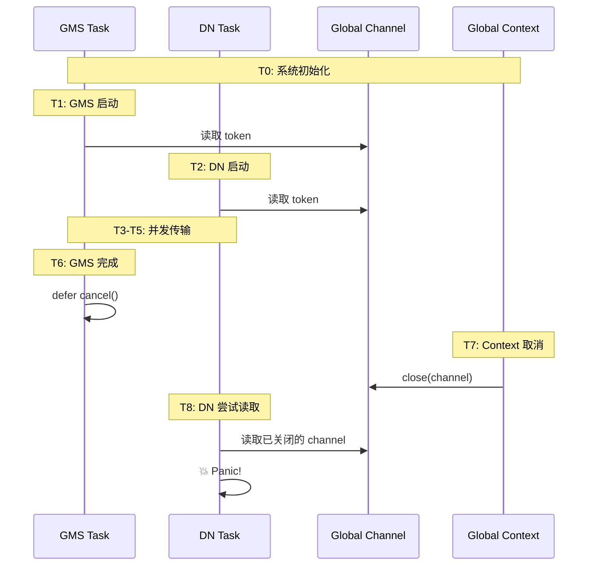

# 时序分析练习

## 目标

理解 HPFS Bug 的触发时序，识别竞态窗口。

## 背景

HPFS Bug 是一个典型的并发资源管理错误。两个并发任务共享一个全局 channel，当第一个任务完成时关闭该 channel，导致第二个任务 panic。

## 练习 1: 填写时序图

下面是 Bug 触发的时序图模板，请填写每个时间点发生的关键事件。

```
时间轴 ──────────────────────────────────────────────────────────────────►

T0: 系统初始化
    事件：_____________________________________________
    状态：_____________________________________________

T1: GMS 任务启动
    事件：_____________________________________________
    创建的资源：_______________________________________
    启动的 goroutine：_________________________________

T2: DN 任务启动（1秒后）
    事件：_____________________________________________
    创建的资源：_______________________________________
    启动的 goroutine：_________________________________

T3-T5: 正常传输阶段
    GMS 任务状态：_____________________________________
    DN 任务状态：______________________________________
    全局 channel 状态：________________________________

T6: GMS 任务完成
    触发的操作：_______________________________________
    defer 执行的内容：_________________________________
    影响：_____________________________________________

T7: 全局 Context 取消 ⚠️
    触发原因：_________________________________________
    执行的操作：_______________________________________
    关键变化：_________________________________________

T8: DN 任务尝试读取 💥
    DN 任务状态：______________________________________
    尝试的操作：_______________________________________
    实际结果：_________________________________________
    Panic 原因：_______________________________________

T9: 崩溃连锁反应
    HPFS 状态：________________________________________
    备份任务状态：_____________________________________
    Kubernetes 响应：__________________________________
```

## 练习 2: 识别竞态窗口

竞态窗口是指两个并发操作可能产生不确定结果的时间段。

**问题 1**: 在上面的时序图中，竞态窗口在哪个时间段？

答：从 T___ 到 T___

**问题 2**: 为什么这个时间段是竞态窗口？

答：
```
_________________________________________________________________
_________________________________________________________________
_________________________________________________________________
```

**问题 3**: 如果 GMS 和 DN 任务的完成时间相差很大（比如 10 分钟），还会触发 bug 吗？

答：□ 会  □ 不会

原因：
```
_________________________________________________________________
_________________________________________________________________
```

## 练习 3: 关键时间点分析

对于每个关键时间点，分析系统状态：

### T6: GMS 任务完成

| 资源 | 状态 | 说明 |
|------|------|------|
| GMS tokensChan | _______ | _______ |
| GMS context | _______ | _______ |
| 全局 totalFlowTokenChan | _______ | _______ |
| 全局 context | _______ | _______ |
| DN 任务 | _______ | _______ |

### T7: 全局 Context 取消

| 资源 | 状态变化 | 影响 |
|------|----------|------|
| 全局 context | _______ → _______ | _______ |
| totalFlowTokenChan | _______ → _______ | _______ |
| 全局 dispatchToken goroutine | _______ → _______ | _______ |
| DN 任务 | _______ | _______ |

### T8: DN 任务尝试读取

| 操作 | 预期结果 | 实际结果 | 原因 |
|------|----------|----------|------|
| 读取 tokensChan | _______ | _______ | _______ |
| 读取 totalFlowTokenChan | _______ | _______ | _______ |
| 继续执行 | _______ | _______ | _______ |

## 练习 4: 绘制序列图

使用 Mermaid 语法绘制序列图，展示 GMS 任务、DN 任务、全局 channel 之间的交互。



**任务**: 完善上面的序列图，添加更多细节：
- 添加 tokensChan 的交互
- 添加 dispatchToken goroutine
- 标注每个操作的返回值

## 练习 5: 对比正常流程和 Bug 流程

### 正常流程（单任务）

```
T0: 启动任务
T1-T5: 传输数据
T6: 任务完成
    - defer cancel() → 本地 context 取消
    - defer close(tokensChan) → 关闭本地 channel
    - 全局 channel 仍然有效 ✓
T7: 清理完成
```

### Bug 流程（并发任务）

```
T0: 启动任务 A
T1: 启动任务 B
T2-T5: 并发传输
T6: 任务 A 完成
    - defer cancel() → 本地 context 取消
    - 某个事件触发全局 context 取消 ⚠️
    - 全局 channel 被关闭 ❌
T7: 任务 B 仍在运行
    - 尝试读取全局 channel
    - 💥 Panic!
```

**问题**: 两个流程的关键区别是什么？

答：
```
_________________________________________________________________
_________________________________________________________________
_________________________________________________________________
```

## 练习 6: 预测不同场景

对于以下场景，预测是否会触发 bug：

| 场景 | 并发任务数 | 数据大小 | 会触发 bug？ | 原因 |
|------|-----------|----------|-------------|------|
| 1 | 1 | 1MB | □ 会 □ 不会 | _______ |
| 2 | 2 | 1MB | □ 会 □ 不会 | _______ |
| 3 | 10 | 1MB | □ 会 □ 不会 | _______ |
| 4 | 2 | 1KB | □ 会 □ 不会 | _______ |
| 5 | 2 | 1GB | □ 会 □ 不会 | _______ |

## 验证清单

完成练习后，检查你是否能够：

- [ ] 准确描述每个时间点发生的事件
- [ ] 识别竞态窗口的位置和原因
- [ ] 理解为什么嵌套 select 无法阻止 panic
- [ ] 绘制完整的序列图
- [ ] 预测不同场景下的行为
- [ ] 解释正常流程和 bug 流程的区别

## 参考资料

- [HPFS Bug 流程图](../../review/HPFS_BUG_FLOW_DIAGRAM.md)
- [HPFS Bug 详细分析](../../review/HPFS_FLOW_CONTROL_BUG_ANALYSIS.md)
- [Go Concurrency Patterns](https://go.dev/blog/pipelines)

## 下一步

完成这个练习后，继续学习：
- 练习 2.3: 问答测试
- 练习 2.4: 数据流图练习
