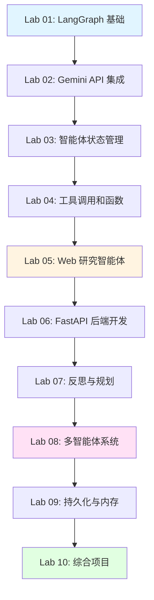

# 课程结构：Gemini LangGraph Deep Search Agent

本文档提供所有课程模块的详细分解，包括学习目标、依赖关系和时间估计。

## 课程概览

```
基础 (Labs 1-3) → 工具与搜索 (Labs 4-5) → 后端与高级模式 (Labs 6-8) → 生产与综合 (Labs 9-10)
```

## 模块依赖图



---

## 阶段 1: 基础 (Labs 1-3)

### Lab 01: LangGraph 基础
**目录**: `lab01-langgraph-fundamentals/`

**学习目标**:
- 理解 LangGraph 是什么以及何时使用
- 学习状态机概念和基于图的工作流
- 掌握节点、边和条件路由
- 构建简单的有状态应用

**前置要求**: 
- Python 基础（函数、类）
- 理解控制流

**核心概念**:
- StateGraph 和 MessageGraph
- 节点函数和状态转换器
- 条件边和路由逻辑
- 图编译和执行

**理论文档**:
1. `01-what-is-langgraph.md` - 介绍、用例和架构模式
2. `02-state-machines.md` - 状态机基础和设计模式
3. `03-nodes-and-edges.md` - 图构建和组合模式
4. `04-graph-compilation.md` - 编译和执行机制
5. `05-debugging-graphs.md` - 调试技术和工具

**示例**（从基础到高级）:
- `01_simple_graph.py` - 基本线性工作流
- `02_stateful_graph.py` - 状态管理演示
- `03_conditional_edges.py` - 条件路由逻辑
- `04_parallel_execution.py` - 并行节点执行
- `05_subgraphs.py` - 图组合和子图
- `06_error_handling.py` - 错误处理模式

**练习**（渐进式难度）:
- 构建简单的决策树图
- 实现基于状态的条件路由
- 创建多步骤工作流
- 实现并行执行模式
- 构建带错误处理的复杂图

**项目**: 增强型聊天机器人
- 有状态的对话管理
- 跨轮次的上下文保留
- 对话历史和记忆
- 多轮对话理解
- 错误恢复机制

**预计时间**: 4-5 小时

---

### Lab 02: Gemini API 集成
**目录**: `lab02-gemini-api-integration/`

**学习目标**:
- 设置 Google Gemini API 访问
- 理解模型能力和限制
- 掌握提示工程技术
- 处理 API 响应和错误

**前置要求**: 
- Lab 01 完成
- API 密钥管理基础

**核心概念**:
- Gemini 模型系列（Flash、Pro）
- 温度和生成参数
- 流式 vs. 批量响应
- 速率限制和错误处理

**理论文档**:
1. `01-gemini-overview.md` - 所有模型能力详解
2. `02-authentication.md` - API 设置和安全
3. `03-prompt-engineering.md` - 高级提示工程技术
4. `04-model-selection.md` - Flash vs Pro 模型对比
5. `05-safety-settings.md` - 内容过滤和安全设置

**示例**（全面覆盖）:
- `01_basic_calls.py` - 简单 API 使用
- `02_model_configs.py` - 参数调优和配置
- `03_streaming.py` - 流式响应实现
- `04_error_handling.py` - 健壮的错误管理
- `05_token_counting.py` - Token 管理和计数
- `06_function_calling.py` - 函数调用演示
- `07_multimodal.py` - 多模态输入（图像+文本）

**练习**（深入实践）:
- 实现不同的提示策略
- 比较模型配置和性能
- 构建错误恢复逻辑
- 实现函数调用模式

**项目**: 高级问答系统
- Gemini 驱动的问答
- 上下文感知响应
- 对话历史管理
- 多轮对话跟进
- 多种个性模式
- 函数调用集成

**预计时间**: 4-5 小时

---

### Lab 03: 智能体状态管理
**目录**: `lab03-agent-state-management/`

**学习目标**:
- 设计复杂的状态模式
- 实现状态归约器和转换器
- 使用检查点进行持久化
- 从故障中恢复

**前置要求**: 
- Lab 01-02 完成
- 理解 TypedDict 和类型提示

**核心概念**:
- 状态模式设计模式
- 注解类型和归约器
- 检查点保存器（内存、文件、数据库）
- 状态验证和恢复

**理论文档**:
1. `01-state-schema-design.md` - 状态模式设计模式
2. `02-state-reducers.md` - 转换函数和归约器
3. `03-checkpointing.md` - 全面的持久化策略
4. `04-state-validation.md` - 状态验证技术
5. `05-state-recovery.md` - 故障恢复模式

**示例**（渐进式复杂度）:
- `01_custom_state.py` - 复杂状态模式
- `02_state_reducers.py` - 归约器函数
- `03_checkpointing_memory.py` - 内存持久化
- `04_checkpointing_file.py` - 文件持久化
- `05_checkpointing_sqlite.py` - SQLite 持久化
- `06_state_recovery.py` - 故障恢复
- `07_state_validation.py` - 状态验证

**练习**（深入实践）:
- 为任务管理器设计状态模式
- 实现自定义归约器
- 实现多种持久化策略
- 构建状态验证逻辑
- 实现故障恢复机制

**项目**: 高级任务管理器智能体
- 有状态的任务跟踪
- 优先级和截止日期管理
- 多种持久化策略
- 任务历史和审计
- 状态恢复和验证

**预计时间**: 5-6 小时

---

## 阶段 2: 工具与搜索 (Labs 4-5)

### Lab 04: 工具调用和函数
**目录**: `lab04-tool-calling-and-functions/`

**学习目标**:
- 定义工具并绑定到智能体
- 实现函数调用模式
- 创建自定义工具
- 处理工具执行错误

**前置要求**: 
- Lab 01-03 完成
- 理解函数装饰器

**核心概念**:
- 带模式的工具定义
- 函数调用 vs. 工具调用
- 工具绑定和调用
- 工具中的错误处理

**理论文档**:
1. `01-tool-definition.md` - 工具模式和模式设计
2. `02-function-calling.md` - 调用模式和最佳实践
3. `03-custom-tools.md` - 自定义工具创建
4. `04-tool-composition.md` - 工具链和组合
5. `05-tool-error-handling.md` - 工具错误处理模式

**示例**（全面覆盖）:
- `01_calculator_tool.py` - 基础数学运算工具
- `02_search_tool.py` - Tavily Web 搜索集成
- `03_database_tool.py` - SQLite 数据查询
- `04_custom_tool.py` - 自定义工具创建
- `05_tool_chaining.py` - 工具链和组合
- `06_parallel_tools.py` - 并行工具执行
- `07_tool_error_handling.py` - 健壮的错误处理

**练习**（深入实践）:
- 创建天气查询工具
- 实现文件系统工具
- 构建工具链
- 实现并行工具执行
- 添加错误处理和重试

**项目**: 高级数据分析智能体
- 多个专业分析工具
- 智能工具选择和路由
- 工具链和组合
- 并行工具执行
- 结果聚合和综合

**预计时间**: 5-6 小时

---

### Lab 05: Web 研究智能体
**目录**: `lab05-web-research-agent/`

**学习目标**:
- 实现迭代研究模式
- 生成有效的搜索查询
- 处理和综合结果
- 管理引用和来源

**前置要求**: 
- Lab 01-04 完成
- 理解搜索 API

**核心概念**:
- 查询生成策略
- 结果解析和提取
- 反思和差距分析
- 带引用的答案综合

**理论文档**:
1. `01-query-generation.md` - 高级查询生成策略
2. `02-result-processing.md` - 结果解析和提取技术
3. `03-iterative-refinement.md` - 反思循环和迭代优化
4. `04-citation-management.md` - 来源跟踪和引用管理
5. `05-information-synthesis.md` - 信息综合策略
6. `06-quality-assessment.md` - 质量评估和度量

**示例**（完整研究流程）:
- `01_query_generator.py` - 智能查询生成
- `02_result_parser.py` - 结果提取和清洗
- `03_reflection.py` - 差距分析和反思
- `04_synthesizer.py` - 答案生成和综合
- `05_citation_manager.py` - 引用跟踪管理
- `06_iterative_research.py` - 多次迭代研究循环
- `07_quality_scorer.py` - 质量评估和打分

**练习**（深入实践）:
- 实现查询优化和扩展
- 构建结果排名和过滤逻辑
- 创建引用格式化器
- 实现质量评估机制
- 构建完整的迭代研究循环

**项目**: 高级研究智能体
- 多次迭代研究循环
- 智能查询生成和优化
- 知识差距检测和填补
- 带引用的答案生成
- 质量评估和自我改进
- 结果排名和过滤

**预计时间**: 6-7 小时

---

## 阶段 3: 后端与高级模式 (Labs 6-8)

### Lab 06: FastAPI 后端开发
**目录**: `lab06-fastapi-backend-development/`

**学习目标**:
- 使用 FastAPI 构建 REST API
- 掌握异步编程
- 定义请求/响应模型
- 实现中间件和 CORS

**前置要求**: 
- Python async/await 理解
- HTTP/REST 概念
- Lab 01-05 完成

**核心概念**:
- FastAPI 路由和依赖
- Pydantic 模型验证
- 异步请求处理
- CORS 和中间件

**理论文档**:
1. `01-fastapi-fundamentals.md` - 核心概念和架构
2. `02-async-programming.md` - 异步编程模式
3. `03-request-response-models.md` - Pydantic 数据验证
4. `04-middleware-cors.md` - 中间件和 CORS 设置
5. `05-dependency-injection.md` - 依赖注入模式
6. `06-streaming-responses.md` - SSE 和流式响应

**示例**（全面覆盖）:
- `01_basic_endpoints.py` - CRUD 操作
- `02_pydantic_models.py` - 数据模型和验证
- `03_middleware.py` - 自定义中间件
- `04_error_handling.py` - 错误响应和异常处理
- `05_dependency_injection.py` - DI 模式
- `06_streaming_sse.py` - Server-Sent Events
- `07_background_tasks.py` - 后台任务
- `08_websockets.py` - WebSocket 支持

**练习**（深入实践）:
- 创建用户管理 API
- 实现请求验证和错误处理
- 添加认证和授权中间件
- 实现流式响应
- 添加后台任务处理

**项目**: 高级研究 API
- 完整的研究端点
- 流式响应（SSE）
- 请求验证和错误处理
- 认证和速率限制
- 后台任务处理
- 完整的 API 文档
- WebSocket 支持（可选）

**预计时间**: 5-6 小时

---

### Lab 07: 反思与规划
**目录**: `lab07-reflection-and-planning/`

**学习目标**:
- 实现反思模式
- 构建自我批评机制
- 使用规划和分解
- 应用 ReAct 模式

**前置要求**: 
- Lab 01-06 完成
- 理解智能体工作流

**核心概念**:
- 反思循环
- 自我评估标准
- 计划-执行模式
- 质量改进

**理论文档**:
1. `01-reflection-patterns.md` - 反思模式和策略
2. `02-self-critique.md` - 自我评估和批评机制
3. `03-planning-decomposition.md` - 规划和任务分解
4. `04-react-pattern.md` - ReAct（推理+行动）模式
5. `05-chain-of-thought.md` - 思维链推理
6. `06-tree-of-thoughts.md` - 思维树探索

**示例**（完整模式覆盖）:
- `01_reflection_node.py` - 反思节点实现
- `02_plan_execute.py` - 计划-执行模式
- `03_self_correction.py` - 自我纠错机制
- `04_quality_assessment.py` - 质量评估
- `05_react_agent.py` - ReAct 智能体
- `06_chain_of_thought.py` - CoT 推理
- `07_iterative_refinement.py` - 迭代优化循环

**练习**（深入实践）:
- 为研究智能体添加反思
- 实现计划-执行工作流
- 构建质量评分器
- 实现 ReAct 模式
- 添加思维链推理

**项目**: 高级写作助手
- 自我改进的草稿生成
- 多层次质量评估
- 迭代优化和精炼
- ReAct 模式集成
- 思维链推理
- 自我批评和改进

**预计时间**: 6-7 小时

---

### Lab 08: 多智能体系统
**目录**: `lab08-multi-agent-systems/`

**学习目标**:
- 设计专业化智能体
- 实现通信模式
- 协调多个智能体
- 使用监督者模式

**前置要求**: 
- Lab 01-07 完成
- 理解智能体架构

**核心概念**:
- 智能体专业化
- 监督者-工作者模式
- 点对点通信
- 共享状态管理

**理论文档**:
1. `01-agent-specialization.md` - 智能体角色设计和专业化
2. `02-communication-patterns.md` - 智能体通信策略
3. `03-coordination-strategies.md` - 协调和编排模式
4. `04-supervisor-patterns.md` - 监督者架构设计
5. `05-consensus-mechanisms.md` - 共识和投票机制
6. `06-agent-collaboration.md` - 协作模式和策略

**示例**（完整多智能体系统）:
- `01_supervisor_worker.py` - 分层智能体架构
- `02_peer_agents.py` - 点对点通信
- `03_agent_handoff.py` - 任务交接和转移
- `04_shared_state.py` - 共享状态管理
- `05_consensus_voting.py` - 投票和共识机制
- `06_parallel_agents.py` - 并行智能体执行
- `07_agent_orchestration.py` - 复杂编排模式

**练习**（深入实践）:
- 构建监督者智能体系统
- 实现智能体交接和路由
- 创建专业化智能体角色
- 实现共识机制
- 构建并行执行系统

**项目**: 高级研究团队
- 研究员智能体（搜索和收集）
- 分析师智能体（评估和批评）
- 综合者智能体（生成答案）
- 监督者智能体（协调工作流）
- 共识和投票机制
- 并行任务执行
- 复杂协调逻辑

**预计时间**: 7-8 小时

---

## 阶段 4: 生产与综合 (Labs 9-10)

### Lab 09: 持久化与内存
**目录**: `lab09-persistence-and-memory/`

**学习目标**:
- 集成数据库进行持久化
- 使用 Redis 进行缓存
- 管理对话线程
- 实现内存策略

**前置要求**: 
- Lab 01-08 完成
- 基本数据库知识

**核心概念**:
- PostgreSQL 检查点器
- Redis 缓存层
- 线程管理
- 内存检索模式

**理论文档**:
1. `01-database-integration.md` - 数据库集成模式
2. `02-redis-caching.md` - 缓存策略和优化
3. `03-thread-management.md` - 线程和会话管理
4. `04-memory-strategies.md` - 内存检索模式
5. `05-vector-stores.md` - 向量数据库集成
6. `06-semantic-search.md` - 语义搜索和检索

**示例**（完整持久化方案）:
- `01_postgres_checkpointer.py` - PostgreSQL 持久化
- `02_redis_cache.py` - Redis 缓存层
- `03_thread_persistence.py` - 线程管理
- `04_memory_retrieval.py` - 内存访问和检索
- `05_vector_store.py` - 向量数据库（Chroma/FAISS）
- `06_semantic_search.py` - 语义搜索实现
- `07_hybrid_storage.py` - 混合存储策略

**练习**（深入实践）:
- 添加 PostgreSQL 持久化
- 实现 Redis 缓存策略
- 构建线程管理器
- 集成向量数据库
- 实现语义搜索

**项目**: 高级持久化研究智能体
- PostgreSQL 数据库集成
- Redis 缓存优化
- 对话历史和线程管理
- 用户会话持久化
- 向量存储集成
- 语义搜索和检索
- 混合存储策略

**预计时间**: 6-7 小时

---

### Lab 10: 综合项目 - 深度搜索智能体
**目录**: `lab10-capstone-deep-search-agent/`

**学习目标**:
- 设计完整的 AI 应用
- 集成所有学到的概念
- 部署生产系统
- 文档化和展示工作

**前置要求**: 
- 所有之前的实验完成
- 对所有概念有深入理解

**核心概念**:
- 需求分析
- 系统设计
- 实现规划
- 生产部署

**理论文档**:
1. `01-requirements-analysis.md` - 收集需求
2. `02-system-design.md` - 架构设计
3. `03-implementation-planning.md` - 规划方法
4. `04-deployment-strategy.md` - 部署规划
5. `05-testing-strategy.md` - 测试方法

**项目功能**:

**核心功能**:
1. **深度搜索引擎**
   - 多次迭代搜索
   - 智能查询生成
   - 结果综合
   - 引用管理

2. **多智能体协作**
   - 研究员智能体（搜索和收集）
   - 分析师智能体（评估和批评）
   - 综合者智能体（生成最终答案）
   - 监督者智能体（协调工作流）

3. **反思与规划**
   - 自我评估机制
   - 知识差距识别
   - 迭代改进
   - 质量控制

4. **持久化与内存**
   - PostgreSQL 存储对话历史
   - Redis 缓存搜索结果
   - 线程管理
   - 用户会话

5. **FastAPI 后端**
   - RESTful API 端点
   - 流式响应（SSE）
   - 请求验证
   - 错误处理
   - API 文档

6. **生产就绪**
   - Docker 容器化
   - 环境配置
   - 日志记录
   - 监控
   - 测试套件

**技术栈**:
- **后端**: Python, FastAPI, LangGraph
- **LLM**: Google Gemini
- **搜索**: Tavily API
- **数据库**: PostgreSQL, Redis
- **部署**: Docker, docker-compose
- **测试**: pytest

**项目结构**:
```
deep-search-agent/
├── src/
│   ├── agents/          # 智能体定义
│   ├── tools/           # 工具实现
│   ├── api/             # FastAPI 端点
│   ├── models/          # 数据模型
│   └── utils/           # 工具函数
├── tests/               # 测试套件
├── docker/              # Docker 配置
├── docs/                # 文档
├── .env.example         # 环境变量模板
├── requirements.txt     # Python 依赖
├── docker-compose.yml   # 服务编排
└── README.md            # 项目文档
```

**实现步骤**:
1. 设计系统架构
2. 实现核心智能体
3. 集成搜索和工具
4. 添加反思和规划
5. 实现多智能体协作
6. 添加持久化层
7. 构建 FastAPI 后端
8. 容器化应用
9. 编写测试
10. 文档化系统

**评估标准**:
- 功能完整性
- 代码质量和组织
- 测试覆盖率
- 文档质量
- 生产就绪程度

**交付物**:
- 完整的工作应用
- 全面的文档
- 测试套件
- 部署配置
- 演示/展示

**预计时间**: 15-20 小时

---

## 学习路径推荐

### 顺序路径（推荐初学者）
按顺序完成所有实验：Lab 01 → Lab 02 → ... → Lab 10

**总时间**: 65-77 小时

### 快速入门路径（快速原型）
Labs: 1, 2, 4, 5

**总时间**: 18-22 小时

### 深度学习路径（全面掌握）
所有实验 + 额外练习和项目扩展

**总时间**: 60-75 小时

---

## 难度评级

- 🟢 **初级**: Labs 1, 2
- 🟡 **中级**: Labs 3, 4, 6
- 🟠 **高级**: Labs 5, 7, 9
- 🔴 **专家**: Labs 8, 10

---

## 时间估计总结

| 阶段 | Labs | 总时间 |
|------|------|--------|
| 基础 | 1-3 | 13-16 小时 |
| 工具与搜索 | 4-5 | 11-13 小时 |
| 后端与高级模式 | 6-8 | 18-21 小时 |
| 生产与综合 | 9-10 | 23-27 小时 |
| **总计** | **1-10** | **65-77 小时** |

**注**: 增加的时间反映了更深入的内容覆盖和更多的高级主题。

---

## 模块依赖快速参考

| Lab | 需要 | 启用 |
|-----|------|------|
| 01 | 无 | 02 |
| 02 | 01 | 03 |
| 03 | 02 | 04 |
| 04 | 03 | 05 |
| 05 | 04 | 06 |
| 06 | 05 | 07 |
| 07 | 06 | 08 |
| 08 | 07 | 09 |
| 09 | 08 | 10 |
| 10 | 09 | - |

---

## 下一步

1. **开始学习**: 从 [Lab 01](lab01-langgraph-fundamentals/README.md) 开始
2. **跟踪进度**: 使用每个实验 README 中的检查清单
3. **获取帮助**: 参考故障排除部分和社区资源
4. **构建作品集**: 完成项目以展示你的技能

祝学习愉快！🚀
