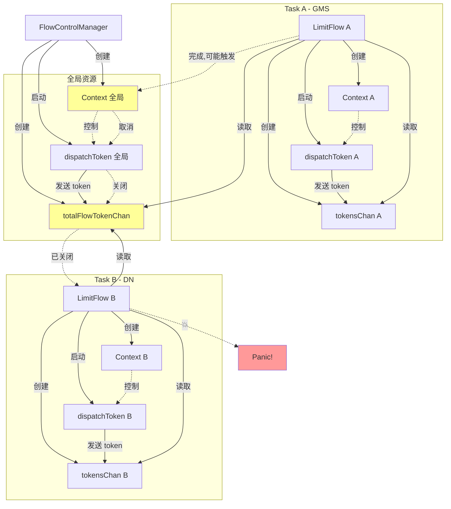

# 模块 1 答案和解析

## 问答测试答案

### 问题 1: Bug 性质判断
**答案**: C. 并发资源管理错误

**解释**: 
这是一个典型的并发资源管理错误。全局 `totalFlowTokenChan` 被多个并发任务共享，但没有引用计数或其他同步机制来确保所有任务完成后才关闭。第一个任务完成时可能关闭该 channel，导致其他仍在运行的任务 panic。

这不是硬件、网络或数据库问题，而是代码设计缺陷。

---

### 问题 2: 全局 Channel 的作用
**答案**: B. 限制所有任务的总流量

**解释**:
`totalFlowTokenChan` 的设计目的是实现全局流量控制。每个任务除了有本地的流量限制（通过 `tokensChan`），还需要检查全局流量限制（通过 `totalFlowTokenChan`）。这样可以确保所有并发任务的总流量不超过系统限制。

设计意图是好的，但实现有严重的并发安全问题。

---

### 问题 3: Channel 生命周期
**答案**: B. 全局 context 取消时

**解释**:
当全局 context 取消时，`dispatchToken` goroutine 会立即退出并执行 `defer close(totalFlowTokenChan)`。但此时可能还有其他任务正在使用这个 channel，导致它们 panic。

正确的做法应该是：
1. 使用引用计数，最后一个任务才关闭
2. 或者每个任务使用独立的 channel，不共享全局 channel

---

### 问题 4: 嵌套 Select 行为
**答案**: B. 跳出内层 select

**为什么这会导致问题**:
在 Go 中，`break` 语句只跳出最内层的 `select` 或 `for` 循环。在嵌套 select 中，`break` 只跳出内层 select，代码会继续执行到后面的 `Read()` 操作。

正确的做法：
```go
case _, ok := <-f.totalFlowTokenChan:
    if !ok {
        break out  // 使用标签跳出外层循环
    }
```

或者：
```go
case _, ok := <-f.totalFlowTokenChan:
    if !ok {
        err = errors.New("global channel closed")
        break out
    }
```

---

### 问题 5: Panic 触发机制
**答案**: B. 向已关闭的 channel 发送数据

**位置**:
- 文件: `pkg/hpfs/filestream/flowcontrol.go`
- 行号: 173 (根据 stack trace)

**详细说明**:
虽然代码中看起来是在读取 channel，但实际的 panic 可能发生在某个尝试向已关闭的 channel 发送数据的地方。从 stack trace 可以看出，panic 发生在 `LimitFlow` 方法中。

注意：读取已关闭的 channel 不会 panic，会返回零值和 `ok=false`。只有向已关闭的 channel 发送数据才会 panic。

---

### 问题 6: 竞态条件
**答案**: B. 一个任务关闭 channel，另一个任务仍在使用

**为什么这是竞态条件**:
竞态条件是指程序的行为依赖于不可控的事件顺序。在这个 bug 中：
- 如果任务 A 先完成，可能触发全局 context 取消，关闭 channel
- 任务 B 是否会 panic 取决于它是否还在使用 channel
- 这个时序是不确定的，取决于数据大小、网络速度等因素

这就是典型的竞态条件。

---

### 问题 7: 触发概率
**答案**: B. 两个并发任务，数据量小

**原因**:
数据量小意味着任务完成快，两个任务的执行时间更可能重叠，竞态窗口更大。

触发概率分析：
- 单个任务：0% (没有并发)
- 两个并发，小数据：90%+ (快速完成，竞态窗口大)
- 两个并发，大数据：50-90% (执行时间长，但仍有重叠)
- 多个串行：0% (没有并发)

---

### 问题 8: 环境相关性
**答案**: C. 否，任何环境下并发时都会触发

**为什么**:
这是代码逻辑错误，与运行环境无关。只要满足以下条件就会触发：
1. 至少 2 个并发任务
2. Flow control 已启用
3. 任务执行时间有重叠

即使在 8 核 16GB 的高配置服务器上，这个 bug 依然会触发。这不是性能问题，而是并发安全问题。

---

### 问题 9: defer 的危险性
**答案**: C. 没有检查是否还有其他 goroutine 在使用

**正确的做法**:

**方案 1: 引用计数**
```go
type FlowControlManager struct {
    activeCount int32
}

func (f *FlowControlManager) LimitFlow(...) {
    atomic.AddInt32(&f.activeCount, 1)
    defer func() {
        if atomic.AddInt32(&f.activeCount, -1) == 0 {
            // 最后一个任务才关闭
            close(f.totalFlowTokenChan)
        }
    }()
}
```

**方案 2: 不共享全局 channel**
```go
// 每个任务使用独立的 channel
func (f *FlowControlManager) LimitFlow(...) {
    tokensChan := make(chan int, 2)
    defer close(tokensChan)  // 安全，因为只有这个任务使用
}
```

---

### 问题 10: 根本原因总结
**一句话总结**:
两个并发任务共享一个全局 channel，第一个任务完成时关闭该 channel，导致第二个任务 panic。

**设计缺陷**: B. 缺少并发安全机制

**详细说明**:
这个 bug 反映了以下设计缺陷：
1. 共享资源没有引用计数
2. 没有考虑并发场景下的资源生命周期
3. 过早关闭仍在使用的资源
4. 缺少并发安全的保护机制

---

## 时序分析练习答案

### 时序图填空

```
T0: 系统初始化
    事件：FlowControlManager.Start() 被调用
    状态：创建全局 context 和 totalFlowTokenChan

T1: GMS 任务启动
    事件：LimitFlow(gms) 被调用
    创建的资源：本地 context, tokensChan
    启动的 goroutine：dispatchToken(tokensChan, local_ctx)

T2: DN 任务启动（1秒后）
    事件：LimitFlow(dn) 被调用
    创建的资源：本地 context, tokensChan
    启动的 goroutine：dispatchToken(tokensChan, local_ctx)

T3-T5: 正常传输阶段
    GMS 任务状态：读取 token，传输数据
    DN 任务状态：读取 token，传输数据
    全局 channel 状态：持续发送 token，两个任务共享读取

T6: GMS 任务完成
    触发的操作：读取到 EOF
    defer 执行的内容：cancel() 本地 context, close(tokensChan), release()
    影响：GMS 本地资源清理，但全局资源仍在使用

T7: 全局 Context 取消 ⚠️
    触发原因：HPFS 收到信号/健康检查失败/其他原因
    执行的操作：全局 dispatchToken goroutine 检测到 ctx.Done()
    关键变化：defer close(totalFlowTokenChan) 执行，全局 channel 关闭

T8: DN 任务尝试读取 💥
    DN 任务状态：仍在传输循环中
    尝试的操作：读取 totalFlowTokenChan
    实际结果：读取到 ok=false，但 break 只跳出内层 select
    Panic 原因：代码继续执行，某处尝试向已关闭的 channel 发送

T9: 崩溃连锁反应
    HPFS 状态：进程崩溃，容器退出
    备份任务状态：DN 备份失败，PolarDBXBackup 状态变为 Failed
    Kubernetes 响应：检测到容器退出，重启 HPFS pod
```

### 竞态窗口

**问题 1**: 竞态窗口在 T6 到 T8 之间

**问题 2**: 
这个时间段是竞态窗口，因为：
- T6: GMS 任务完成，可能触发全局 context 取消
- T7: 全局 channel 被关闭
- T8: DN 任务仍在运行，尝试使用已关闭的 channel
- 这个时序是不确定的，取决于任务完成时间、系统调度等因素

**问题 3**: 会触发

原因：
即使时间相差很大，只要两个任务有重叠执行的时间，就可能触发。关键不是时间长短，而是：
1. 是否并发执行
2. 第一个任务完成时是否触发全局 context 取消
3. 第二个任务是否还在使用全局 channel

---

## 数据流图答案

### 完整的并发任务数据流图



### 问题标注

- 🔴 严重问题：
  - 全局 channel 被多个任务共享
  - 没有引用计数机制
  - 过早关闭 channel

- 🟡 潜在问题：
  - 嵌套 select 的 break 行为
  - defer close 没有检查使用者

- 🟢 正常操作：
  - 本地 channel 的创建和关闭
  - 本地 context 的管理
  - 信号量的获取和释放

---

## 学习建议

如果你在某些问题上答错了：

**问题 1-3**: 重新阅读 Bug 分析文档，理解 bug 的性质和根本原因

**问题 4-6**: 学习 Go 并发基础，特别是 channel 和 select 的行为

**问题 7-8**: 理解竞态条件和并发场景

**问题 9-10**: 学习并发安全的设计模式

## 推荐阅读

1. [Go Concurrency Patterns](https://go.dev/blog/pipelines)
2. [The Go Memory Model](https://go.dev/ref/mem)
3. [Effective Go - Concurrency](https://go.dev/doc/effective_go#concurrency)
4. [Common Goroutine Mistakes](https://go.dev/blog/race-detector)
