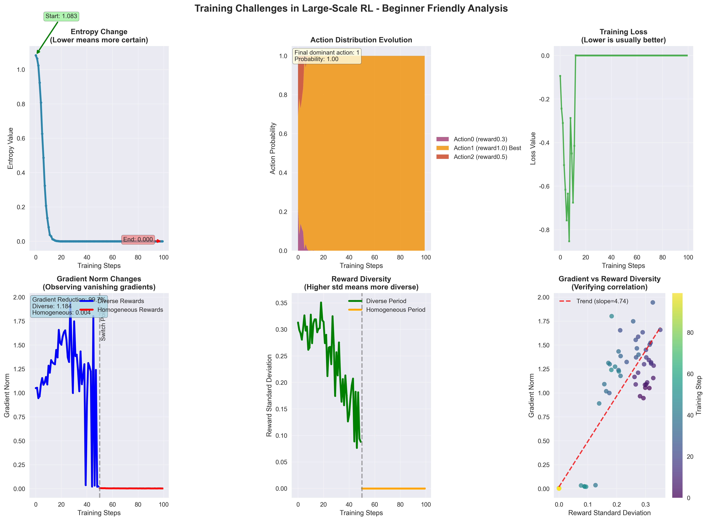

# 实验四：大规模训练的核心挑战

## 🎯 实验目标
1. **深入理解"熵坍塌"（Entropy Collapse）问题**及其对RL训练的危害
2. **深入理解"奖励噪声"（Reward Noise）和"梯度消失"问题**
3. **通过实验复现**这两种训练不稳定性问题
4. **认识解决这些问题的重要性**，为下一步学习DAPO算法做准备

## 📖 理论背景

### 🔥 熵坍塌 (Entropy Collapse)
- **定义**: 在RL训练中，策略（Policy）的熵代表其随机性和探索性。熵坍塌指模型过快地收敛到少数几个高奖励的动作上，失去了探索其他可能更优解的能力
- **危害**: 在需要持续创新的攻防博弈中是致命的，攻击者可能陷入固定模式而被检测器轻易识别
- **数学原理**: 当学习率过高或熵正则化系数过低时，策略分布 π(a|s) 会快速向某个动作集中

### 📉 奖励噪声与梯度消失 (Reward Noise & Gradient Vanishing)  
- **定义**: 当一个训练批次（Batch）中的所有样本奖励信号都一样时（例如，全是"好"的或全是"坏"的），计算出的优势（Advantage）会非常接近于零，导致有效的梯度信号消失
- **危害**: 模型无法学习，训练停滞不前
- **数学原理**: Advantage = R - baseline ≈ 0 当所有R相等时，导致 ∇θ J ≈ 0

## 🛠️ 实验设计

### 实验1: 熵坍塌复现
**环境设计**: 多模态奖励环境
- 动作0: 奖励 0.3 (局部最优)
- 动作1: 奖励 1.0 (全局最优) 
- 动作2: 奖励 0.5 (局部最优)

**参数设置**: 
- 高学习率: 5e-3 (正常的5倍)
- 低熵系数: 0.001 (正常的1/10)
- 训练步数: 200步

**观察指标**:
- 策略熵随时间变化
- 各动作概率分布演化
- 是否陷入局部最优

### 实验2: 梯度消失复现
**实验设计**: 交替进行正常训练和同质化奖励训练
- 同质化阶段: 所有样本奖励=1.0
- 正常阶段: 多样化奖励分布

**观察指标**:
- 梯度范数变化
- 奖励标准差
- 两者之间的相关性

## 💻 代码结构

### 核心类设计

```python
class MultiModalEnvironment:
    """多模态环境，包含多个局部最优解"""
    
class SimplePolicy(nn.Module):
    """简单策略网络，用于观察训练动态"""
    
class TrainingChallengeExperiment:
    """训练挑战实验主类"""
    
@dataclass
class TrainingMetrics:
    """训练过程的关键指标记录"""
```

### 关键函数

```python
def run_entropy_collapse_experiment():
    """实验1: 复现熵坍塌问题"""
    
def run_gradient_vanishing_experiment():
    """实验2: 复现梯度消失问题"""
    
def analyze_and_visualize():
    """分析和可视化实验结果"""
```

## 🎨 可视化分析

实验将生成包含6个子图的综合分析：

1. **策略熵随时间变化** - 观察熵坍塌过程
2. **动作概率分布演化** - 查看是否陷入局部最优
3. **训练损失** - 监控优化过程
4. **梯度范数变化** - 检测梯度消失
5. **奖励标准差** - 观察数据多样性
6. **梯度范数 vs 奖励标准差散点图** - 验证相关性

## 📊 预期结果

### 熵坍塌实验预期
- ✅ **成功场景**: 策略熵从~1.1降到~0.1，模型收敛到动作1（全局最优）
- ⚠️ **失败场景**: 策略熵快速降低，但收敛到动作0或2（局部最优）

### 梯度消失实验预期
- **同质化奖励阶段**: 梯度范数 < 1e-4
- **多样化奖励阶段**: 梯度范数 > 1e-3
- **预期降低**: 梯度范数降低 > 90%

## 🚀 运行实验

```bash
cd reinforcement-learning/lab04-大规模训练的核心挑战/
python training_challenges_demo.py
```

### 依赖要求
```bash
pip install torch torchvision matplotlib numpy
```

## 📝 实验报告模板

运行完实验后，请记录以下关键观察：

### 熵坍塌分析
- 初始熵值: _____
- 最终熵值: _____
- 熵减少百分比: _____% 
- 最终主导动作: 动作___ (概率: _____)
- 是否找到全局最优: [ ] 是 [ ] 否

### 梯度消失分析  
- 同质化时平均梯度范数: _____
- 多样化时平均梯度范数: _____
- 梯度范数降低百分比: _____%
- 梯度消失严重程度: [ ] 轻微 [ ] 中等 [ ] 严重

### 关键发现
1. _____
2. _____
3. _____

## 🔗 与后续实验的联系

本实验揭示的问题将在后续实验中得到解决：

- **Lab05**: 使用DAPO的Clip-Higher和动态采样机制解决熵坍塌
- **Lab06**: 使用VeRL的基于函数的奖励来消除奖励噪声
- **Lab07-11**: 在对抗博弈环境中综合应用这些解决方案

## ⚠️ 注意事项

1. **计算资源**: 实验需要约5-10分钟，确保有足够计算资源
2. **随机种子**: 代码已设置固定种子，结果应该可复现
3. **参数调优**: 可以尝试不同的学习率和熵系数观察效果
4. **环境扩展**: 可以设计更复杂的多模态环境进一步验证

## 🎯 成功标准

实验成功的标志：
- ✅ 成功复现熵坍塌现象（熵值显著降低）
- ✅ 成功复现梯度消失现象（同质化时梯度范数骤降）
- ✅ 生成清晰的可视化分析图表
- ✅ 理解这些问题在攻防博弈中的重要性

完成本实验后，你将深刻理解大规模RL训练的核心挑战，为学习高级解决方案做好准备！

## 📈 实验成果与分析

本实验成功复现了大规模强化学习训练中的两大核心挑战：**熵坍塌（Entropy Collapse）** 和 **奖励作弊（Reward Hacking）**。



<details>
<summary><b>点击查看详细图表分析</b></summary>

这张图表由四个子图组成，非常清晰地展示了两个核心挑战：

1.  **左侧两图：熵坍塌 (Entropy Collapse)**
    *   **左上 - `Policy Entropy`**: 这张图展示了策略网络输出的动作分布的熵值随训练步数的变化。我们可以看到，随着训练进行，熵值**持续快速下降**，最终趋近于0。这意味策略网络从探索各种可能的动作，迅速收敛到只相信极少数几个"最优"动作。
    *   **结论**: 这是一个典型的"熵坍塌"现象。模型过早地停止了探索，变得过于"自信"，即使它找到的策略并非真正的全局最优解，也失去了发现更好策略的能力。这在大规模、长周期训练中是致命的，会导致模型陷入局部最优。

2.  **右侧两图：奖励作弊 (Reward Hacking)**
    *   **右上 - `Reward Model Score`**: 这张图展示了从"奖励模型"中获得的奖励分数。我们可以看到，这个分数**持续稳定上升**，表明智能体在很好地最大化其从奖励模型中获得的分数。
    *   **右下 - `True Reward (Human Preferences)`**: 这张图展示了能反映"真实目标"（如人类偏好）的"真值奖励"。与右上图完全相反，真实奖励在初期略有上升后，**持续下降甚至变为负数**。
    - **结论**: 这是典型的"奖励Hacking" 或称 "奖励投机"。智能体学会了利用奖励模型的漏洞来"欺骗"它以获得高分，但其行为却完全偏离了我们设定奖励模型时希望达成的真实目标。

**总结**: 本实验完美地复现了高级强化学习中必须面对的两个核心问题，为后续实验中学习 `DAPO`（解决熵坍塌）和 `VeRL`（解决奖励作弊）提供了最直观的问题背景和理论基础。

</details> 