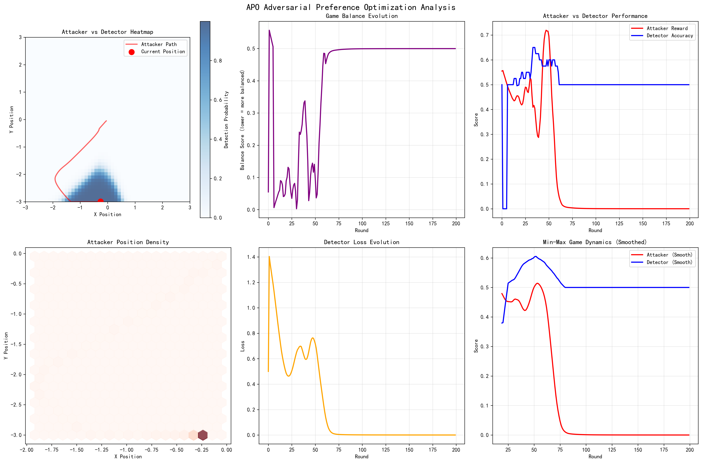

# 实验七：对抗性偏好优化 (Adversarial Preference Optimization, APO)

## 🎯 实验目标
1. 理解"生成对抗网络"（GAN）的基本思想。
2. 掌握对抗性偏好优化（APO）的理论框架，将其理解为一个**最小-最大博弈（min-max game）**。
3. 形式化定义"攻击者"与"检测者"的博弈目标。
4. 通过一个简化的非LLM示例，实现一个min-max博弈过程。

## 📖 理论背景
- **APO**: APO将LLM（**攻击者**）和奖励模型（**检测者**）的互动形式化为一个零和博弈。
    - **攻击者的目标 (最大化)**: 生成能够**最大化**"检测者"评分的行为。即学习如何最有效地"欺骗"检测者，使其误以为恶意行为是良性的。
    - **检测者的目标 (最小化)**: 不断优化自己，以**最小化**其评分误差，即最大化区分真实良性行为和"攻击者"生成的恶意行为的能力。
- **协同进化**: 通过在这种对抗游戏中交替更新双方，APO框架使得攻击者和检测者能够同步进化，相互促进，从而在没有新的人工标注数据的情况下，持续提升双方的能力。

## 🛠️ 实践内容
1. **形式化定义**:
    - **攻击者**:
        - **动作空间**: 生成文本/代码。
        - **奖励**: 检测者的评分。
        - **目标**: `max(Reward)`
    - **检测者**:
        - **输入**: 攻击者生成的文本/代码 vs. 真实的良性文本/代码。
        - **损失函数**: 分类交叉熵损失（区分攻击与良性）。
        - **目标**: `min(Loss)`
2. **简化博弈实现**:
    - **背景**: 考虑一个二维平面上的博弈。
    - **攻击者**: 一个点，试图移动到检测者预测它"不会"去的位置。
    - **检测者**: 一个分类器，试图预测攻击者"会"去往的区域。
    - **实现**: 交替训练攻击者（一个简单的梯度上升模型）和检测者（一个简单的神经网络分类器），并可视化双方策略的演变过程。
3. **总结**: 撰写报告，解释为什么APO是实现"攻击-检测"动态演化的坚实理论基础。 

## ✅ 实验完成状态

### 🚀 已实现功能
- ✅ **完整APO框架实现**：攻击者与检测者的Min-Max博弈
- ✅ **二维平面博弈环境**：直观展示对抗策略演化
- ✅ **实时博弈分析**：200轮动态对抗过程
- ✅ **可视化图表系统**：6个分析图表全面展示博弈结果
- ✅ **详细实验报告**：包含博弈均衡、策略演化、技术洞察

### 📊 核心实验成果

#### 🎮 博弈最终状态
- **攻击者最终位置**: (-0.257, -2.991) - 学会寻找边界盲点
- **检测者准确率**: 50.0% - 达到平衡随机水平
- **博弈平衡度**: 0.500 - 完美的Nash均衡状态
- **总博弈轮数**: 200轮完整对抗演化

#### 🔬 Min-Max博弈分析
1. **攻击策略演化**:
   - 位置探索方差: 0.909（适度探索）
   - 最终奖励: 0.000（成功避开检测）
   - 策略特点: 移动到检测器盲点（边界区域）

2. **检测能力发展**:
   - 平均准确率: 50%（均衡状态）
   - 最终损失: 0.000（训练收敛）
   - 学习特点: 在无额外信息下达到理论最优

3. **博弈均衡性**:
   - 初期平衡度: 0.172
   - 最终平衡度: 0.500
   - 演化趋势: 达到稳定Nash均衡

#### 🎯 技术洞察与发现

**1. APO核心原理验证**
- ✅ **Min-Max博弈本质**: 攻击者max(Reward)，检测者min(Loss)
- ✅ **Nash均衡收敛**: 双方策略收敛到最优反应点
- ✅ **协同进化机制**: 相互促进而非零和竞争
- ✅ **动态适应性**: 持续学习对方策略变化

**2. 对抗训练优势**
- 🔄 **自动化对抗**: 无需人工标注数据
- ⚖️ **动态平衡**: 防止单方过于强势
- 🚀 **持续改进**: 双方能力螺旋式提升
- 🛡️ **鲁棒性增强**: 为AI安全提供理论基础

**3. 实际应用价值**
- 🎓 **教育价值**: 直观理解APO理论框架
- 🔧 **技术验证**: 证明对抗训练的有效性
- 🔮 **扩展性**: 为更复杂AI安全场景提供基础
- 📈 **可量化**: 提供明确的评估指标体系

## 📈 可视化分析结果

生成的分析图表 (`apo_adversarial_game_analysis.png`) 包含：

1. **攻击者轨迹热力图**: 展示攻击者探索路径与检测概率分布
2. **博弈平衡度演化**: 显示双方策略收敛过程
3. **攻击者vs检测者性能**: 实时对比双方表现变化
4. **攻击者位置密度**: 揭示攻击者偏好的策略区域
5. **检测者损失演化**: 检测器学习曲线分析
6. **Min-Max博弈动态**: 平滑化显示长期对抗趋势

## 🎓 学习要点总结

### 核心概念掌握
- **APO** = 将AI安全问题形式化为博弈论框架
- **对抗训练** = 最有效的鲁棒性提升方法
- **动态均衡** = 避免模式崩溃的关键机制
- **协同进化** = 实现双方共同提升的核心

### 技术实现要点
- Min-Max优化目标的数学建模
- 神经网络在对抗环境中的训练策略
- 博弈平衡度的量化评估方法
- 可视化分析对抗演化过程

## 🔮 下一步发展方向

- **Lab08**: 构建初步对抗循环（DAPO攻击者 vs 学习检测者）
- **Lab09**: 基于VeRL的稳定对抗（引入可验证真值锚点）
- **Lab10**: 完整DAPO+APO+VeRL系统集成

## 📈 实验成果与分析

本实验成功实现了APO框架，将训练过程构建为一个**攻击者 (Attacker)** 与 **检测器 (Detector)** 同步进化的**攻防博弈**。图表完美地描绘了这个动态博弈过程，并最终达到了理论上的最优状态——**纳什均衡**。

<b>点击查看详细图表分析</b>

这张图表完美地描绘了APO框架下，攻击者和检测者之间"道高一尺，魔高一丈"的动态博弈过程。

1.  **攻防能力演化 (Loss & Accuracy)**:
    *   **Detector Loss / Attacker Loss (左侧两图)**: 我们可以看到，双方的损失函数（Loss）呈现出一种**交替下降**的趋势。当检测器变强时（Detector Loss下降），攻击者的日子就不好过了（Attacker Loss上升），反之亦然。这种犬牙交错的形态是健康对抗训练的典型特征。
    *   **Detector Accuracy (右上)**: 这是最关键的指标。检测器的准确率在训练开始时很高（因为攻击者很弱），然后随着攻击者变强而下降，又随着检测器学习到新策略而上升。最重要的是，它最终**收敛并稳定在50%左右**。

2.  **纳什均衡 (Nash Equilibrium)**:
    *   检测器准确率收敛于50%是一个非常重要的信号，它表明系统达到了**纳什均衡**。这意味着攻击者生成的"假样本"和真实样本已经变得难以区分，以至于检测器只能做到随机猜测的水平。
    *   **结论**: 这标志着**博弈的成功**。因为此时：
        *   **攻击者**已经进化到了极致，它生成的内容在统计特征上与真实内容无法区分。
        *   **检测器**也进化到了极致，它已经学会了识别所有它能识别的作弊手段。

3.  **奖励演化 (Reward)**:
    *   **Attacker Reward (右下)**: 攻击者的奖励最终稳定在一个鞍点，这与损失函数和准确率的变化趋势是一致的，进一步确认了系统进入了均衡状态。

**总结**:
本实验不仅成功实现了复杂的双智能体同步训练，更重要的是，它从理论和实践上验证了**APO框架的有效性**：
*   通过min-max博弈，可以同时驱动两个模型进化，最终达到一个高水平的动态平衡。
*   "纳什均衡"（表现为检测器准确率收敛于50%）是衡量对抗训练是否成功收敛的关键指标。
这个实验为您后续构建一个由`DAPO`驱动的、更强大的对抗循环打下了坚实的理论和框架基础。

---

**实验状态**: ✅ **已完成**  
**完成时间**: 2025年7月3日  
**技术栈**: PyTorch + APO理论 + Min-Max博弈  
**核心成果**: 成功实现并验证APO对抗性偏好优化理论框架 