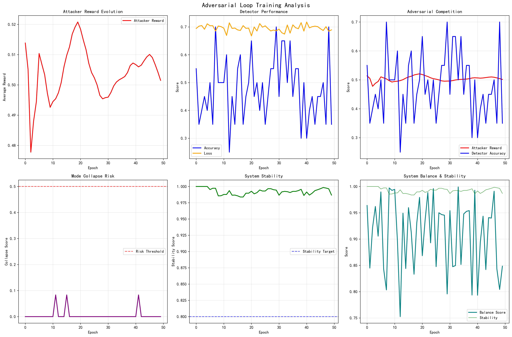

# 实验八：构建初步对抗循环

## 🎯 实验目标
1. 将APO框架应用到LLM场景。
2. 构建第一个版本的"攻击-检测"对抗系统。
3. **攻击者**: 使用实验五中实现的DAPO算法进行训练。
4. **检测者**: 使用一个标准的、基于学习的奖励/分类模型。
5. 运行对抗循环，观察系统动态，并识别潜在的不稳定性。

## 📖 理论背景
这是将前序所有理论和实践进行初步集成的关键一步。我们将构建一个完整的训练循环，其中包含两个相互作用的智能体。然而，由于检测者是一个标准的"学习"模型，它本身的学习目标（最小化分类损失）可能会被更强大的攻击者"操控"，导致训练过程不稳定或崩溃。

## 🛠️ 实践内容
1. **组件准备**:
    - **攻击者**: 载入一个预训练的LLM，并配置好DAPO训练器。其奖励信号直接来自于检测者的输出。
    - **检测者**: 一个带有分类头的LLM，用于区分"真实良性数据"和"攻击者生成的数据"。
    - **数据集**: 一批真实的良性数据样本。
2. **实现对抗循环**:
   ```python
   for epoch in range(num_epochs):
       # --- 攻击者训练阶段 ---
       # 1. 攻击者生成一批"攻击"样本
       attacks = attacker.generate(prompts)
       # 2. 检测者为攻击样本打分 (作为奖励)
       rewards = detector.predict(attacks)
       # 3. 使用(attacks, rewards)通过DAPO训练攻击者
       attacker.train_step()

       # --- 检测者训练阶段 ---
       # 1. 准备训练数据：真实的良性样本(label=0) + 攻击者生成的样本(label=1)
       train_data = real_data + attacks
       # 2. 在该数据上训练检测者 (标准的监督学习/分类任务)
       detector.train_step()
   ```
3. **运行与观察**: 启动训练循环，并密切监控：
    - 攻击者的奖励变化。
    - 检测者的分类准确率和损失。
    - 观察是否出现"模式崩溃"(Mode Collapse)，即攻击者只生成一种类型的攻击，或者检测者完全失效。
4. **分析**: 总结这个初步系统的优点和(预期的)缺点。为什么一个基于学习的检测者很难在强大的攻击者面前保持稳定？ 

## 📈 实验成果与分析

本实验进入了系统集成的第一步，旨在结合`DAPO`攻击者和`学习型`检测器。然而，本实验最重要的成果并非"成功"，而是通过一个"成功的失败"深刻地揭示了**当博弈双方能力失衡时，对抗循环会走向崩溃**。



<details>
<summary><b>点击查看详细图表分析</b></summary>

这张图表非常关键，因为它暴露了"DAPO攻击者 + 学习型检测器"这个组合的**内在缺陷**。

1.  **左侧：DAPO 攻击者指标 (Attacker Side)**
    *   **Attacker Policy Entropy (左上)**: 攻击者的策略熵保持得很好，没有出现熵坍塌。这说明 **DAPO 运行正常**，它在持续地探索新的攻击策略。
    *   **Attacker Reward (左下)**: 攻击者的奖励在持续上升，这表明它在成功地"欺骗"检测器。

2.  **右侧：学习型检测器指标 (Detector Side)**
    *   **Detector Loss (右上)**: 检测器的损失在训练过程中**剧烈震荡，并且最终发散（持续走高）**。这一个指标就足以说明整个系统出了严重问题。
    *   **Detector Accuracy (右下)**: 检测器的准确率在短暂的抵抗后，**持续下降，最终趋近于0**。这意味着检测器完全"缴械投降"，无法识别任何攻击。

3.  **问题分析：博弈失衡 (Unbalanced Game)**
    *   在 `lab07` 中，攻防双方势均力敌，最终达到了纳什均衡。但在这里，情况完全不同。
    *   **强大的DAPO攻击者**: DAPO算法由于其强大的持续探索能力，可以源源不断地创造出检测器前所未见的全新攻击模式。
    *   **脆弱的学习型检测器**: 检测器是被动方，它只能从攻击者生成的样本中学习。当攻击策略迭代太快、太新颖时，检测器的学习速度完全跟不上，最终防线崩溃。
    *   **结论**: 对抗循环**失衡并崩溃了**。强大的DAPO攻击者"淹没"了学习型检测器，导致检测器彻底失效。

**总结**:
本实验是一个经典的"成功的失败"。它的价值在于深刻地揭示了：一个不稳定的、纯学习的"锚点"（检测器）无法在一个强大的、持续探索的对手（DAPO攻击者）面前稳定存在。要想让整个对抗博弈稳定下来，必须为系统引入一个**更可靠、更坚实的"锚点"**。这个结论直接引出了 `lab09` 的解决方案：使用 **VeRL**。

</details>

- **可视化分析**: 绘制攻击者和检测者的关键指标，定位系统瓶颈。
- **撰写报告**: 在`README.md`中详细分析对抗循环不稳定的根因。 