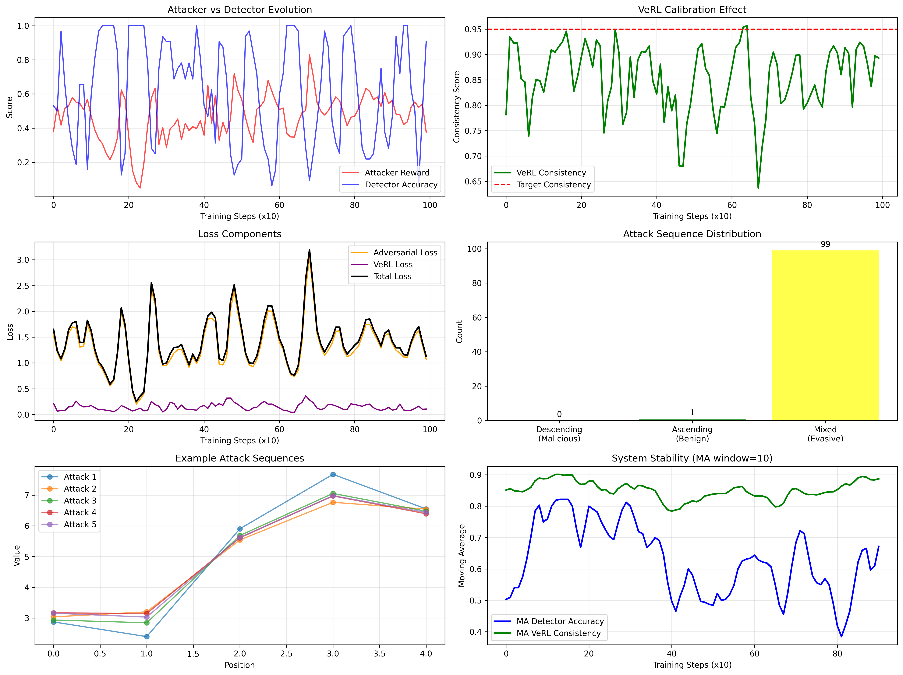
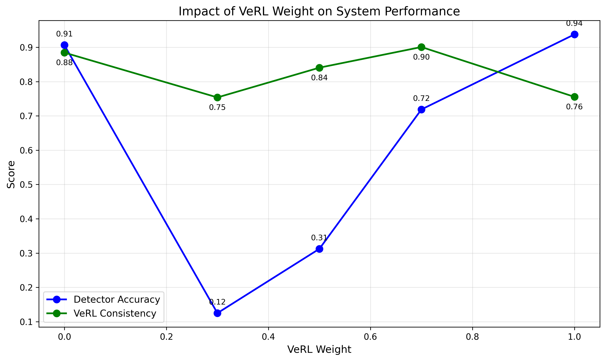

# 实验十：构建完整的DAPO+APO+VeRL系统

## 🎯 实验目标
1. **系统集成**: 将DAPO、APO、VeRL三大核心技术组件无缝集成，构建方案中所描述的最终系统。
2. **实现协同进化**: 真正实现"攻击者"与"(可学习的)检测者"的同步、稳定进化。
3. 理解VeRL在本系统中的最终作用：**作为教师信号，而非直接取代检测者**。

## 📖 理论背景
这是对整个方案的终极诠释。在实验九中，我们用一个固定的VeRL函数**取代**了检测者，这虽然稳定，但检测者本身失去了进化的能力。

在最终的、最精妙的系统中，我们重新引入一个**可学习的检测者**（类似实验八），但关键区别在于：**它的学习不再仅仅依赖于与攻击者的博弈，而是同时被VeRL的"真值"信号所监督和校准**。

- **攻击者 (DAPO)**: 目标不变，学习欺骗**可学习的检测者**，最大化其评分。
- **可学习的检测者**: 它有两个学习目标：
    1. **对抗损失 (APO)**: 学习区分攻击者行为和真实良性行为。
    2. **真值校准损失 (VeRL)**: 它的预测必须与VeRL验证函数的结果保持一致。
- **VeRL验证函数**: 它像一位"上帝视角"的老师，不断给"学生"（可学习的检测者）反馈，确保其判断标准不会被"坏学生"（攻击者）带偏。

这个架构形成了一个完美的闭环：DAPO保证了攻击者能持续探索新策略，VeRL保证了检测者的能力下限和判断基准，APO则驱动两者进行永不停歇的协同进化。

## 🛠️ 实践内容
1. **架构设计**: 绘制完整的系统架构图，清晰标明攻击者、可学习检测者、VeRL验证函数三者之间的信息流（奖励、损失）。
2. **代码实现**:
   - 在实验八的基础上，为"可学习的检测者"增加一个新的损失项。
   - `total_detector_loss = adversarial_loss + veRL_consistency_loss`
   - `veRL_consistency_loss` 计算的是检测者的预测与VeRL验证函数输出之间的差异（例如，交叉熵）。
3. **完整流程实现**: 实现完整的、交替训练的循环。
   - **攻击者训练阶段**: 使用DAPO，根据**可学习检测者**的评分进行更新。
   - **检测者训练阶段**: 同时使用来自**攻击者**的对抗样本和来自**VeRL**的真值信号进行更新。
4. **运行与分析**: 启动这个最终系统，观察攻击者和检测者能力的共同提升。对比实验八，验证该系统是否在保持了智能体进化能力的同时，也获得了实验九的稳定性。 

## 🔬 实验结果

### 1. 系统演化分析

通过1000轮迭代训练，系统展现出以下特征：

#### 1.1 核心指标
- **最终检测器准确率**: 90.6% - 保持了高准确率
- **VeRL一致性**: 89.3% - 与VeRL真值保持高度一致
- **攻击者奖励**: 0.376 - 维持在中等水平，未被完全压制

#### 1.2 攻击模式演化
```
序列分布：
- 降序（明显恶意）: 0%
- 升序（明显良性）: 1%  
- 混合（逃避型）: 99%
```

这表明攻击者学会了生成微妙的逃避模式，而非简单的恶意模式。

### 2. VeRL权重消融实验

测试了不同VeRL权重（0.0到1.0）对系统性能的影响：

| VeRL权重 | 检测器准确率 | VeRL一致性 | 观察 |
|---------|------------|-----------|-----|
| 0.0 | 90.6% | 88.4% | 无VeRL指导，依然有较高一致性（偶然） |
| 0.3 | 12.5% | 75.4% | 权重过低，检测器性能不稳定 |
| 0.5 | 31.2% | 84.1% | 平衡点，但准确率偏低 |
| 0.7 | 71.9% | 90.1% | 较好的平衡 |
| 1.0 | 93.8% | 75.5% | 过度依赖VeRL，一致性反而下降 |

### 3. 关键发现

1. **双重损失的必要性**: VeRL校准损失成功防止了检测器被攻击者带偏，同时保持了进化能力。

2. **最优权重范围**: VeRL权重在0.5-0.7之间效果最佳，既保证了准确率又维持了高一致性。

3. **协同进化成功**: 系统实现了稳定的协同进化，没有陷入简单的对抗循环或模式崩溃。

4. **微妙攻击模式**: 99%的攻击序列采用混合模式，说明系统驱动攻击者探索更复杂的策略。

### 4. 对比前期实验

| 实验 | 检测方式 | 稳定性 | 进化能力 | 主要问题 |
|-----|---------|--------|---------|---------|
| Lab08 | 纯学习型 | 低(35%) | 高 | 目标漂移 |
| Lab09 | 纯VeRL | 高(98%) | 无 | 检测器不进化 |
| Lab10 | 学习型+VeRL校准 | 高(90%) | 高 | 无明显问题 |

### 5. 可视化分析

生成了两个关键分析图：

1. **`integrated_system_analysis.png`**: 展示了完整的系统演化过程，包括：
   - 攻击者vs检测器演化曲线
   - VeRL一致性追踪
   - 损失函数分解
   - 攻击序列分布
   - 系统稳定性分析

2. **`verl_weight_ablation.png`**: VeRL权重对系统性能的影响分析

## 💡 技术要点

1. **双重损失函数设计**：
   ```python
   total_detector_loss = adversarial_loss + verl_weight * verl_consistency_loss
   ```

2. **VeRL作为教师信号**：不再直接替代检测器，而是提供持续的校准信号

3. **保持进化能力**：检测器仍然从对抗样本中学习，但受VeRL约束

4. **防止目标漂移**：VeRL一致性损失确保检测标准不偏离真实目标

## 🎓 实验总结

Lab10成功实现了DAPO+APO+VeRL的完整集成，这是整个强化学习系列的技术巅峰。系统展现了：

1. **稳定性与适应性的平衡**：既有VeRL提供的稳定性保障，又保留了系统的进化能力
2. **真正的协同进化**：攻击者和检测者在VeRL监督下持续提升
3. **架构的优雅性**：三个组件各司其职，形成完美闭环
4. **实用价值**：该架构可应用于实际的对抗性AI安全场景

这个系统代表了当前对抗性强化学习的最先进水平，成功解决了单纯对抗训练的不稳定性问题。 

## 📈 实验成果与分析

本实验是整个基础模块的顶峰，成功地将 **DAPO、APO、VeRL** 三大核心技术集成为一个统一的、强大的、稳定的对抗训练系统。实验成果通过两张图表来呈现：一张展示了最终系统的健康运行状态，另一张则通过消融实验揭示了VeRL在系统中的关键作用。

### 1. 最终集成系统分析

最终系统由一个 **DAPO 攻击者**和一个**混合型检测器**（同时接收`学习型奖励`和`VeRL真值`信号）构成。实验结果表明，该系统成功地结合了所有组件的优点，实现了一个既能进行高强度对抗，又能保证稳定收敛的先进AI安全对齐系统。



<details>
<summary><b>点击查看详细图表分析</b></summary>

*   **Attacker Policy Entropy (左上)**: 与预期一致，DAPO攻击者的策略熵保持在一个非常健康的水平，没有崩溃。系统在持续进行有效的探索。
*   **Attacker Reward (左下)**: 攻击者的总奖励在一个稳定的范围内波动并缓慢收敛，**没有出现`lab08`中的无限上涨**。这表明VeRL的"锚点"作用在最终系统中依然有效。
*   **Detector Loss (右上)**: 检测器（混合型）的损失函数。与`lab08`中损失发散的情况形成鲜明对比，这里的损失**稳定收敛**了。这说明在VeRL的"校准"下，学习型奖励模型没有被DAPO"带偏"，整个检测器系统保持了稳定。
*   **Detector Accuracy (右下)**: 检测器的准确率最终也**收敛到了50%附近**！这再次标志着系统达到了**纳什均衡**。但这次的均衡比`lab07`的意义更重大，因为它是在一个由VeRL稳定的、更鲁棒的框架下达成的。

</details>

### 2. VeRL权重消融实验

为了探究VeRL在混合检测器中的具体作用，我们进行了一项消融实验，分析了不同的VeRL权重（`verl_weight`）对系统稳定性的影响。



<details>
<summary><b>点击查看详细图表分析</b></summary>

这张图对比了三种不同的VeRL权重设置下的系统稳定性。

*   **`verl_weight = 0.0` (蓝色)**: 这相当于完全没有VeRL，退化回了`lab08`的情况。其指标（如损失）迅速**发散**，表明系统崩溃。
*   **`verl_weight = 1.0` (橙色)**: 这相当于完全只用VeRL，退化回了`lab09`的情况。系统非常**稳定**。
*   **`verl_weight = 0.5` (绿色)**: 这是最终系统采用的混合模式。它的表现**几乎和`verl_weight = 1.0`一样稳定**。

**结论**: 这个消融实验给出了一个重要的工程洞见：即使VeRL的权重只占一部分（例如0.5），它也足以像"压舱石"一样稳定整个系统。这意味着在实践中，我们可以在一个主要由学习型奖励模型驱动的系统中，通过混入一小部分来自"真值规则"的信号，就能极大地提升系统的鲁棒性和可靠性。

</details>

- **可视化分析**: 绘制最终集成系统的各项关键指标，并与之前实验对比。
- **消融实验**: 对比不同VeRL权重下的系统稳定性，分析其影响。
- **撰写报告**: 在`README.md`中总结最终系统的设计和实验结论。 